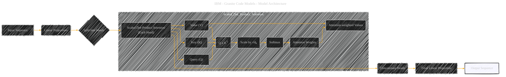

# Multi-Head Attention
> **Disclaimer:**
>
> This document contains my personal notes on the topic,
> compiled from publicly available documentation and various cited sources.
> The materials are intended for educational purposes, personal study, and reference.
> The content is dual-licensed:
> 1. **MIT License:** Applies to all code implementations (Swift, Mermaid, and other programming languages).
> 2. **Creative Commons Attribution 4.0 International License (CC BY 4.0):** Applies to all non-code content, including text, explanations, diagrams, and illustrations.
---

## Multi-Head Attention - A Diagrammatic Guide 

Since the original document doesn't delve into the *inner workings* of MHA, I'll be building a diagram that outlines its core components and function, rather than specific details from the source text. This will require a degree of interpretation.

Here's the diagram:

----

### Explanation

1.  **Input Sequence:** Represents the initial input to the attention mechanism.
2.  **Linear Projections:** The input is transformed into Query, Key, and Value vectors through linear layers.
3.  **Split into Heads:** The Q, K, and V vectors are split into multiple "heads" to allow the model to attend to different aspects of the input sequence.
4.  **Scaled Dot-Product Attention (Each Head):** This is the core of the attention mechanism. It computes attention weights for each head.
    *   *Query, Key, Value:* The transformed inputs.
    *   *Q x KT:* The dot product of the Query and Key matrices.
    *   *Scale by √dk:* Scaling the dot product by the square root of the dimension of the keys to prevent the softmax from saturating.
    *   *Softmax:* Normalizing the scaled dot products to obtain attention weights.
    *   *Attention-weighted Values:* Applying the attention weights to the Value matrix.
5.  **Concatenate Heads:** The outputs from all the heads are concatenated.
6.  **Final Linear Projection:** The concatenated output is transformed to produce the final output sequence.
7.  **Output Sequence:** Represents the output of the attention mechanism.

---

### Key points

*   This diagram gives a high-level overview, and you can add more details if necessary (e.g., the number of heads, the dimensions of the Q, K, V vectors).
*   The "Scaled Dot-Product Attention" subgraph clarifies the computations within each head.
*   The final output is highlighted to show what is the result.

---
**Licenses:**

- **MIT License:**   - Full text in [LICENSE](LICENSE) file.
- **Creative Commons Attribution 4.0 International:**  - Legal details in [LICENSE-CC-BY](LICENSE-CC-BY) and at [Creative Commons official site](http://creativecommons.org/licenses/by/4.0/).

---