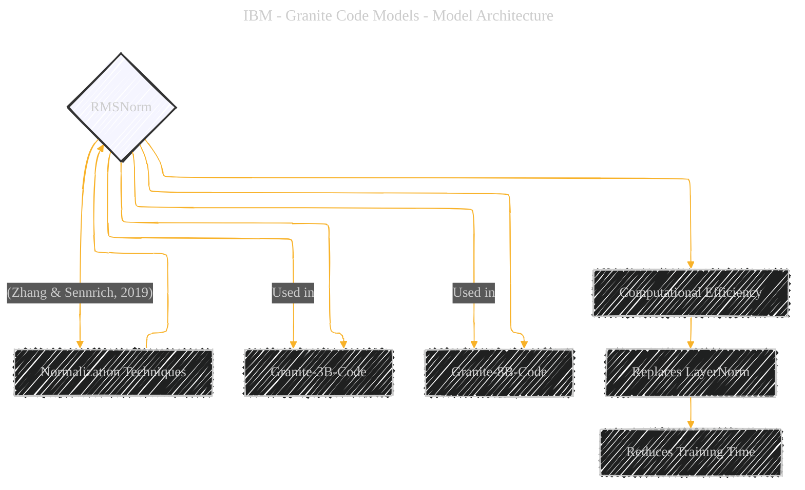

# RMSNorm
> **Disclaimer:**
>
> This document contains my personal notes on the topic,
> compiled from publicly available documentation and various cited sources.
> The materials are intended for educational purposes, personal study, and reference.
> The content is dual-licensed:
> 1. **MIT License:** Applies to all code implementations (Swift, Mermaid, and other programming languages).
> 2. **Creative Commons Attribution 4.0 International License (CC BY 4.0):** Applies to all non-code content, including text, explanations, diagrams, and illustrations.
---

## RMSNorm - A Diagrammatic Guide 

The diagram below illustrates the context of RMSNorm (Root Mean Square Layer Normalization) technique within the "Granite Code Models" architecture. It prioritizes a conceptual understanding of its role and benefit. If the user asks for further mathematical explanation, that can be addressed as well.

----

### Explanation

*   **Central Concept:** `RMSNorm` (Root Mean Square Layer Normalization) is highlighted as the primary focus.
*   **Usage:** The connections to `Granite-3B-Code` and `Granite-8B-Code` show where RMSNorm is employed within the model family.
*   **Benefits:** The connections to `Computational Efficiency` and `Replaces LayerNorm` explain the main motivation for choosing RMSNorm.
*   **Reference:**  The source of RMSNorm is cited as (Zhang & Sennrich, 2019)
*   **Style**: Node fill-style added to the central concept.

---
**Licenses:**

- **MIT License:**   - Full text in [LICENSE](LICENSE) file.
- **Creative Commons Attribution 4.0 International:**  - Legal details in [LICENSE-CC-BY](LICENSE-CC-BY) and at [Creative Commons official site](http://creativecommons.org/licenses/by/4.0/).

---