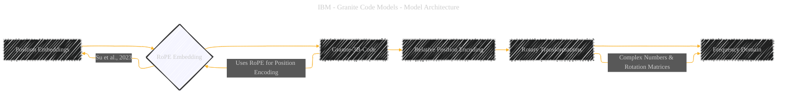

# RoPE Embedding
> **Disclaimer:**
>
> This document contains my personal notes on the topic,
> compiled from publicly available documentation and various cited sources.
> The materials are intended for educational purposes, personal study, and reference.
> The content is dual-licensed:
> 1. **MIT License:** Applies to all code implementations (Swift, Mermaid, and other programming languages).
> 2. **Creative Commons Attribution 4.0 International License (CC BY 4.0):** Applies to all non-code content, including text, explanations, diagrams, and illustrations.
---

## RoPE Embedding - A Diagrammatic Guide 

Based on the original document, here's the Mermaid diagram representing RoPE (Rotary Position Embedding) as it relates to the Granite Code Models:

---

### Explanation

*   **A [Position Embeddings]:** This is the general concept that RoPE falls under. The need for position embeddings comes from the Transformer architecture being inherently order-agnostic.
*   **B {RoPE Embedding}:** This is the main concept of the diagram.
*   **C [Granite-3B-Code]:** Connects the specific model (Granite-3B-Code) to the technique (RoPE), as RoPE is used in this architecture
*   **D [Relative Position Encoding]:** RoPE is a type of relative position encoding. Relative position encodings help the model understand the distances between tokens.
*   **E [Rotary Transformations]:** Key idea behind RoPE is to encode position information using rotation matrices.
*   **F [Frequency Domain]:** Connects the rotary transformations with the frequency domain, as the rotations are performed in this domain.

---
**Licenses:**

- **MIT License:**   - Full text in [LICENSE](LICENSE) file.
- **Creative Commons Attribution 4.0 International:**  - Legal details in [LICENSE-CC-BY](LICENSE-CC-BY) and at [Creative Commons official site](http://creativecommons.org/licenses/by/4.0/).

---