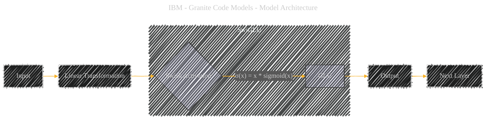

# SwiGLU
> **Disclaimer:**
>
> This document contains my personal notes on the topic,
> compiled from publicly available documentation and various cited sources.
> The materials are intended for educational purposes, personal study, and reference.
> The content is dual-licensed:
> 1. **MIT License:** Applies to all code implementations (Swift, Mermaid, and other programming languages).
> 2. **Creative Commons Attribution 4.0 International License (CC BY 4.0):** Applies to all non-code content, including text, explanations, diagrams, and illustrations.
---

## SwiGLU - A Diagrammatic Guide 

**Concept:**  `SwiGLU` (Swish-Gated Linear Unit) is used as an activation function within the Multi-Layer Perceptron (MLP) block in some of the Granite Code models.

**Diagram Type:** Directed Graph.  This best illustrates the flow of data through the activation and its role in the model.

**Nodes:**

*   `Input`: Input to the MLP block (before activation).
*   `Linear Transformation`:  A linear layer within the MLP.
*   `Swish`: The Swish activation function (σ(x) = x * sigmoid(x)).
*   `GLU`:  Gated Linear Unit.  This modulates the output of the Swish activation.
*   `Output`: Output of the SwiGLU activation (to the next layer).

**Edges:**

*   Directed edges showing the flow of data.
*   Annotations with the relevant equations.

**Mermaid Code:**

---

### Explanation and Considerations

*   **Focus:** This diagram specifically highlights how SwiGLU integrates within the MLP layer.
*   **Equations:** I've included the core equation for the Swish activation as an edge label.
*   **Conciseness:** The diagram is very compact, focusing on the key components.
*   **Model Specificity**  Note that this SwiGLU is used primarily in the smaller Granite Code models (3B, 8B), and is replaced with GELU in the larger models.

---
**Licenses:**

- **MIT License:**   - Full text in [LICENSE](LICENSE) file.
- **Creative Commons Attribution 4.0 International:**  - Legal details in [LICENSE-CC-BY](LICENSE-CC-BY) and at [Creative Commons official site](http://creativecommons.org/licenses/by/4.0/).

---