# Transformer Decoder Architecture Used in the Granite Code Models
> **Disclaimer:**
>
> This document contains my personal notes on the topic,
> compiled from publicly available documentation and various cited sources.
> The materials are intended for educational purposes, personal study, and reference.
> The content is dual-licensed:
> 1. **MIT License:** Applies to all code implementations (Swift, Mermaid, and other programming languages).
> 2. **Creative Commons Attribution 4.0 International License (CC BY 4.0):** Applies to all non-code content, including text, explanations, diagrams, and illustrations.
---

## Transformer Decoder - A Diagrammatic Guide 

The diagram below provides a good overview of the transformer decoder architecture, emphasizing the specific components and configurations used in the Granite Code models.

**Concept:**  The core components of the Transformer Decoder as used in Granite Code Models. This will use a directed graph.

**Nodes:**

*   `Input Embeddings`: Represents the input token embeddings.
*   `Positional Encoding`: Represents the addition of positional information.
*   `Decoder Layer x N`: Represents the stack of N identical decoder layers.
*   `Pre-Normalization`: RMSNorm or LayerNorm (applied before attention and MLP blocks).
*   `Masked Multi-Head Attention`: Attention mechanism that attends only to preceding tokens.
*   `Grouped-Query Attention`: Attention mechanism with grouped queries.
*   `Multi-Query Attention`: Attention mechanism with multiple queries.
*   `Add & Norm`: Residual connection and normalization.
*   `Feed Forward Network`:  MLP block with SwiGLU or GELU activation.
*   `Linear Layer`: Linear projection layer.
*   `Output Probabilities`: Predicted token probabilities.

**Edges:** Directed edges showing the flow of data and operations.

**Mermaid Code:**

```mermaid
---
title: "IBM - Granite Code Models - Model Architecture"
config:
  layout: elk
  look: handDrawn
  theme: dark
---
%%%%%%%% Mermaid version v11.4.1-b.14
%%%%%%%% Available curve styles include the following keywords:
%% basis, bumpX, bumpY, cardinal, catmullRom, linear, monotoneX, monotoneY, natural, step, stepAfter, stepBefore.
%%{
  init: {
    "graph": { "htmlLabels": true, 'curve': 'linear' },
    'fontFamily': 'Fantasy',
    'themeVariables': {
      'primaryColor': '#BB2528',
      'primaryTextColor': '#f529',
      'primaryBorderColor': '#7C0000',
      'lineColor': '#F8B229',
      'secondaryColor': '#006100',
      'tertiaryColor': '#fff'
    }
  }
}%%
graph LR
    A[Input Embeddings] --> B(Positional Encoding)
    B --> C("Pre-Normalization")
    C --> D{"Decoder Layer x N"}
    D --> E["Masked Multi-Head Attention / GQA / MQA"]
    E --> F("Add & Norm")
    F --> G["Feed Forward Network<br>(SwiGLU / GELU)"]
    G --> H("Add & Norm")
    H --> I[Linear Layer]
    I --> J(Output Probabilities)

    style J fill:#ccf3,stroke:#333,stroke-width:2px
     style B fill:#dde3,stroke:#333,stroke-width:1px
    style C fill:#dde3,stroke:#333,stroke-width:1px
     style E fill:#dde3,stroke:#333,stroke-width:1px
    style F fill:#dde3,stroke:#333,stroke-width:1px
     style G fill:#dde3,stroke:#333,stroke-width:1px
    style H fill:#dde3,stroke:#333,stroke-width:1px
     style I fill:#dde3,stroke:#333,stroke-width:1px

    D -- "N Layers<br>(32-88)" --> E
    E -- "Depends on Model Size<br>(3B, 8B, 20B, 34B)" --> F
    G -- "SwiGLU<br>(3B/8B), GELU (20B/34B)" --> H
    C -- "RMSNorm (3B/8B), LayerNorm (20B/34B)" --> E
    
```

Key improvements and explanations:

*   **Specific Attention Types:** Instead of a single "Attention" node, I included the variations used (MHA, GQA, MQA) and noted which model sizes used them as annotations.
*   **Activation Functions:** Included SwiGLU and GELU in the diagram.
*    **Clearer Structure:** Nodes are positioned to represent the processing flow through the decoder.
*   **Emphasis with Style**: Added fill to the `Output Probabilities` to indicate that this is the final stage. Also, other sub-nodes are highlighted to indicate the sub-process.
*   **Annotations:** Added details about layer count and which elements depend on Model size (3B, 8B, 20B, 34B)

---
**Licenses:**

- **MIT License:**   - Full text in [LICENSE](LICENSE) file.
- **Creative Commons Attribution 4.0 International:**  - Legal details in [LICENSE-CC-BY](LICENSE-CC-BY) and at [Creative Commons official site](http://creativecommons.org/licenses/by/4.0/).

---