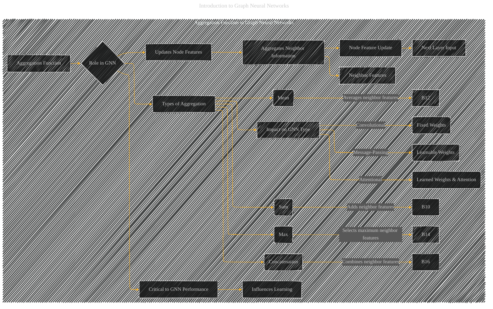

# Aggregation Function in Graph Neural Networks
> **Disclaimer:**
>
> This document contains my personal notes on the topic,
> compiled from publicly available documentation and various cited sources.
> The materials are intended for educational purposes, personal study, and reference.
> The content is dual-licensed:
> 1. **MIT License:** Applies to all code implementations (Swift, Mermaid, and other programming languages).
> 2. **Creative Commons Attribution 4.0 International License (CC BY 4.0):** Applies to all non-code content, including text, explanations, diagrams, and illustrations.
---

## - A Diagrammatic Guide 

DOI:[10.13140/RG.2.2.24239.85922](http://dx.doi.org/10.13140/RG.2.2.24239.85922)

----

### Explanation

This diagram focuses on the role of aggregation functions within a Graph Neural Network (GNN) architecture.

* **Aggregation Function (A):** The central concept, representing the method used to combine information from neighboring nodes.
* **Role in GNN (B):**  Explains the function's importance in updating a node's feature vector.
* **Updates Node Features (B1):**  Describes the primary task of the aggregation function.
* **Aggregates Neighbor Information (B2):**  Details how the function gathers information from a node's neighbors.
* **Neighbor Features (B3):** Represents the individual feature vectors of the neighbors.
* **Node Feature Update (B4):**  Shows the result of the aggregation function; the updated feature vector for the central node.
* **Next Layer Input (B5):**  The updated feature vector becomes the input for the next layer in the GNN.
* **Critical to GNN Performance (B6):** Emphasizes the significance of the aggregation function.
* **Types of Aggregation (B8):** Lists common types of aggregation functions found in the literature.
* **Impact on GNN Type (B17):** Connects the aggregation function to the overall architecture type (convolutional, message-passing, attentional).
* **Fixed Weights (B18):**  Illustrates the concept of fixed weights in convolutional GNNs, where the aggregation weights don't change during training.
* **Learnable Weights (B19):**  Illustrates the concept of learnable weights in message-passing GNNs, where the weights are adjusted during training to optimize performance.
* **Learned Weights & Attention (B20):**  Illustrates the concept of learned weights and attention mechanisms in attentional GNNs, where the weights are learned and used in an attention mechanism to focus on the most relevant neighbors.

---
**Licenses:**

- **MIT License:**   - Full text in [LICENSE](LICENSE) file.
- **Creative Commons Attribution 4.0 International:**  - Legal details in [LICENSE-CC-BY](LICENSE-CC-BY) and at [Creative Commons official site](http://creativecommons.org/licenses/by/4.0/).

---