# Applications of Graph Neural Network
> **Disclaimer:**
>
> This document contains my personal notes on the topic,
> compiled from publicly available documentation and various cited sources.
> The materials are intended for educational purposes, personal study, and reference.
> The content is dual-licensed:
> 1. **MIT License:** Applies to all code implementations (Swift, Mermaid, and other programming languages).
> 2. **Creative Commons Attribution 4.0 International License (CC BY 4.0):** Applies to all non-code content, including text, explanations, diagrams, and illustrations.
---

## Applications of Graph Neural Network - A Diagrammatic Guide 

```mermaid
---
title: "Introduction to Graph Neural Networks"
config:
  layout: elk
  look: handDrawn
  theme: dark
---
%%%%%%%% Mermaid version v11.4.1-b.14
%%%%%%%% Available curve styles include the following keywords:
%% basis, bumpX, bumpY, cardinal, catmullRom, linear, monotoneX, monotoneY, natural, step, stepAfter, stepBefore.
%%{
  init: {
    "graph": { "htmlLabels": true, 'curve': 'linear' },
    'fontFamily': 'Fantasy',
    'themeVariables': {
      'primaryColor': '#BB2528',
      'primaryTextColor': '#f529',
      'primaryBorderColor': '#7C0000',
      'lineColor': '#F8B229',
      'secondaryColor': '#006100',
      'tertiaryColor': '#fff'
    }
  }
}%%
graph TD
    A["Graph Neural Networks<br>(GNNs)"] --> B{"Applications"}

    subgraph Node_Classification["Node Classification"]
        B --> B1["Node Classification"]
        B1 --> B1a["Categorizing nodes based on attributes or relationships"]
        B1 --> B1b["Social networks (roles, interests, group membership)" ]
        B1 --> B1c["Document/video/webpage categorization"]
        B1 --> B1d["Bioinformatics<br>(protein function, protein interactions)"]
    end

    subgraph Link_Prediction["Link Prediction"]
        B --> B2["Link Prediction"]
        B2 --> B2a["Predicting relationships (edges) between nodes"]
        B2 --> B2b["Social networks (present/future relationships)"]
        B2 --> B2c["Recommendation systems<br>(product-customer)"]
        B2 --> B2d["Entity resolution<br>(linking different records of the same entity)"]
        B2 --> B2e["Bioinformatics<br>(drug-disease associations, disease similarity)"]
        B2 --> B2f["Knowledge graph completion<br>(finding new relationships)"]
    end

    subgraph Community_Detection["Community Detection"]
        B --> B3["Community Detection"]
        B3 --> B3a["Clustering nodes based on similarity"]
        B3 --> B3b["Social networks<br>(identifying groups)"]
        B3 --> B3c["Entity resolution"]
        B3 --> B3d["Fraud detection"]
        B3 --> B3e["Text clustering<br>(e.g., Reddit posts)"]
        B3 --> B3f["Visualization"]
    end


    subgraph Node_Edge_Regression["Node Edge Regression"]
        B --> B4["Node/Edge Regression"]
        B4 --> B4a["Predicting numerical values associated with nodes or edges"]
        B4 --> B4b["Traffic prediction<br>(speed, volume)"]
        B4 --> B4c["House prices"]
        B4 --> B4d["Weather characteristics"]
        B4 --> B4e["Internet traffic"]
    end

    subgraph Graph_Classification_Regression["Graph Classification Regression"]
        B --> B5["Graph Classification/Regression"]
        B5 --> B5a["Predicting properties of entire graphs"]
        B5 --> B5b["Molecule property prediction<br>(materials science, drug discovery)"]
        B5 --> B5c["High accuracy with sufficient labeled data"]
        B5 --> B5d["Challenges with limited labeled data (self-supervised approaches)"]

    end

```

---

### Explanation

* **Hierarchical Structure:** The diagram groups applications into meaningful categories (Node Classification, Link Prediction, etc.) using subgraphs, mirroring the previous diagram structure.
* **Clarity and Conciseness:**  Each application is represented by a concise label.
* **Detailed Descriptions (Implicit):** The relationships within each subgraph imply the various aspects of each application, as described in the original text. For example, "Social networks (roles, interests, group membership)" under "Node Classification" shows various applications of node classification in social contexts.
* **Contextual Connections:**  The arrows connecting the applications to the main "Applications" box emphasize the relationship to GNNs as the method for performing these tasks.

This improved diagram provides a more visually clear and organized representation of the diverse applications of GNNs, as described in the original text.  Remember that these are just the *categories*, and further detail can be added by annotating the nodes with specific examples or relevant equations. For example, the `Node Classification` category could include more specific sub-nodes for particular domains like social network analysis, bioinformatics, etc.

---
**Licenses:**

- **MIT License:**   - Full text in [LICENSE](LICENSE) file.
- **Creative Commons Attribution 4.0 International:**  - Legal details in [LICENSE-CC-BY](LICENSE-CC-BY) and at [Creative Commons official site](http://creativecommons.org/licenses/by/4.0/).

---