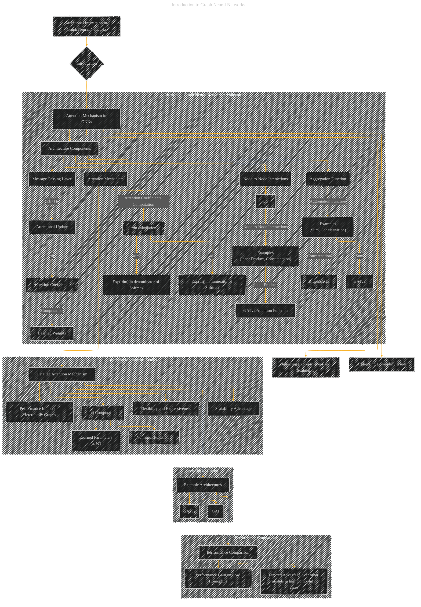

# Attentional Interaction in Graph Neural Networks
> **Disclaimer:**
>
> This document contains my personal notes on the topic,
> compiled from publicly available documentation and various cited sources.
> The materials are intended for educational purposes, personal study, and reference.
> The content is dual-licensed:
> 1. **MIT License:** Applies to all code implementations (Swift, Mermaid, and other programming languages).
> 2. **Creative Commons Attribution 4.0 International License (CC BY 4.0):** Applies to all non-code content, including text, explanations, diagrams, and illustrations.
---

## Attentional Interaction in Graph Neural Networks - A Diagrammatic Guide 

Below is an improved diagram providing a more focused and detailed visual representation of the attentional interaction in graph neural networks, allowing for a deeper understanding of its role and behavior. 

---

### Explanation and Improvements

* **Clearer Structure:** The diagram now focuses specifically on the attentional interaction, with subgraphs to elaborate on different aspects.
* **Detailed Components:**  Nodes like `Attention Coefficients`, `Nonlinear Function σ`, `Learned Parameters (a, W)`, etc., are explicitly included, allowing for detailed exploration of the attention mechanism.
* **Interaction with Other Concepts:** Connections are shown between attention and message passing, aggregation, and overall architecture, emphasizing the integrated nature of the attention mechanism.
* **Specific Examples:**  The diagram now explicitly links attentional mechanisms to specific architectures like GAT and GATv2.
* **Performance Context:** The diagram includes subgraphs to discuss how attentional GNNs perform compared to other models (GCN, GraphSAGE) on different graph types.
* **Visual Clarity:**  Use of different shapes and colors to distinguish components.

---
**Licenses:**

- **MIT License:**   - Full text in [LICENSE](LICENSE) file.
- **Creative Commons Attribution 4.0 International:**  - Legal details in [LICENSE-CC-BY](LICENSE-CC-BY) and at [Creative Commons official site](http://creativecommons.org/licenses/by/4.0/).

---