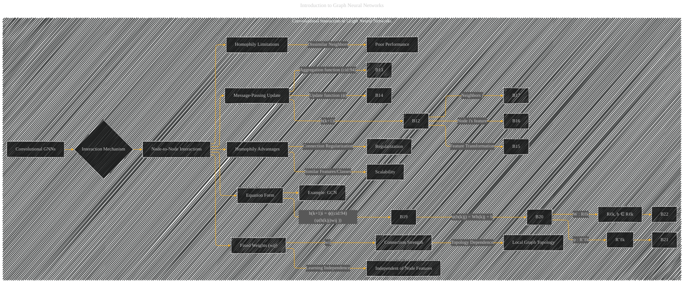

# Convolutional Interaction in Graph Neural Networks
> **Disclaimer:**
>
> This document contains my personal notes on the topic,
> compiled from publicly available documentation and various cited sources.
> The materials are intended for educational purposes, personal study, and reference.
> The content is dual-licensed:
> 1. **MIT License:** Applies to all code implementations (Swift, Mermaid, and other programming languages).
> 2. **Creative Commons Attribution 4.0 International License (CC BY 4.0):** Applies to all non-code content, including text, explanations, diagrams, and illustrations.
---

## Convolutional Interaction in Graph Neural Networks - A Diagrammatic Guide 

---

### Explanation

This Mermaid diagram focuses on the convolutional interaction mechanism within Graph Neural Networks (GNNs), specifically highlighting the role of fixed weights and their implications.

* **Convolutional GNNs (A):** The top-level node.
* **Interaction Mechanism (B):**  The core concept.  Explores how nodes interact within the convolutional framework.
* **Node-to-Node Interactions (B1):**  The critical element.  Focuses on the fixed weights (`wij`) that determine the strength of connections between nodes.
* **Fixed Weights (wij) (B2):** These weights are crucial; they are *not* learned during training. They depend solely on the local graph topology and the connections between nodes.
* **Connection Strength (B3):** The fixed weights represent the strength of the connection between node pairs.  A higher weight indicates a stronger influence.
* **Local Graph Topology (B4):** The weights are derived from the inherent structure of the graph, not the node features themselves.
* **Homophily Advantages (B6):**  In graphs exhibiting homophily (nodes with similar features or classes tend to be connected), the fixed weights are often beneficial for scalability and regularization.
* **Homophily Limitations (B9):**  For graphs with less homophily, fixed weights may not capture complex relationships well, leading to poor performance if adjacent nodes have dissimilar characteristics.
* **Message-Passing Update (B11):**  Illustrates the basic structure of the convolutional message-passing process.
* **Update Function (ϕ) (B14):** Shows the transformation applied on the aggregate of neighbor features.
* **Equation Form (B18):**  Shows the general mathematical formulation of the convolutional interaction.  Includes aggregation function ((cid:94)) and the transformation function (ψ).  This should be accompanied by a clear explanation of the variables involved (e.g., `h(k)i`, `wij`, etc.).
* **Example: GCN (B23):**  Provides a specific example of a convolutional GNN (e.g., Graph Convolutional Network) to ground the abstract concept.

---
**Licenses:**

- **MIT License:**   - Full text in [LICENSE](LICENSE) file.
- **Creative Commons Attribution 4.0 International:**  - Legal details in [LICENSE-CC-BY](LICENSE-CC-BY) and at [Creative Commons official site](http://creativecommons.org/licenses/by/4.0/).

---