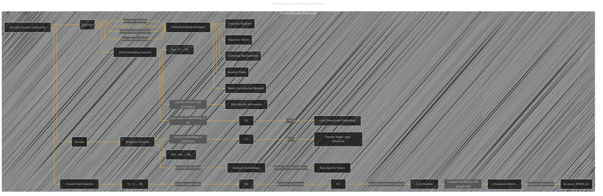

# Encoder-Decoder Frameworks
> **Disclaimer:**
>
> This document contains my personal notes on the topic,
> compiled from publicly available documentation and various cited sources.
> The materials are intended for educational purposes, personal study, and reference.
> The content is dual-licensed:
> 1. **MIT License:** Applies to all code implementations (Swift, Mermaid, and other programming languages).
> 2. **Creative Commons Attribution 4.0 International License (CC BY 4.0):** Applies to all non-code content, including text, explanations, diagrams, and illustrations.
---

## Encoder-Decoder Framework - A Diagrammatic Guide 

DOI: [10.13140/RG.2.2.30111.88482](http://dx.doi.org/10.13140/RG.2.2.30111.88482)

----

### Explanation of the Diagram

* **Encoder (B):**  The encoder takes a node (or graph) as input and produces a low-dimensional vector representation called a *node embedding*.  This embedding contains relevant information about the node that's necessary for the task.  Crucially, it handles the irregular structure of graphs (unlike traditional array-based models) by considering both node attributes and edge information.  The notation `Enc : N → Rℓ` emphasizes the function's input (nodes) and output (low-dimensional vectors).  The `B3` and `B4` nodes highlight the importance of reducing dimensionality to avoid issues with high-dimensional, sparse data and to improve the efficiency of the model.

* **Decoder (C):** The decoder takes the node embedding (or graph embedding) as input and produces a prediction for the task at hand.  Crucially, it's not just an inverse function.  The decoder interprets the abstract node embedding and produces the output that solves the task. The notation `Dec : Rm → Rk` highlights the input (node embedding) and output (task prediction).  The `C4` node notes the capability to handle larger input dimensions, which is relevant for graph-structured data that may have numerous node features. `C5` clarifies that the decoder interprets the embedding, rather than simply inverting it.

* **Ground Truth Function (D):** The `Gt` function defines the target values for the task.  It varies depending on the task: for node classification, it's the node's class; for link prediction, it indicates whether an edge exists between two nodes; and for other tasks, it provides the relevant ground truth information.  This ground truth is crucial for training and evaluating the model, as it allows the model to adjust its predictions and understand the relationships between different data points.

* **Loss Functions/Metrics (D):**  Loss functions quantify the difference between the model's prediction and the ground truth, guiding the training process.  Evaluation metrics assess the model's overall performance, providing a measure of accuracy and usefulness. The `D5` node notes the relationship between the loss function and the evaluation metrics, which directly impacts the overall performance and usefulness of the model.

* **Node Embedding Examples (E):**  The diagram highlights common ways to generate node embeddings, including using the adjacency matrix, centrality measures, clustering measurements, matrix factorization, and random walks.  These techniques demonstrate different ways of incorporating structural and attribute information from the graph into the embedding.

This diagram provides a more structured and visually clear representation of the encoder-decoder framework within the context of GNNs, emphasizing the key aspects and examples presented in the original document.

---
**Licenses:**

- **MIT License:**   - Full text in [LICENSE](LICENSE) file.
- **Creative Commons Attribution 4.0 International:**  - Legal details in [LICENSE-CC-BY](LICENSE-CC-BY) and at [Creative Commons official site](http://creativecommons.org/licenses/by/4.0/).

---