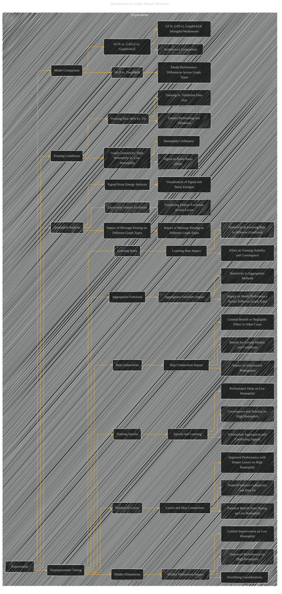

# Experiments
> **Disclaimer:**
>
> This document contains my personal notes on the topic,
> compiled from publicly available documentation and various cited sources.
> The materials are intended for educational purposes, personal study, and reference.
> The content is dual-licensed:
> 1. **MIT License:** Applies to all code implementations (Swift, Mermaid, and other programming languages).
> 2. **Creative Commons Attribution 4.0 International License (CC BY 4.0):** Applies to all non-code content, including text, explanations, diagrams, and illustrations.
---

## Experiments - A Diagrammatic Guide 

The enhanced diagram below provides a visual representation of the experimental procedures and analyses described in the paper, making it easier to understand the overall approach and the specific findings.

---

### Explanation and Diagram Improvements

* **Detailed Breakdown of Experiments:** The diagram now explicitly shows the different aspects of the experimental setup and analysis:  hyperparameter tuning, training conditions, model comparison, and qualitative analysis.
* **Relationships between Concepts:** Arrows clearly connect each experimental aspect (e.g., "Hidden Dimensions" to "Improved Performance on High Homophily").
* **Specific Outcomes:** The diagram now includes more specific outcomes and observations from the experiments. For example, B111 points to "Improved Performance on High Homophily" as a direct outcome of tuning hidden dimensions. This makes the diagram more descriptive and insightful.
* **Qualitative Analysis:** The diagram explicitly shows the qualitative analysis component, including the analysis of signal and noise energies.
* **Hyperparameter Tuning Details:**  The subgraph for hyperparameter tuning now shows the specific hyperparameters tuned and the types of analyses performed (e.g., "Training Epochs" and "Convergence and Stability on High Homophily").
* **Visual Structure:**  The diagram remains clear and well-organized, using different shapes and colors (using `style`) to distinguish between the different components of the experiments.

---
**Licenses:**

- **MIT License:**   - Full text in [LICENSE](LICENSE) file.
- **Creative Commons Attribution 4.0 International:**  - Legal details in [LICENSE-CC-BY](LICENSE-CC-BY) and at [Creative Commons official site](http://creativecommons.org/licenses/by/4.0/).

---