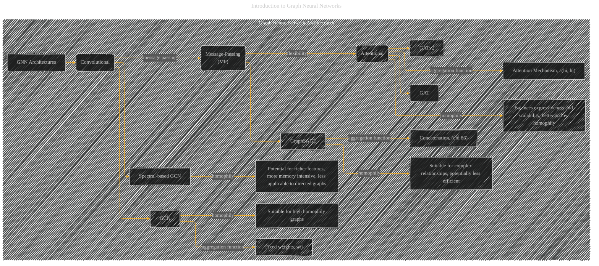

# Graph Neural Network Architectures
> **Disclaimer:**
>
> This document contains my personal notes on the topic,
> compiled from publicly available documentation and various cited sources.
> The materials are intended for educational purposes, personal study, and reference.
> The content is dual-licensed:
> 1. **MIT License:** Applies to all code implementations (Swift, Mermaid, and other programming languages).
> 2. **Creative Commons Attribution 4.0 International License (CC BY 4.0):** Applies to all non-code content, including text, explanations, diagrams, and illustrations.
---

## Graph Neural Network Architectures - A Diagrammatic Guide 

-----

### Explanation and Improvements

* **Categories:** The diagram now clearly distinguishes between Convolutional, Message-Passing (MP), and Attentional GNN architectures, aligning with the paper's classification.
* **Key Differentiators (Aggregation Function):** The diagram highlights the crucial difference between the architectures, focusing on how they handle aggregation of neighbor information:
    * **Convolutional (GCN, Spectral-based GCN):**  Emphasizes fixed weights (`wij`) for aggregation.
    * **Message-Passing (GraphSAGE):**  Shows that it uses concatenation (`(cid:86)`).
    * **Attentional (GAT, GATv2):**  Points to the attention mechanism for node-to-node interactions (`a(hi, hj)`).
* **Homophily Consideration:** The diagram incorporates the paper's discussion of how homophily (similarity of connected nodes) affects the suitability of each architecture. This provides a stronger connection between the architecture and its expected performance on different types of graphs.
* **Architectural Strengths:** The diagram now explicitly highlights the strengths of each architecture in relation to graph characteristics.
* **Conciseness:** The diagram is more concise and focuses on the core elements.
* **Visual Clarity:**  Use of different shapes and colors (using `style`) helps distinguish between different types of concepts (e.g., common applications, GNN layers, experiments).

This improved diagram provides a more effective visual representation of the various GNN architectures and their key characteristics discussed in the paper, particularly regarding the choice of aggregation function and its relationship to graph structure.

---
**Licenses:**

- **MIT License:**   - Full text in [LICENSE](LICENSE) file.
- **Creative Commons Attribution 4.0 International:**  - Legal details in [LICENSE-CC-BY](LICENSE-CC-BY) and at [Creative Commons official site](http://creativecommons.org/licenses/by/4.0/).

---