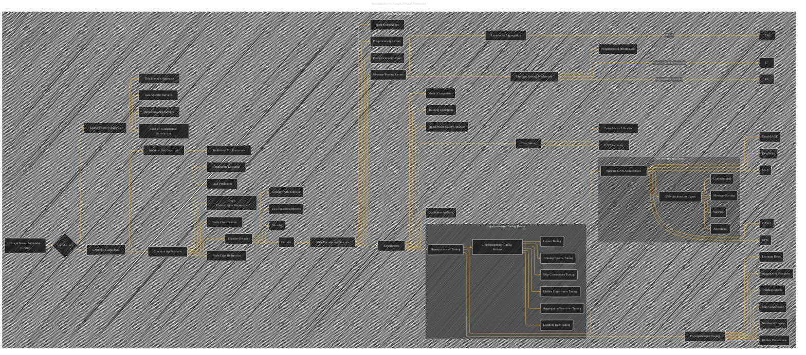

# Graph Neural Networks
> **Disclaimer:**
>
> This document contains my personal notes on the topic,
> compiled from publicly available documentation and various cited sources.
> The materials are intended for educational purposes, personal study, and reference.
> The content is dual-licensed:
> 1. **MIT License:** Applies to all code implementations (Swift, Mermaid, and other programming languages).
> 2. **Creative Commons Attribution 4.0 International License (CC BY 4.0):** Applies to all non-code content, including text, explanations, diagrams, and illustrations.
---

## Graph Neural Networks - A Diagrammatic Guide 

---

### Explanation and Improvements

* **Clearer Structure:** The diagram is reorganized to better reflect the flow of ideas and the hierarchical relationships between concepts.  Sections are now more clearly defined.
* **Specific GNN Architectures:**  Individual nodes are added for specific GNN architectures (GCN, GATv2, GraphSAGE, MLP, DeepWalk) as a separate subgraph,  providing better visual organization.
* **Emphasis on Hyperparameter Tuning:** The hyperparameter tuning process is highlighted with a separate subgraph.
* **Detailed Tuning Parameters:** Explicit parameters like hidden dimensions, training epochs, layers, skip connections, etc., are included in the tuning subgraph.
* **GNN Architecture Types:** A new subgraph for different types of GNN architectures is added, enabling a deeper visualization.
* **Relationship Visualization:** The diagram effectively visualizes the relationships between concepts like hyperparameter tuning, GNN types, common applications, and overall GNN behavior.

This revised diagram is more comprehensive and detailed, capturing the core concepts of the original paper in a clear, organized, and hierarchical structure.  Adding specific details, examples, and inline equations within the nodes would enhance the visual representation further. Remember that each node can be elaborated with further detail. For example, the "Message Passing Mechanism" node can be detailed with different aggregation functions, showing how they influence performance in the `Experiments` subgraph.

---
**Licenses:**

- **MIT License:**   - Full text in [LICENSE](LICENSE) file.
- **Creative Commons Attribution 4.0 International:**  - Legal details in [LICENSE-CC-BY](LICENSE-CC-BY) and at [Creative Commons official site](http://creativecommons.org/licenses/by/4.0/).

---