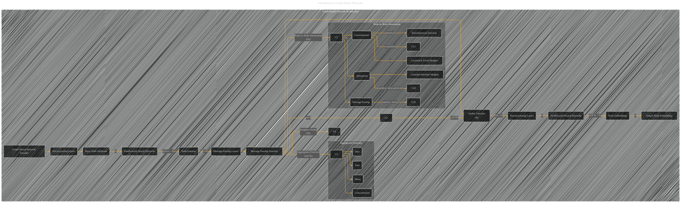

# Graph Neural Networks Architecture
> **Disclaimer:**
>
> This document contains my personal notes on the topic,
> compiled from publicly available documentation and various cited sources.
> The materials are intended for educational purposes, personal study, and reference.
> The content is dual-licensed:
> 1. **MIT License:** Applies to all code implementations (Swift, Mermaid, and other programming languages).
> 2. **Creative Commons Attribution 4.0 International License (CC BY 4.0):** Applies to all non-code content, including text, explanations, diagrams, and illustrations.
---

## Graph Neural Networks Architecture - A Diagrammatic Guide 

DOI:[10.13140/RG.2.2.29692.45441](http://dx.doi.org/10.13140/RG.2.2.29692.45441)

----

### Explanation

This diagram visualizes a typical Graph Neural Network (GNN) encoder architecture, focusing on the message-passing mechanism.  Key elements are:

* **Pre-processing Layers (B):**  These are optional layers that operate on the input node attributes (`xi`) to produce a new set of node features (`˜xi`).  These layers are usually simple feedforward neural networks.

* **Message-Passing Layers (C):**  This is the core of the GNN.  It takes the processed node features (`h(k)i`) and information about the node's neighbors (`Ni`) and their interactions (`µij`) to update the node's features for the next layer (`h(k+1)i`).  The message-passing function (`ϕ`) is crucial for aggregating information.

    * **Aggregation Functions (C3-C10):**  Various ways to aggregate information from neighbors.  Common choices are sum, mean, max, and concatenation.  The diagram shows these as separate branches to highlight their distinct roles.

    * **Node-to-Node Interactions (C5, C11-C18):** How the features of a node interact with the aggregated features of its neighbors.  Different GNN architectures use different types of interactions:
        * **Convolutional (C11):**  Fixed or learned weights (`wij`) are used to modulate the contribution of each neighbor. A transformation function (`ψ`) may be applied to the neighbor's features.
        * **Message Passing (C15):**  A function (`ψ`) directly takes the features of both the current node and its neighbor to determine the interaction.
        * **Attentional (C17):** Learns scalar-valued attention weights (`αij`) to focus on relevant neighbors.  A transformation function (`ψ`) may also be involved.

* **Post-processing Layers (D):**  These layers are also optional and refine the node features (`hi`) produced by the message-passing layers to generate the final node embeddings (`zi`).  They also use feedforward neural networks.

* **Output Node Embeddings (E):** The final representation of each node. These embeddings are used as input for the decoder in downstream tasks.

---
**Licenses:**

- **MIT License:**   - Full text in [LICENSE](LICENSE) file.
- **Creative Commons Attribution 4.0 International:**  - Legal details in [LICENSE-CC-BY](LICENSE-CC-BY) and at [Creative Commons official site](http://creativecommons.org/licenses/by/4.0/).

---