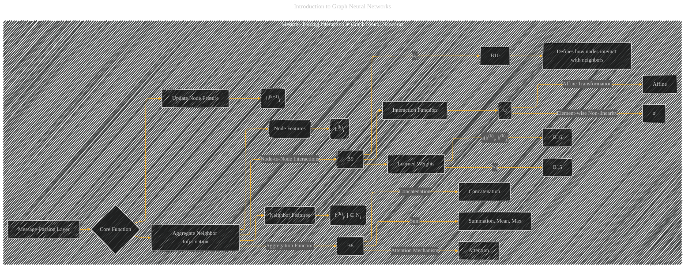

# Message-Passing Interaction in Graph Neural Networks
> **Disclaimer:**
>
> This document contains my personal notes on the topic,
> compiled from publicly available documentation and various cited sources.
> The materials are intended for educational purposes, personal study, and reference.
> The content is dual-licensed:
> 1. **MIT License:** Applies to all code implementations (Swift, Mermaid, and other programming languages).
> 2. **Creative Commons Attribution 4.0 International License (CC BY 4.0):** Applies to all non-code content, including text, explanations, diagrams, and illustrations.
---

## Message-Passing Interaction in Graph Neural Networks - A Diagrammatic Guide 

---

### Explanation and Refinements

* **Hierarchical Structure:** The subgraph clearly delineates the "Message-Passing Interaction in GNNs" concept, making it distinct from other GNN components.

* **Core Function:** The `B` node is the central concept of aggregation and update.
* **Node Features:** `B2` shows the input features at each node in the k-th layer and the output of the k+1-th layer.
* **Neighbor Features:** `B4` denotes the features of neighboring nodes relevant to node `i` in the k-th layer.
* **Aggregation Function:** `B8` highlights that the message-passing layer's primary function is to aggregate information from neighbors,  through specific functions (e.g., Sum, Concatenation, Attention).  Each of these aggregation functions are given their own nodes for clear distinction (e.g., B11).
* **Node-to-Node Interaction:** `B9` shows the way features of node `i` and its neighbors `j` interact in the message-passing process, and is further represented in more detail.
* **Update Node Feature:** `B6` illustrates how the updated feature at node `i` in the k+1 layer is computed.

* **Interaction Function (ψ):** `B18` represents the function that defines how the message is calculated.  The types of this function (e.g., affine transformation, non-linearity) are represented in the diagram with `B19` and `B20`.

* **Learned Weights (wij) and Attention Mechanism (a):** The interaction function may include learned weights (`B14`), which determine the strength of the connection between a node and its neighbors. The use of attention (`B16`) is also illustrated in the diagram.

This refined diagram is more specific and visually distinct, and directly maps the relevant parts of the GNN message-passing mechanism, and explicitly links those with the different types of interaction functions and aggregation mechanisms used by the different GNN architectures. 

---
**Licenses:**

- **MIT License:**   - Full text in [LICENSE](LICENSE) file.
- **Creative Commons Attribution 4.0 International:**  - Legal details in [LICENSE-CC-BY](LICENSE-CC-BY) and at [Creative Commons official site](http://creativecommons.org/licenses/by/4.0/).

---