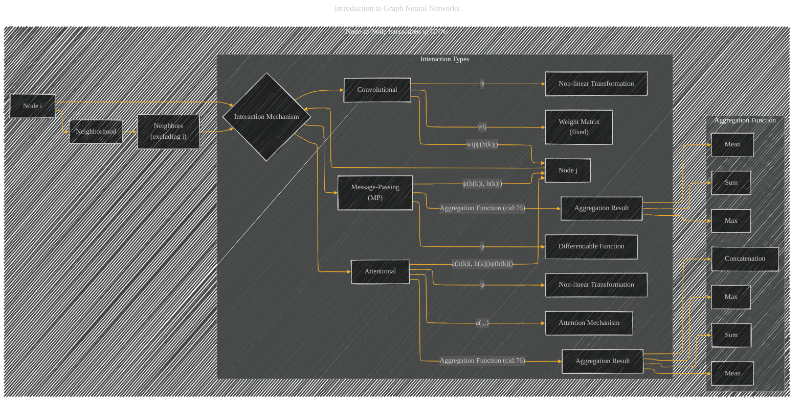

# Node-to-Node Interactions in Graph Neural Networks
> **Disclaimer:**
>
> This document contains my personal notes on the topic,
> compiled from publicly available documentation and various cited sources.
> The materials are intended for educational purposes, personal study, and reference.
> The content is dual-licensed:
> 1. **MIT License:** Applies to all code implementations (Swift, Mermaid, and other programming languages).
> 2. **Creative Commons Attribution 4.0 International License (CC BY 4.0):** Applies to all non-code content, including text, explanations, diagrams, and illustrations.
---

## Node-to-Node Interactions in Graph Neural Networks - A Diagrammatic Guide 

DOI: [10.13140/RG.2.2.14173.52968](http://dx.doi.org/10.13140/RG.2.2.14173.52968)

---

### Explanation

This diagram illustrates the different ways node-to-node interactions are handled within a Graph Neural Network (GNN) architecture. The core idea is that a GNN's message-passing mechanism allows information to flow between nodes, effectively capturing relationships.

* **Node i:** Represents the central node for which we're considering interactions.
* **Neighborhood:** The set of nodes directly connected to node `i`.  The `B1` node is crucial, specifically excluding node `i` itself.
* **Interaction Mechanism (C):**  This is the central decision point, determining how node `i` processes information from its neighbors.
* **Interaction Types (subgraph):**  The different categories of GNN architectures and their corresponding interaction methods are presented.
* **Convolutional (C1):**  Node `i` receives messages from its neighbors (`D`) weighted by the `wij` matrix and the non-linear transformation `ψ`. The weights `wij` are fixed and usually depend on the graph's topology, encoding the strength of connections.  This is illustrated by arrows connecting `C1` to `D1` and `D2`.
* **Message-Passing (MP) (C2):**  Node `i` receives messages from neighbors (`D`) where the interaction between nodes `i` and `j` is described by the differentiable function `ψ(h(k)i, h(k)j)`. This interaction is not limited to simple weights, it's a more general function.  This is more complex and flexible, allowing the model to learn more sophisticated relationships.
* **Attentional (C3):**  Node `i` receives weighted messages from neighbors (`D`). The weights are learned through an attention mechanism (`a(h(k)i, h(k)j)`), allowing the model to focus on more important neighbors for each specific node.  The `a(.,.)` function learns the relative importance of connections based on the node features.
* **Aggregation Functions (subgraph):** Shows how the aggregated messages are combined.
    *  `Sum`, `Mean`, `Max`: Basic aggregation methods used in some GNN architectures.
    * `Concatenation`: This is a specific method used in GraphSAGE, where the feature vectors of neighbors are concatenated.

---
**Licenses:**

- **MIT License:**   - Full text in [LICENSE](LICENSE) file.
- **Creative Commons Attribution 4.0 International:**  - Legal details in [LICENSE-CC-BY](LICENSE-CC-BY) and at [Creative Commons official site](http://creativecommons.org/licenses/by/4.0/).

---