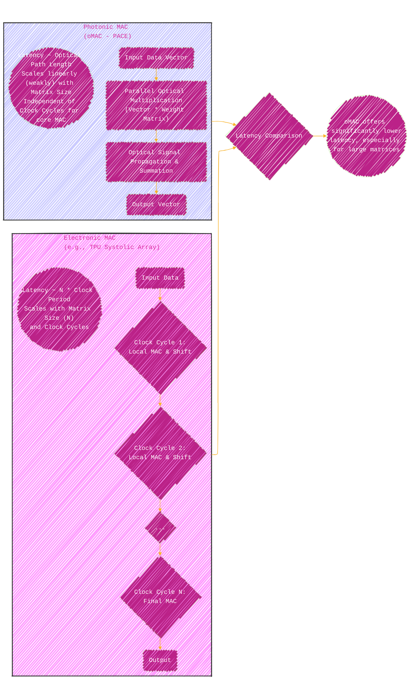
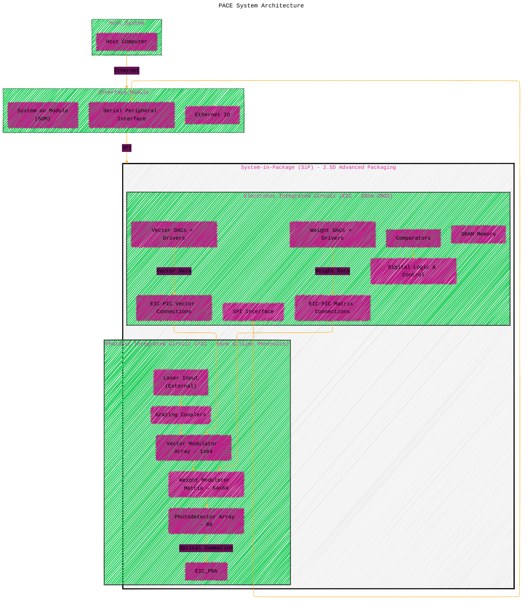
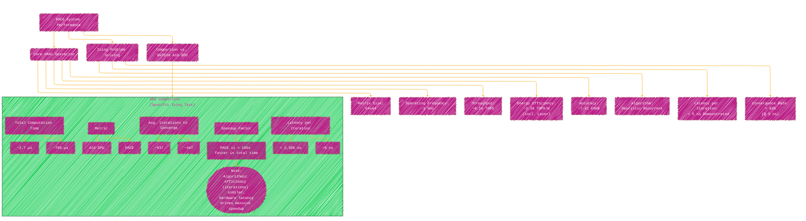

# An integrated large-scale photonic accelerator with ultralow latency - A Diagrammatic Guide 
> **Disclaimer:**
>
> This document contains my personal notes on the topic,
> compiled from publicly available documentation and various cited sources.
> The materials are intended for educational purposes, personal study, and reference.
> The content is dual-licensed:
> 1. **MIT License:** Applies to all code implementations (Swift, Mermaid, and other programming languages).
> 2. **Creative Commons Attribution 4.0 International License (CC BY 4.0):** Applies to all non-code content, including text, explanations, diagrams, and illustrations.
---


## Integrated Photonic Accelerator (PACE) Overview

This diagram provides a high-level overview of the problem context, the proposed solution (PACE system), its key features, and the main application demonstrated.

```mermaid
---
title: "Integrated Photonic Accelerator (PACE) Overview"
author: "Cong Le"
version: "1.0"
license(s): "MIT, CC BY 4.0"
copyright: "Copyright (c) 2025 Cong Le. All Rights Reserved."
config:
  layout: elk
  look: handDrawn
  theme: base
---
%%%%%%%% Mermaid version v11.4.1-b.14
%%%%%%%% Available curve styles include the following keywords:
%% basis, bumpX, bumpY, cardinal, catmullRom, linear, monotoneX, monotoneY, natural, step, stepAfter, stepBefore.
%%{
  init: {
    'graph': { 'htmlLabels': false},
    'fontFamily': 'Monospace',
    'themeVariables': {
      'primaryColor': '#B28',
      'primaryTextColor': '#F82',
      'primaryBorderColor': '#7C33',
      'secondaryColor': '#615',
      'lineColor': '#F8B229'
    }
  }
}%%
mindmap
  root((Integrated Large-Scale Photonic Accelerator))
    ::icon(fa fa-brain)
    **Problem Context**
      Growing AI Compute Demands
      Limitations of Electronic Computing
        Power Consumption
        Latency Bottlenecks (esp. MAC)
      Photonic Computing Promise
        High Speed / Bandwidth
        Low Latency Potential
        Energy Efficiency
      Photonic Scaling Challenges
        ::icon(fa fa-exclamation-triangle)
        Device Consistency & Yield
        Complex Circuit Design/Verification
        Advanced Packaging Needs
        Optical-Electronic Co-integration
        Analogue Accuracy

    **Proposed Solution: PACE System**
      ::icon(fa fa-cogs)
      Photonic Arithmetic Computing Engine
      Target: Linear Matrix Multiply-Accumulate (MAC)
      **Key Features**
        Large Scale: >16,000 Photonic Components
        Matrix Size: 64x64 oMAC
        Hybrid Integration
          Photonic_Integrated_Circuit["Photonic Integrated Circuit (PIC) - Silicon Photonics (65nm)"]
          Electronic_Integrated_Circuit["Electronic Integrated Circuit (EIC) - CMOS (28nm)"]
        Advanced Packaging: 2.5D Flip-Chip SiP (System in Package)
        High Speed: Up to 1 GHz Operation
        Ultralow Latency: < 5 ns demonstrated (potential for 3 ns)
        Accuracy: ~7.61 ENOB for oMAC
        Co_integration["Co-integration: Logic, Memory (SRAM), Control in EIC"]

    **Core Technology**
      ::icon(fa fa-lightbulb)
      Optical_MAC["Optical MAC (oMAC) Operation"]
      Incoherent Light Architecture
      Components
        High-Perf Grating Couplers (~ -1 dB loss)
        Mach-Zehnder Modulators (Vector & Weight)
        Germanium Photodetectors (~ 1 A/W)
      Controllable_Noise_Injection["Controllable Noise Injection (Laser, TIA, Digital) for Algorithm"]

    **Demonstrated Application**
      ::icon(fa fa-puzzle-piece)
      Heuristic Recurrent Algorithm for Ising Problems
      Solves Combinatorial Optimization (NP-complete)
        Graph Max-Cut
        Image Memorization (Cat Example)
      Leverages Ultralow Latency
      Performance
        >92% Convergence Rate (@ 5 ns)
        >100x Faster Total Compute Time vs. NVIDIA A10 GPU

    **Significance**
     ::icon(fa fa-trophy)
     Milestone in Large-Scale Photonic Computing
     Demonstrates Viability of Scaled Integration & Packaging
     Highlights Potential for Latency-Sensitive Applications
     Path Towards Commercialization
     
```


---

## Photonic MAC (oMAC) vs. Electronic MAC (TPU) Latency

This diagram conceptually contrasts the latency scaling behavior of the proposed optical MAC approach with a traditional electronic systolic array (like in a TPU).




----

## PACE System Architecture

This diagram details the architecture of the PACE system, showing the interaction between the Electronic Integrated Circuit (EIC) and the Photonic Integrated Circuit (PIC) within the System-in-Package (SiP).



----

## Heuristic Recurrent Algorithm for Ising Problems (Implemented on PACE)

This flowchart illustrates the steps of the iterative heuristic algorithm used to solve Ising problems on the PACE hardware.


---

## PACE System - Addressing Key Photonic Scaling Challenges

This diagram shows how the design and implementation of the PACE system address the critical challenges faced in scaling integrated photonics.


---

## Performance Summary and Comparison

This diagram summarizes the key performance metrics achieved by the PACE system and compares its Ising problem solving speed to a conventional GPU.




---
**Licenses:**

- **MIT License:**  [](LICENSE) - Full text in [LICENSE](LICENSE) file.
- **Creative Commons Attribution 4.0 International:** [](LICENSE-CC-BY) - Legal details in [LICENSE-CC-BY](LICENSE-CC-BY) and at [Creative Commons official site](http://creativecommons.org/licenses/by/4.0/).

---