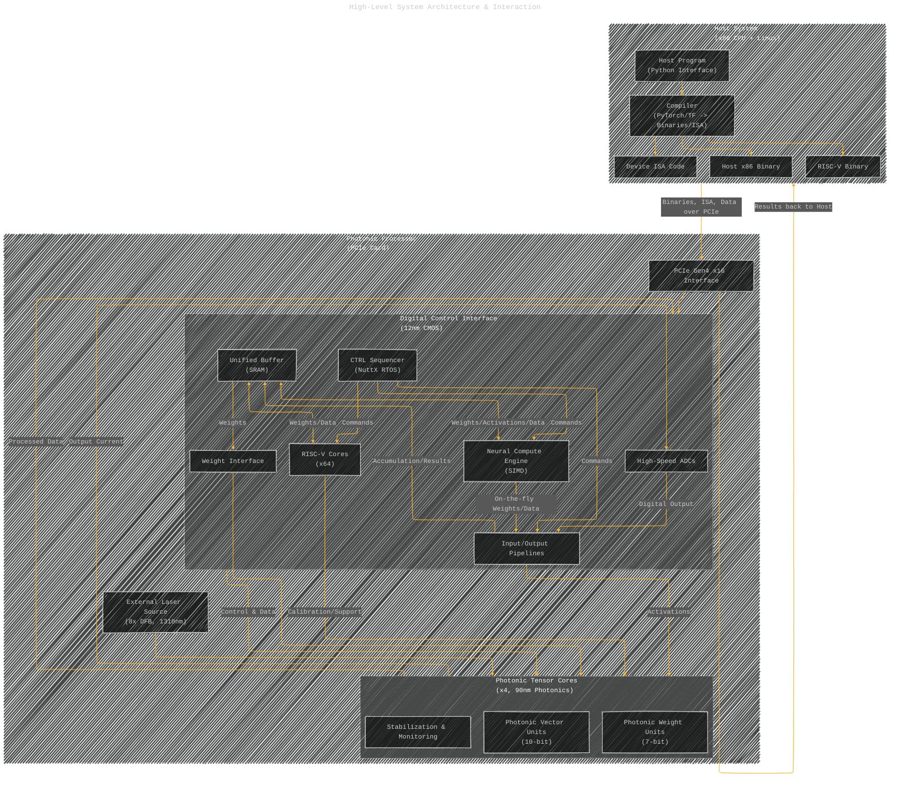
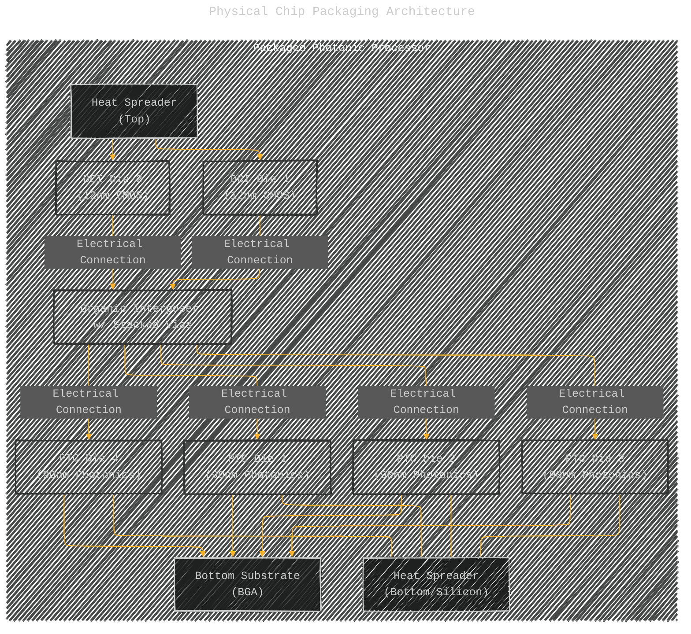
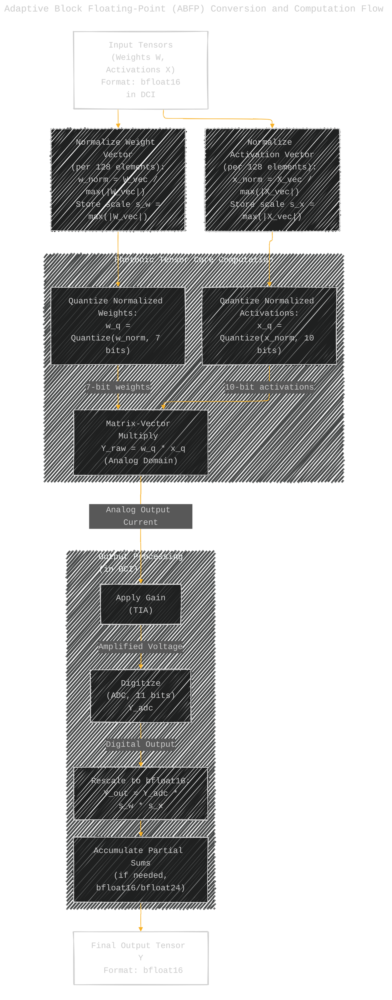
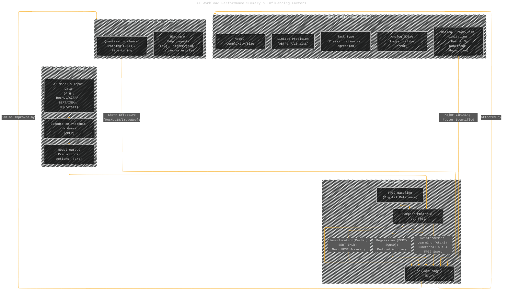

# Universal photonic artificial intelligence acceleration
> **Disclaimer:**
>
> This document contains my personal notes on the topic,
> compiled from publicly available documentation and various cited sources.
> The materials are intended for educational purposes, personal study, and reference.
> The content is dual-licensed:
> 1. **MIT License:** Applies to all code implementations (Swift, Mermaid, and other programming languages).
> 2. **Creative Commons Attribution 4.0 International License (CC BY 4.0):** Applies to all non-code content, including text, explanations, diagrams, and illustrations.
---

## Paper Overview

The paper introduces a novel photonic AI processor designed to address the limitations of traditional electronic hardware posed by the end of Moore's Law and Dennard scaling. Built by Lightmatter, this processor integrates photonic and electronic components (four 90nm Photonic Tensor Cores (PTCs) and two 12nm Digital Control Interface (DCI) chips) in a single package. It aims to perform high-speed, energy-efficient tensor operations, specifically matrix-vector products (MVPs), crucial for AI workloads.

Key achievements highlighted are:
1.  **First Photonic Processor for Advanced AI:** Capable of running complex models like ResNet, BERT, and DeepMind's Atari reinforcement learning algorithms directly.
2.  **Near-Digital Precision:** Achieves accuracies comparable to 32-bit floating-point (FP32) systems on many tasks *without* specialized retraining (like quantization-aware training), using an Adaptive Block Floating-Point (ABFP) format.
3.  **High Integration & Performance:** Combines six chips with high-speed interconnects. It reports a capability of 65.5 TFLOPs (ABFP16) at 78W electrical + 1.6W optical power, though current operation is at a reduced clock speed (500 MHz) due to DCI clock tree issues, with potential for 2 GHz (262 TFLOPS).
4.  **Hybrid Architecture:** Leverages photonics for the core matrix multiplication (within PTCs) and advanced CMOS (12nm DCI) for control, data management (unified buffer, RISC cores, NCE), and high-speed data conversion (ADCs/DACs).

The architecture uses differential light encoding for vectors, hybrid photonic-electronic unit cells for weights, and electrical current summation for outputs. While achieving significant results, limitations include optical power constraints due to silicon nonlinear absorption (affecting gain and thus accuracy on larger models) and the current clock speed bottleneck. Future work focuses on scaling, developing memory-aware network architectures, overcoming material limitations, and potentially using Wavelength Division Multiplexing (WDM).

---
 
## Mermaid Diagrams and Explanations

Here are diagrams illustrating the core concepts:

---

## 1. High-Level System Architecture & Interaction

This diagram shows the main components and the flow of control and data from the host system to the photonic processor.

**Explanation:** The host system compiles the AI model into binaries and instruction sets (ISA). These are sent via PCIe to the Digital Control Interface (DCI) chip. The DCI manages execution using RISC-V cores and a Neural Compute Engine (NCE), storing data in a unified buffer. It sends weights and activation vectors (after conversion) to the Photonic Tensor Cores (PTCs). External lasers provide light. PTCs perform the core matrix-vector product using photonics. The results (electrical currents) are converted back to digital by ADCs in the DCI, processed by pipelines, potentially accumulated, stored back in the buffer, and finally sent back to the host.

---

## 2. Physical Chip Packaging Architecture

This diagram illustrates the physical arrangement of the different chips within the packaged processor, highlighting the 3D integration.

**Explanation:** This shows the vertical stacking. The two large 12nm DCI chips sit on top of an organic interposer. Four smaller 90nm PTC chips are mounted underneath the interposer, allowing direct, high-density electrical connections between the DCI and PTCs. Heat spreaders manage thermal dissipation from both DCI and PTC layers. The entire assembly connects to the outside world via a Ball Grid Array (BGA) on the bottom substrate.

---

## 3. Photonic Tensor Core (PTC) - Conceptual Data Flow for MVP

This simplified diagram illustrates the data flow within a single PTC during a Matrix-Vector Product (MVP) operation.

```mermaid
---
title: "Photonic Tensor Core (PTC) - Conceptual Data Flow for MVP"
author: "Cong Le"
version: "1.0"
license(s): "MIT, CC BY 4.0"
copyright: "Copyright (c) 2025 Cong Le. All Rights Reserved."
config:
  layout: elk
  look: handDrawn
  theme: dark
---
%%%%%%%% Mermaid version v11.4.1-b.14
%%%%%%%% Toggle theme value to `base` to activate the initilization below for the customized theme version.
%%%%%%%% Available curve styles include the following keywords:
%% basis, bumpX, bumpY, cardinal, catmullRom, linear, monotoneX, monotoneY, natural, step, stepAfter, stepBefore.
%%{
  init: {
    'graph': { 'htmlLabels': false, 'curve': 'linear' },
    'fontFamily': 'Monospace',
    'themeVariables': {
      'primaryColor': '#BEF',
      'primaryTextColor': '#55ff',
      'primaryBorderColor': '#7c2',
      'lineColor': '#F8B229',
      'secondaryColor': '#EE2',
      'tertiaryColor': '#fff',
      'stroke':'#3323',
      'stroke-width': '0.5px'
    }
  }
}%%
graph LR
    subgraph DCI_Interface["From/To DCI"]
        WeightsIn["Weights<br/>(7-bit ABFP)"]
        ActivationsIn["Activations<br/>(10-bit ABFP)"]
        OutputDataOut["Partial Sum Out<br/>(bfloat16)"]
    end

    subgraph PTC["Photonic Tensor Core<br/>(Conceptual 128x128)"]
        direction TB
        WeightUnitCells["Weight Unit Cells (128x128)<br/> Hybrid Photodetector + 7-bit DAC"]
        VectorEncoders["Vector Encoders (x128) <br/> 10-bit DAC + MZI Modulator"]

        subgraph PhotonicMesh["Photonic Distribution & Interaction"]
             LightSource["Input Light<br/>(From Laser via Tree)"] --> VectorEncoders
             VectorEncoders -- "Modulated Light<br/>(Represents Activation Vector x)" --> WeightUnitCells
        end

        subgraph ElectricalSummation["Electrical Domain"]
             WeightUnitCells -- "Scaled Photocurrent<br/>(Wij * xi)" --> SummationWires["Differential Current Summation Wires"]
             SummationWires -- "Summed Current<br/>(Σ Wij * xi)" --> TIA_Array["TIA Array<br/>(x128)"]
             TIA_Array -- "Amplified Voltage" --> ADC_Array["ADC Array (x128, 11-bit) <br/> [Located in DCI]"]
        end
    end

    WeightsIn --> WeightUnitCells
    ActivationsIn --> VectorEncoders
    ADC_Array --> OutputDataOut


    style WeightUnitCells fill:#lightcoral,stroke:#333
    style VectorEncoders fill:#lightskyblue,stroke:#333
    style PhotonicMesh fill:#lightyellow,stroke:#333,stroke-dasharray: 5 5
    style ElectricalSummation fill:#lightgrey,stroke:#333,stroke-dasharray: 5 5
    
```

**Explanation:** Within a PTC, activation vector elements (`x`) are encoded onto optical signals using Mach-Zehnder Interferometers (MZIs), driven by DACs (Vector Encoders). These optical signals are distributed to an array of Weight Unit Cells. Each weight unit cell contains a photodetector and a DAC that sets the weight value (`Wij`). The cell multiplies the incoming optical power (representing `xi`) by the programmed weight (`Wij`), producing a proportional photocurrent. The photocurrents from all weight cells corresponding to a single output element are summed electrically along shared wires. This summed current (representing the dot product) is amplified by a Transimpedance Amplifier (TIA) and then converted back to a digital value by a high-speed Analog-to-Digital Converter (ADC), technically located in the DCI but logically part of the PTC output chain.

---

## 4. Adaptive Block Floating-Point (ABFP) Conversion and Computation Flow

This diagram outlines the process of converting standard floating-point numbers to the ABFP format used by the PTC, the computation, and the conversion back.

**Explanation:** Standard bfloat16 weight and activation vectors (handled in the DCI) are converted to the ABFP format before being sent to the PTC. This involves normalizing each 128-element vector by its maximum absolute value (storing this scale factor) and then quantizing the normalized vector to the PTC's precision (7 bits for weights, 10 bits for activations). The PTC performs the multiplication in the analog domain using these quantized values. The resulting analog output is amplified (TIA) and digitized (ADC). Back in the DCI, this digital result is rescaled using the stored scale factors (`s_w` and `s_x`) to convert it back to a bfloat16 representation. Partial results for larger matrix multiplications are accumulated in bfloat16 or bfloat24 precision.

---

## 5. AI Workload Performance Summary & Influencing Factors

This diagram summarizes the processor's performance on different AI tasks and highlights the key factors affecting accuracy.

**Explanation**: The processor runs various AI models. Its output is compared against a standard 32-bit floating-point (FP32) baseline to measure accuracy. Performance is generally close to FP32 for classification tasks but degrades for regression and complex reinforcement learning, primarily attributed to limited optical gain (due to silicon nonlinearities), inherent analog noise, and the limited precision of the ABFP format. Larger models are more affected due to the gain issue. Techniques like Quantization-Aware Training (QAT) can substantially recover lost accuracy by adapting the model to the hardware's characteristics during training.

---
**Licenses:**

- **MIT License:**   - Full text in [LICENSE](LICENSE) file.
- **Creative Commons Attribution 4.0 International:**  - Legal details in [LICENSE-CC-BY](LICENSE-CC-BY) and at [Creative Commons official site](http://creativecommons.org/licenses/by/4.0/).

---