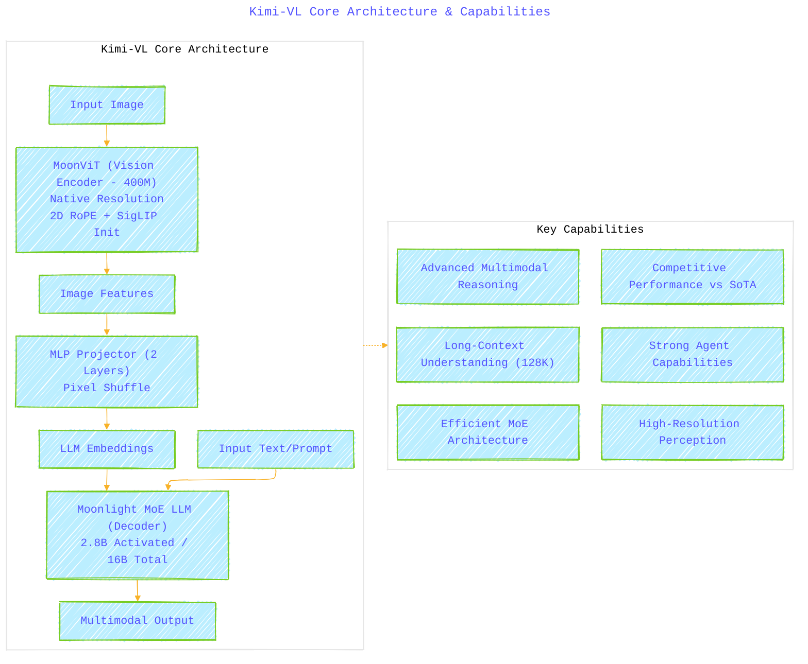
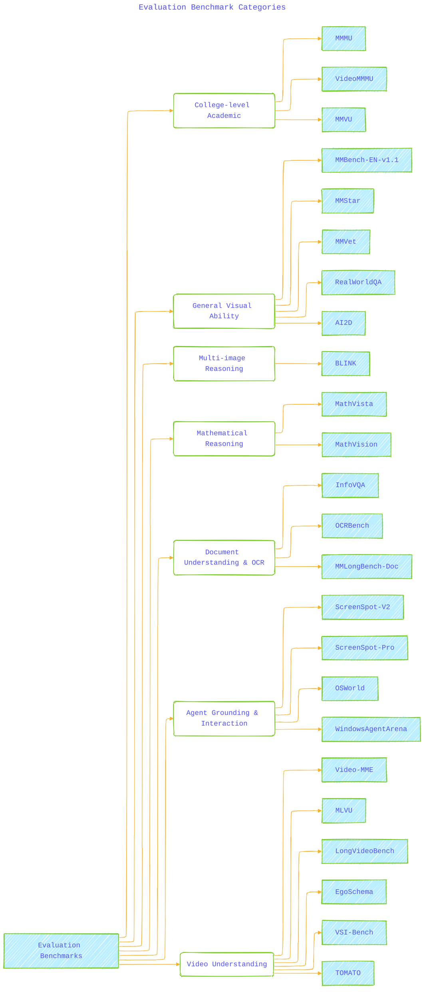

# KIMI-VL TECHNICAL REPORT - A Diagrammatic Guide 
> **Disclaimer:**
>
> This document contains my personal notes on the topic,
> compiled from publicly available documentation and various cited sources.
> The materials are intended for educational purposes, personal study, and reference.
> The content is dual-licensed:
> 1. **MIT License:** Applies to all code implementations (Swift, Mermaid, and other programming languages).
> 2. **Creative Commons Attribution 4.0 International License (CC BY 4.0):** Applies to all non-code content, including text, explanations, diagrams, and illustrations.
---

Here are several Mermaid diagrams illustrating the key concepts extracted from the Kimi-VL Technical Report mindmap structure.

## Diagram 1: Kimi-VL Core Architecture & Capabilities

This diagram shows the main components of the Kimi-VL model and highlights its core capabilities mentioned in the abstract.

**Explanation:** This diagram uses a flowchart (`graph LR` and `graph TB` within subgraphs) to show the flow of information through the model's main architectural components (MoonViT, MLP Projector, MoE LLM) and lists its primary capabilities separately.

---

## Diagram 2: Kimi-VL Training & Development Pipeline

This flowchart outlines the sequential stages involved in training the base Kimi-VL model and the specialized Kimi-VL-Thinking variant.

**Explanation:** This flowchart (`graph TD`) depicts the progression through the various pre-training and post-training stages, highlighting the key inputs and outputs for each stage and the branching leading to the final Kimi-VL and Kimi-VL-Thinking models.

---

## Diagram 3: Data Construction Categories

This mindmap categorizes the different types of data used during the various training phases of Kimi-VL.

**Explanation:** A mindmap is used here to show the hierarchical breakdown of the data sources and types used for pre-training, instruction tuning (SFT), and reasoning enhancement (Long-CoT SFT/RL).

---

## Diagram 4: Evaluation Areas and Key Performance Aspects

This diagram summarizes the major areas where Kimi-VL was evaluated and highlights its standout performance characteristics.

**Explanation:** This flowchart (`graph TD`) categorizes the evaluation approach, summarizing the comparative findings and highlighting the specific domains tested, along with the separate evaluation of the Kimi-VL-Thinking variant.

---

## Diagram 5: Infrastructure Overview

This mindmap provides a high-level view of the storage and parallelism strategies used for training Kimi-VL.

**Explanation:** This mindmap structure effectively outlines the two main aspects of the infrastructure – Storage and Parallelism – detailing the key features and techniques employed within each.

----

## Diagram 6: Kimi-VL-Thinking Enhancement Pipeline

This diagram focuses specifically on the stages that differentiate Kimi-VL-Thinking from the base Kimi-VL model.

```mermaid
---
title: "Kimi-VL-Thinking Enhancement Pipeline"
author: "Cong Le"
version: "1.0"
license(s): "MIT, CC BY 4.0"
copyright: "Copyright (c) 2025 Cong Le. All Rights Reserved."
config:
  layout: elk
  look: handDrawn
  theme: base
---
%%%%%%%% Mermaid version v11.4.1-b.14
%%%%%%%% Toggle theme value to `base` to activate the initilization below for the customized theme version.
%%%%%%%% Available curve styles include the following keywords:
%% basis, bumpX, bumpY, cardinal, catmullRom, linear, monotoneX, monotoneY, natural, step, stepAfter, stepBefore.
%%{
  init: {
    'graph': { 'htmlLabels': false, 'curve': 'linear' },
    'fontFamily': 'Monospace',
    'themeVariables': {
      'primaryColor': '#BEF',
      'primaryTextColor': '#55ff',
      'primaryBorderColor': '#7c2',
      'lineColor': '#F8B229',
      'secondaryColor': '#EE2',
      'tertiaryColor': '#fff',
      'stroke':'#3323',
      'stroke-width': '0.5px'
    }
  }
}%%
graph TD
    subgraph Base_Model
        direction LR
        KimiVL["Kimi-VL<br/>(Post Joint SFT)"]
    end

    subgraph Thinking_Enhancement
        direction TB
        A["Input:<br/>Reasoning QA Data"] --> B{"Generate Reasoning Trajectories"}
        B -- Kimi k1.5 + Prompts --> C("Candidate Trajectories")
        C --> D{Filter & Select}
        D -- Reward Model / Rules --> E["High-Quality Long-CoT Data"]
        E --> F("Stage 1:<br/>Long-CoT SFT")
        F -- Planning, Eval, Reflect, Explore Patterns --> G{"Model Primed for Reasoning"}
        G --> H("Stage 2:<br/>Reinforcement Learning")
        H -- Online Policy Mirror Descent --> I{"Policy Refinement"}
        I -- "Reward (Correctness) & Penalty (Length)" --> J{"Iterative Optimization"}
        J -- Curriculum/Prioritized Sampling --> K["Kimi-VL-Thinking"]
    end

    KimiVL --> A

    style K fill:#cfc,stroke:#333,stroke-width:2px
    
```

**Explanation:** This flowchart details the process of creating the reasoning data (using Kimi k1.5 and filtering) and the subsequent Long-CoT SFT and Reinforcement Learning stages used to produce the Kimi-VL-Thinking variant.

---

## Diagram 7: Evaluation Benchmark Categories

This diagram groups the various benchmarks mentioned in the report according to the capability they primarily assess.

**Explanation:** This uses a tree structure (`graph TD`) to categorize the benchmarks under the main capability areas evaluated in the paper, providing a clearer overview of the testing scope.

---

### Summary of Key Innovations in Kimi-VL:

Beyond the diagrams, here's a concise summary of the core innovations presented:

1.  **Efficient MoE Architecture:** Leverages a Mixture-of-Experts language model (Moonlight) for vision-language tasks, achieving strong performance with significantly fewer *activated* parameters (2.8B) compared to dense models of similar capability.
2.  **Native-Resolution Vision Encoder (MoonViT):** Processes images at their original resolutions without complex patching/stitching, using techniques like NaViT's packing and 2D RoPE for better handling of varying aspect ratios and high resolutions efficiently.
3.  **Integrated Long-Context (128K):** Extends context handling to 128K tokens across both text and multimodal inputs (long documents, long videos) during pre-training stages.
4.  **Long-Thinking Enhancement (Kimi-VL-Thinking):** Introduces a method combining Long-CoT SFT and Reinforcement Learning to explicitly improve multi-step reasoning capabilities on top of the base VLM, allowing the model to "think longer" for complex problems.
5.  **Enhanced Muon Optimizer:** Develops and utilizes a modified Muon optimizer with distributed implementation for efficient training across all model components.
6.  **Comprehensive Data Strategy:** Employs a multi-stage training process with carefully curated and synthesized data across diverse categories (caption, interleaving, OCR, knowledge, agent, video, reasoning) to build robust and varied capabilities.

---
**Licenses:**

- **MIT License:**   - Full text in [LICENSE](LICENSE) file.
- **Creative Commons Attribution 4.0 International:**  - Legal details in [LICENSE-CC-BY](LICENSE-CC-BY) and at [Creative Commons official site](http://creativecommons.org/licenses/by/4.0/).

---