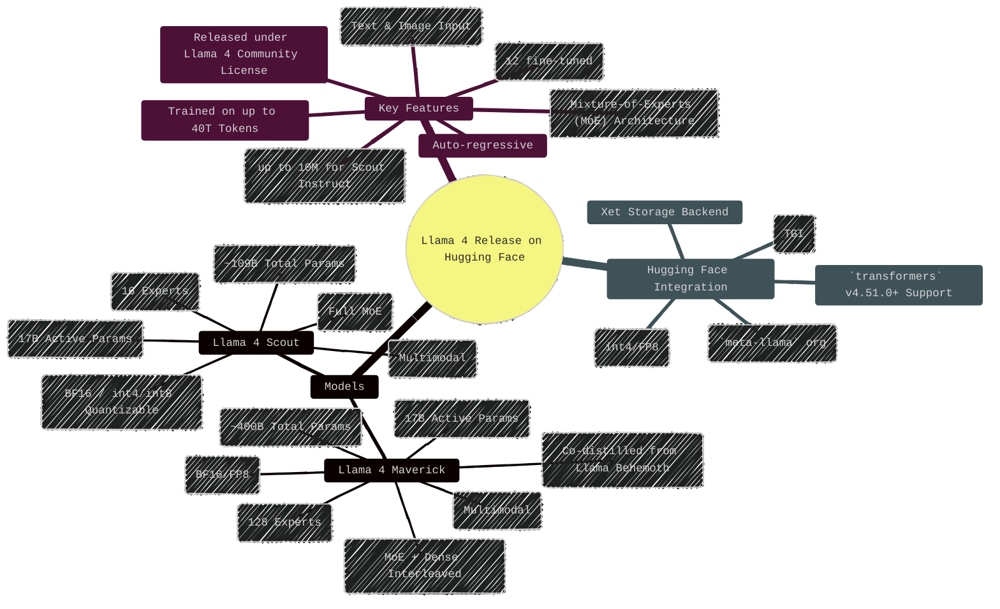
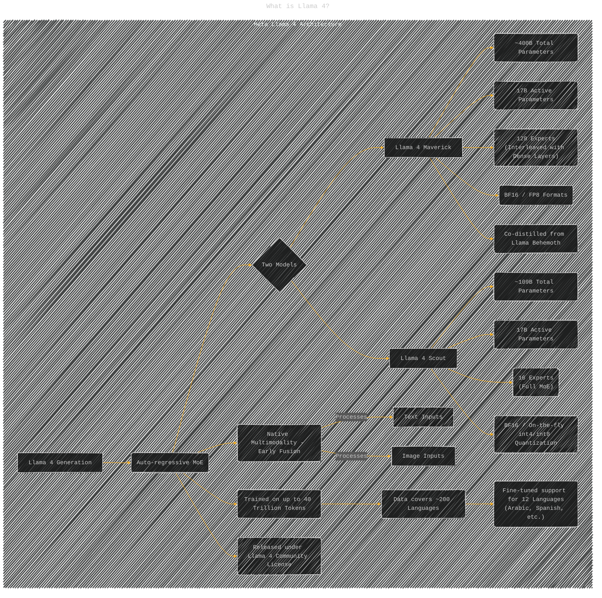
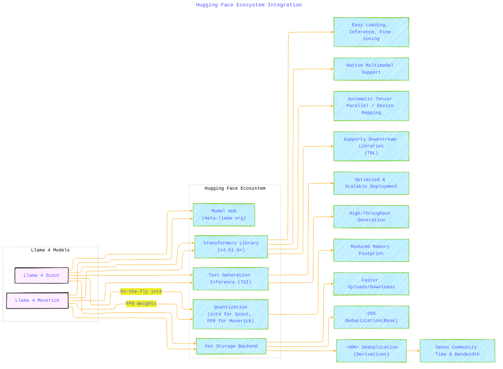
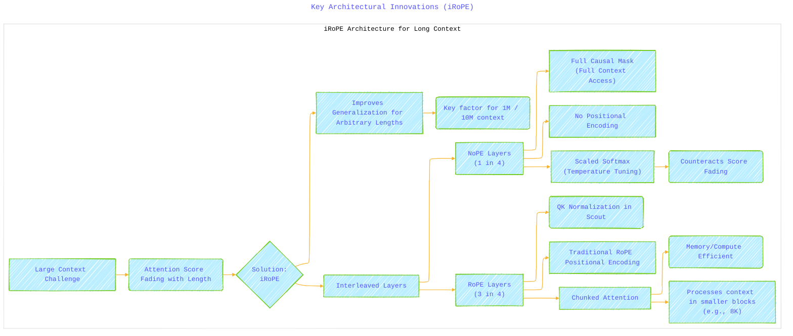
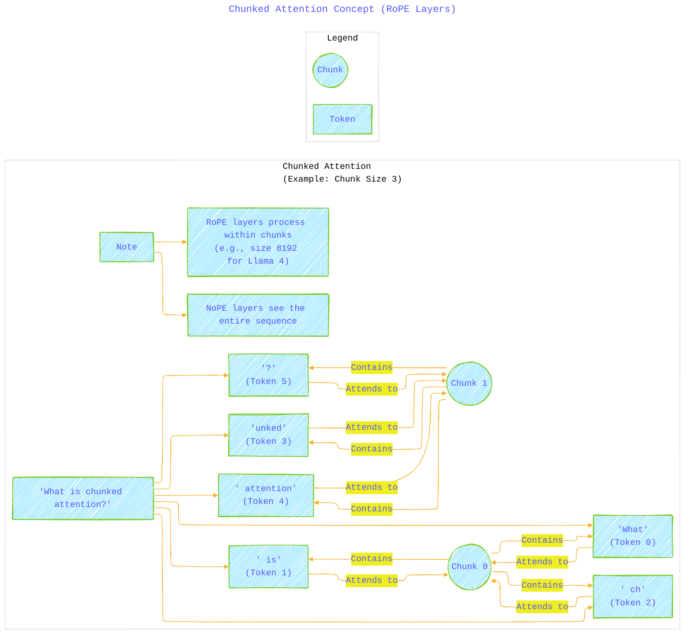
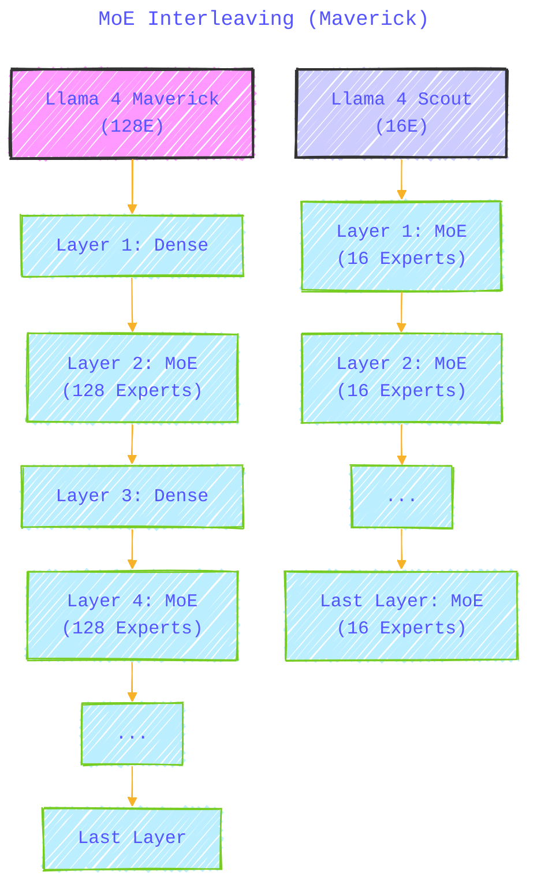
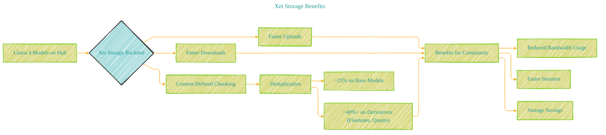
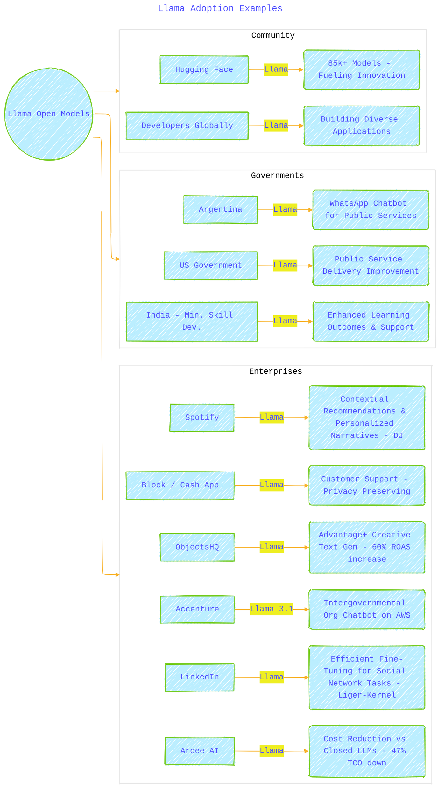
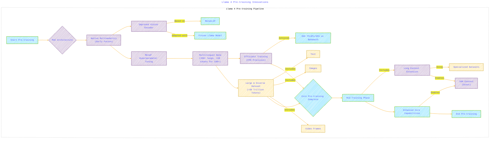
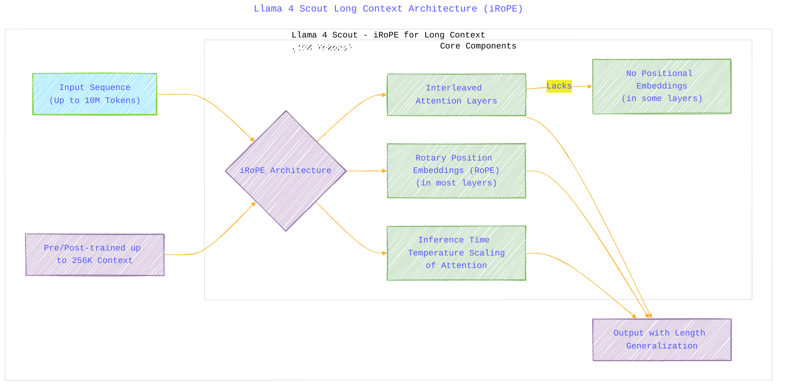

# Llama 4 Comprehensive Overview - A Diagrammatic Guide 
> **Disclaimer:**
>
> This document contains my personal notes on the topic,
> compiled from publicly available documentation and various cited sources.
> The materials are intended for educational purposes, personal study, and reference.
> The content is dual-licensed:
> 1. **MIT License:** Applies to all code implementations (Swift, Mermaid, and other programming languages).
> 2. **Creative Commons Attribution 4.0 International License (CC BY 4.0):** Applies to all non-code content, including text, explanations, diagrams, and illustrations.
---


---

## Llama 4 Introduction on Hugging Face

Meta has released two new powerful, natively multimodal Mixture-of-Experts (MoE) large language models, Llama 4 Maverick and Llama 4 Scout, integrated into the Hugging Face ecosystem.



---


## What is Llama 4?

Llama 4 introduces a new generation of MoE models focusing on performance and efficiency.



---


## Hugging Face Ecosystem Integration

Seamless integration allows immediate use within the Hugging Face ecosystem.



----


## Context Length and Architectural Choices

Llama 4 models support exceptionally large context lengths through innovative architectural designs, especially in the Instruct versions.

**Context Length Summary:**

| Model           | Instruct | Context Length | Architecture Highlights |
| :-------------- | :------: | :------------: | :---------------------- |
| Scout (16E)     |    ✅    |      10M       | iRoPE, QK Norm          |
| Maverick (128E) |    ✅    |       1M       | iRoPE, MoE Interleaving |
| Scout (16E)     |          |      256K      | (Base Pre-training)     |
| Maverick (128E) |          |      256K      | (Base Pre-training)     |

**Key Architectural Innovations (iRoPE):**



---


**Chunked Attention Concept (RoPE Layers):**

Chunked attention allows RoPE layers to operate more efficiently by focusing on local context blocks (e.g., 8192 tokens), while NoPE layers handle the full context.




*(Note: The diagram above simplifies the attention mask concept shown in the ASCII art for clarity within Mermaid's capabilities. Each token attends to tokens within its assigned chunk.)*

----

**MoE Interleaving (Maverick):**




**Other Architectural Notes:**

*   **QK Normalization:** Applied in Scout's RoPE layers (after RoPE embeddings) for improved stability.
*   **Co-distillation:** Maverick learned from a larger model (Llama Behemoth) using a dynamic loss function.
*   **MetaP:** Likely inspired by MuP, used for optimal hyperparameter tuning across dimensions like model size and training budget.

----

## How to Use with Transformers

Using Llama 4 involves installing the latest `transformers` library, handling authentication for model access, and using the `AutoProcessor` and `Llama4ForConditionalGeneration` classes.


---


## Evaluation Scores

Llama 4 Maverick and Scout demonstrate state-of-the-art performance, surpassing previous models like Llama 3.1 405B on various reasoning, knowledge, coding, and multimodal benchmarks. (Refer to the detailed tables in the original document for specific scores).

## Xet Storage Benefits

Using the Xet backend provides significant advantages for downloading and managing these large models.




----


---

## Summary of Key Takeaways & Growth


---

## Llama Model Evolution Timeline (2024)


---


## Llama Ecosystem Overview


---


## Meta AI Assistant: Reach and Integration


---


## Llama Adoption Examples



---


## Future Roadmap (2025 Outlook)


----


---

## Llama 4 Model Family Overview

This diagram provides a high-level view of the new Llama 4 models and their relationship, highlighting the "teacher-student" dynamic with Behemoth.


**Explanation:** This graph shows the three main models in the Llama 4 suite. Behemoth is presented as the large "teacher" model, which influenced the training of the smaller, released "student" models, Scout and Maverick. Key specifications and positioning for each model are included.

----

## Mixture-of-Experts (MoE) Architecture (Llama 4 Maverick Example)

This diagram illustrates the core concept of the MoE architecture as implemented in Llama 4 Maverick.


**Explanation:** This flowchart depicts how a token is processed in an MoE layer. The router sends the token to a mandatory shared expert and selects one additional specialized expert from a large pool. Only these selected experts' parameters are active, leading to computational efficiency despite the large total parameter count. Maverick's specific stats related to MoE are noted.

----

## Llama 4 Pre-training Innovations

This diagram highlights the key techniques and data used during the pre-training phase.




**Explanation:** This flowchart outlines the crucial steps and innovations in the Llama 4 pre-training process. It covers the adoption of MoE, native multimodality via early fusion, vision encoder improvements, MetaP tuning, extensive multilingual data, efficient FP8 training, the vast dataset size, and the mid-training phase for enhancing capabilities like long context.

---

## Llama 4 Maverick Post-training Pipeline

This diagram details the specific supervised fine-tuning (SFT), reinforcement learning (RL), and direct preference optimization (DPO) stages used for Llama 4 Maverick.


**Explanation:** This flowchart illustrates the refined post-training pipeline for Llama 4 Maverick: lightweight SFT on harder data, followed by a continuous online RL phase focusing on difficult prompts, and concluding with lightweight DPO for quality refinement. This approach aims to balance intelligence and conversational ability effectively.

----

## Llama 4 Scout Long Context Architecture (iRoPE)

This diagram conceptualizes the iRoPE architecture enabling Llama 4 Scout's 10M context window.




**Explanation:** This diagram breaks down the iRoPE architecture used in Llama 4 Scout. It highlights the key components: interleaved attention layers (some without positional embeddings), the use of RoPE in most layers, and inference-time temperature scaling. These elements, combined with initial training on a large context, enable the model's advanced length generalization up to 10 million tokens.

----


## Co-distillation Process (Behemoth to Maverick)

This diagram illustrates how Llama 4 Behemoth was used as a teacher model to improve Llama 4 Maverick through co-distillation.


**Explanation:** This flowchart shows the co-distillation process where the larger Behemoth model acts as a teacher for Maverick. Targets (outputs) from Behemoth on training data are used alongside ground truth labels, guided by a dynamic loss function, to improve Maverick's performance during its pre-training. This leverages the power of the larger model efficiently.

----

## Llama 4 Safety and Mitigation Strategy

This diagram outlines the multi-layered approach to safety integrated into Llama 4 development.

```mermaid
---
title: "Llama 4 Safety and Mitigation Strategy"
author: "Cong Le"
version: "1.0"
license(s): "MIT, CC BY 4.0"
copyright: "Copyright (c) 2025 Cong Le. All Rights Reserved."
config:
  look: handDrawn
  theme: base
---
%%%%%%%% Mermaid version v11.4.1-b.14
%%%%%%%% Toggle theme value to `base` to activate the initilization below for the customized theme version.
%%%%%%%% Available curve styles include the following keywords:
%% basis, bumpX, bumpY, cardinal, catmullRom, linear, monotoneX, monotoneY, natural, step, stepAfter, stepBefore.
%%{
  init: {
    'graph': { 'htmlLabels': false, 'curve': 'linear' },
    'fontFamily': 'Monospace',
    'themeVariables': {
      'primaryColor': '#BEF',
      'primaryTextColor': '#55ff',
      'primaryBorderColor': '#7c2',
      'lineColor': '#F8B229',
      'secondaryColor': '#EE2',
      'tertiaryColor': '#fff',
      'stroke':'#3323',
      'stroke-width': '0.5px'
    }
  }
}%%
graph TD
    subgraph SafetyStrategy ["Llama 4 Safety & Mitigation Strategy"]
        direction TB
        A["Goal:<br/>Helpful, Useful, Safe Models"] --> B{Layered Approach}

        subgraph DevelopmentMitigations["Development Mitigations"]
            direction TB
            B --> C[Pre-training]
            C --> C1[Data Filtering]
            C --> C2[Other Data Mitigations]

            B --> D["Post-training"]
            D --> D1["Policy Conformance Techniques"]
            D --> D2["Safety Data Integration<br/>(at each stage)"]
        end

        subgraph SystemLevelTools["System-Level Tools<br/>(Open Source)"]
            direction TB
            B --> E[Tunable System Safeguards]
            E --> F[Llama Guard]
            F -- Detects --> FG["Harmful Input/Output<br/>(Policy-Based)"]
            E --> G[Prompt Guard]
            G -- Detects --> GG["Malicious Prompts<br/>(Jailbreaks, Injections)"]
            E --> H[CyberSecEval]
            H -- Assesses --> HG["Generative AI Cybersecurity Risks"]
            note_for_E["Allows developer customization for specific needs"]
        end

        subgraph EvaluationRedTeaming["Evaluation & Red Teaming"]
            direction TB
            B --> I["Systematic Testing"]
            I --> I1["Wide Range of Scenarios/Use Cases"]
            I --> I2["Data Fed Back into Post-training"]

            B --> J["Adversarial Dynamic Probing"]
            J --> J1["Automated & Manual Testing"]

            B --> K["GOAT<br/>(Generative Offensive Agent Testing)"]
            K --> K1["Simulates Multi-Turn Adversarial Actors"]
            K --> K2["Increases Testing Coverage"]
            K --> K3["Frees Human Red Teams for Novel Areas"]
        end

        B --> L["Bias Reduction Efforts"]
        L --> SeeBiasDiagram["See Separate Bias Diagram"]

        A --> M["Overall Result:<br/>Empowering Developers for Safe Applications"]
    end

    classDef layer fill:#DAE8FC,stroke:#6C8EBF
    class C,D,E,I,J,K,L layer
    classDef tool fill:#D5E8D4,stroke:#82B366
    class F,G,H,K tool
    classDef goal fill:#F8CECC,stroke:#B85450
    class A,M goal
    
```


**Explanation:** This diagram illustrates the comprehensive safety strategy for Llama 4. It encompasses mitigations built-in during pre-training and post-training, open-source system-level tools (Llama Guard, Prompt Guard, CyberSecEval) for developers, and rigorous evaluation methods including automated testing with GOAT and traditional red teaming.

---

## Bias Reduction Efforts and Progress

This diagram summarizes the efforts made to reduce bias in Llama 4 compared to Llama 3.

```mermaid
---
title: "Bias Reduction Efforts and Progress"
author: "Cong Le"
version: "1.0"
license(s): "MIT, CC BY 4.0"
copyright: "Copyright (c) 2025 Cong Le. All Rights Reserved."
config:
  layout: elk
  look: handDrawn
  theme: base
---
%%%%%%%% Mermaid version v11.4.1-b.14
%%%%%%%% Toggle theme value to `base` to activate the initilization below for the customized theme version.
%%%%%%%% Available curve styles include the following keywords:
%% basis, bumpX, bumpY, cardinal, catmullRom, linear, monotoneX, monotoneY, natural, step, stepAfter, stepBefore.
%%{
  init: {
    'graph': { 'htmlLabels': false, 'curve': 'linear' },
    'fontFamily': 'Monospace',
    'themeVariables': {
      'primaryColor': '#BEF',
      'primaryTextColor': '#55ff',
      'primaryBorderColor': '#7c2',
      'lineColor': '#F8B229',
      'secondaryColor': '#EE2',
      'tertiaryColor': '#fff',
      'stroke':'#3323',
      'stroke-width': '0.5px'
    }
  }
}%%
graph TD
    subgraph BiasReduction ["Llama 4 Bias Reduction Efforts"]
        A["Known Issue:<br/>LLMs Tend to Lean Left<br/>(Training Data Bias)"] --> B["Goal:<br/>Remove Bias, Understand/Articulate Multiple Sides"]

        B --> C[Actions Taken]
        C --> C1[Improve Responsiveness]
        C --> C2[Reduce Judgmental Responses]
        C --> C3[Avoid Favoring Specific Viewpoints]

        C --> D["Results & Progress<br/>(Llama 4 vs Llama 3.3)"]
        D -- Refusals --> D1["Refuses Less on Debated Topics<br/>(7% -> <2%)"]
        D -- Balance --> D2["More Balanced Refusals<br/>(Unequal Refusal <1%)"]
        D -- Lean --> D3["Reduced Strong Political Lean<br/>(Rate ~Grok, Half of Llama 3.3)"]

        D --> E[Status:<b/r>Significant Progress Made]
        E --> F[Future:<b/r>Continued Work to Eliminate Bias]

        %% note for D3 "Measured on a contentious set of political/social topics"
    end

    classDef goal fill:#F8CECC,stroke:#B85450
    class B,E,F goal
    classDef action fill:#DAE8FC,stroke:#6C8EBF
    class C,C1,C2,C3 action
    classDef result fill:#D5E8D4,stroke:#82B366
    class D,D1,D2,D3 result
    
```


**Explanation:** This flowchart outlines the acknowledged problem of bias in LLMs, the goal of reducing it in Llama 4, the actions taken, and the measured improvements compared to Llama 3.3, particularly in reducing refusals and political lean on contentious topics. It also acknowledges that this is ongoing work.

---

## Llama 4 Ecosystem and Availability

This diagram shows how developers and users can access and utilize the new Llama 4 models.

```mermaid
---
title: "Llama 4 Ecosystem and Availability"
author: "Cong Le"
version: "1.0"
license(s): "MIT, CC BY 4.0"
copyright: "Copyright (c) 2025 Cong Le. All Rights Reserved."
config:
  layout: elk
  look: handDrawn
  theme: dark
---
%%%%%%%% Mermaid version v11.4.1-b.14
%%%%%%%% Toggle theme value to `base` to activate the initilization below for the customized theme version.
%%%%%%%% Available curve styles include the following keywords:
%% basis, bumpX, bumpY, cardinal, catmullRom, linear, monotoneX, monotoneY, natural, step, stepAfter, stepBefore.
%%{
  init: {
    'graph': { 'htmlLabels': false, 'curve': 'linear' },
    'fontFamily': 'Monospace',
    'themeVariables': {
      'primaryColor': '#BEF',
      'primaryTextColor': '#55ff',
      'primaryBorderColor': '#7c2',
      'lineColor': '#F8B229',
      'secondaryColor': '#EE2',
      'tertiaryColor': '#fff',
      'stroke':'#3323',
      'stroke-width': '0.5px'
    }
  }
}%%
mindmap
  root((Llama 4 Ecosystem & Availability))
    Models
      Llama 4 Scout (Released)
      Llama 4 Maverick (Released)
      Llama 4 Behemoth (In Training)
    Access Points
      Downloads
        llama.com
        Hugging Face
      Cloud & Data Platforms (Coming Soon)
        AWS
        Google Cloud
        Microsoft Azure
        Databricks
        Snowflake
        Oracle Cloud
        Nebius
        Scaleway
        Cloudflare
        IBM Watsonx
      Edge Silicon (Coming Soon)
        AMD
        Arm
        Intel
        Mediatek
        Qualcomm
      Service Integrators (Coming Soon)
        Accenture
        Deloitte
        Infosys
        PwC
        Wipro
      Tools & Libraries
        ollama
        vLLM
        Fireworks AI
        Groq
        Together AI
        Deepinfra
        TensorWave
        CentML
        SambaNova
        Cerebras
        Scale AI
        Sarvam AI
    Product Integrations
      Meta AI
        WhatsApp
        Messenger
        Instagram Direct
        Meta.AI Website
    Community & Events
      Open Source Community
      Developer Resources
      LlamaCon (April 29)
      Kaggle
      DeepLearning.AI
    Partnerships
      Acknowledged companies supporting the ecosystem
      
```


**Explanation:** This mind map provides a broad overview of where and how the Llama 4 models can be accessed and integrated. It covers direct downloads, upcoming availability on major cloud platforms and hardware, integration into Meta products, and community resources.


---
**Licenses:**

- **MIT License:**  [](LICENSE) - Full text in [LICENSE](LICENSE) file.
- **Creative Commons Attribution 4.0 International:** [](LICENSE-CC-BY) - Legal details in [LICENSE-CC-BY](LICENSE-CC-BY) and at [Creative Commons official site](http://creativecommons.org/licenses/by/4.0/).

---