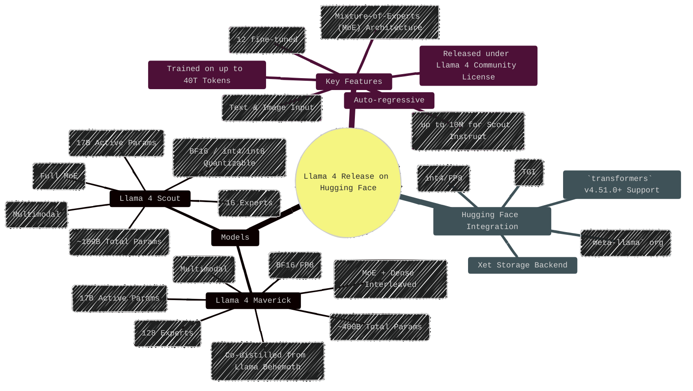
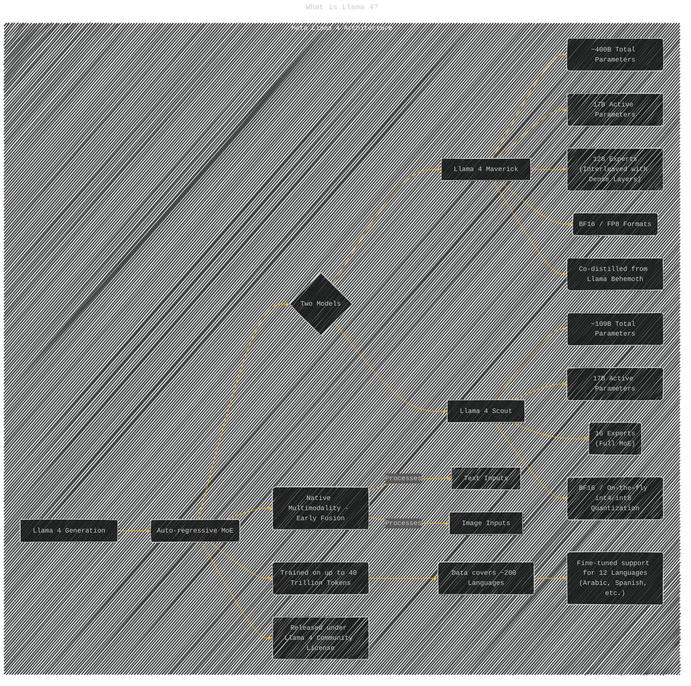
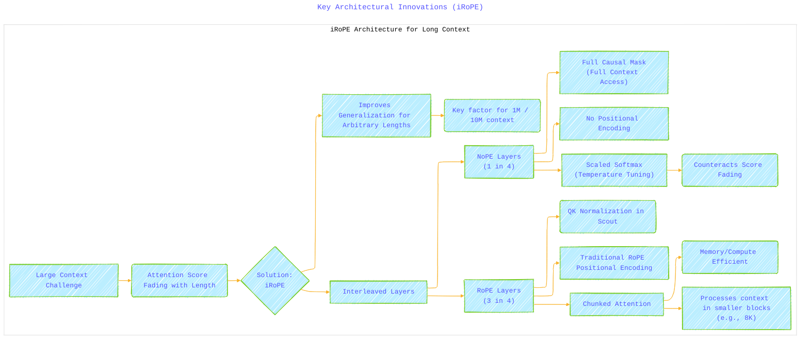
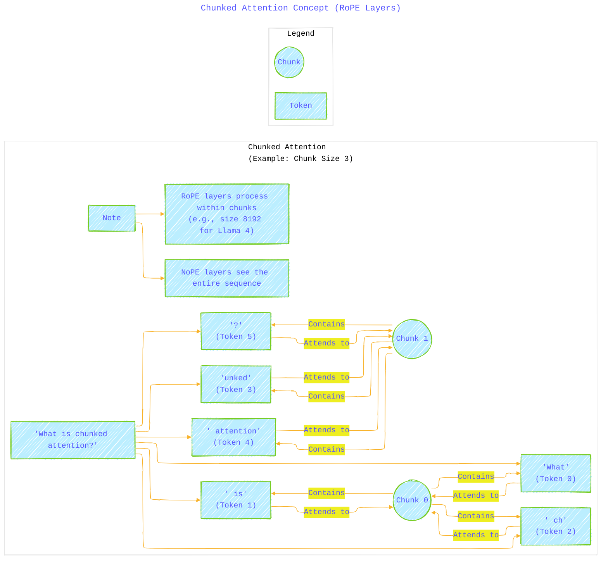
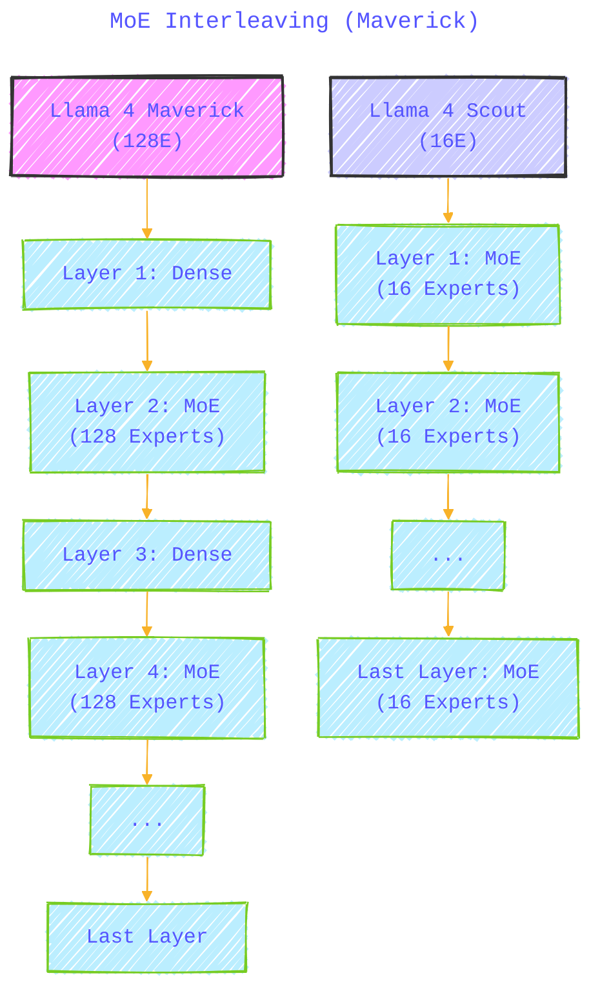
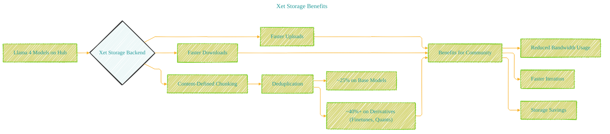

# llama4-release.md on HuggingFace - A Diagrammatic Guide 
> **Disclaimer:**
>
> This document contains my personal notes on the topic,
> compiled from publicly available documentation and various cited sources.
> The materials are intended for educational purposes, personal study, and reference.
> The content is dual-licensed:
> 1. **MIT License:** Applies to all code implementations (Swift, Mermaid, and other programming languages).
> 2. **Creative Commons Attribution 4.0 International License (CC BY 4.0):** Applies to all non-code content, including text, explanations, diagrams, and illustrations.
---

The set of diagrams below aims to visually capture the core information presented in the blog post, breaking down the models, their features, integrations, architecture, usage, and benefits.

## Llama 4 Introduction on Hugging Face

Meta has released two new powerful, natively multimodal Mixture-of-Experts (MoE) large language models, Llama 4 Maverick and Llama 4 Scout, integrated into the Hugging Face ecosystem.

---

## What is Llama 4?

Llama 4 introduces a new generation of MoE models focusing on performance and efficiency.

---

## Hugging Face Ecosystem Integration

Seamless integration allows immediate use within the Hugging Face ecosystem.

----

## Context Length and Architectural Choices

Llama 4 models support exceptionally large context lengths through innovative architectural designs, especially in the Instruct versions.

**Context Length Summary:**

| Model           | Instruct | Context Length | Architecture Highlights |
| :-------------- | :------: | :------------: | :---------------------- |
| Scout (16E)     |    ✅    |      10M       | iRoPE, QK Norm          |
| Maverick (128E) |    ✅    |       1M       | iRoPE, MoE Interleaving |
| Scout (16E)     |          |      256K      | (Base Pre-training)     |
| Maverick (128E) |          |      256K      | (Base Pre-training)     |

**Key Architectural Innovations (iRoPE):**

---

**Chunked Attention Concept (RoPE Layers):**

Chunked attention allows RoPE layers to operate more efficiently by focusing on local context blocks (e.g., 8192 tokens), while NoPE layers handle the full context.

*(Note: The diagram above simplifies the attention mask concept shown in the ASCII art for clarity within Mermaid's capabilities. Each token attends to tokens within its assigned chunk.)*

----

**MoE Interleaving (Maverick):**

**Other Architectural Notes:**

*   **QK Normalization:** Applied in Scout's RoPE layers (after RoPE embeddings) for improved stability.
*   **Co-distillation:** Maverick learned from a larger model (Llama Behemoth) using a dynamic loss function.
*   **MetaP:** Likely inspired by MuP, used for optimal hyperparameter tuning across dimensions like model size and training budget.

----

## How to Use with Transformers

Using Llama 4 involves installing the latest `transformers` library, handling authentication for model access, and using the `AutoProcessor` and `Llama4ForConditionalGeneration` classes.

---

## Evaluation Scores

Llama 4 Maverick and Scout demonstrate state-of-the-art performance, surpassing previous models like Llama 3.1 405B on various reasoning, knowledge, coding, and multimodal benchmarks. (Refer to the detailed tables in the original document for specific scores).

## Xet Storage Benefits

Using the Xet backend provides significant advantages for downloading and managing these large models.

---
**Licenses:**

- **MIT License:**   - Full text in [LICENSE](LICENSE) file.
- **Creative Commons Attribution 4.0 International:**  - Legal details in [LICENSE-CC-BY](LICENSE-CC-BY) and at [Creative Commons official site](http://creativecommons.org/licenses/by/4.0/).

---