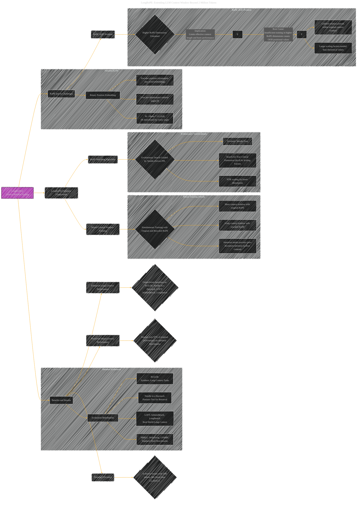

# LongRoPE2: Near-Lossless LLM Context Window Scaling
> **Disclaimer:**
>
> This document contains my personal notes on the topic,
> compiled from publicly available documentation and various cited sources.
> The materials are intended for educational purposes, personal study, and reference.
> The content is dual-licensed:
> 1. **MIT License:** Applies to all code implementations (Swift, Mermaid, and other programming languages).
> 2. **Creative Commons Attribution 4.0 International License (CC BY 4.0):** Applies to all non-code content, including text, explanations, diagrams, and illustrations.
---

## LongRoPE2 Paper Overview - A Diagrammatic Guide 

Here's a breakdown of the "LongRoPE2: Near-Lossless LLM Context Window Scaling" paper, represented using the Mermaid diagram structure provided.  This focuses on the core concepts and relationships.

----

### Explanation of Diagram Elements

*   **Root Node (A):** `LongRoPE2: Context Window Scaling` represents the main topic of the paper.

*   **RoPE and its Challenges (B):** This section outlines the context of the problem – Rotary Position Embeddings and their limitations.
    *   **RoPE OOD Problem (C):** A major focus of the paper, representing the out-of-distribution issue in RoPE at longer context lengths.
        *   **Higher RoPE Dimensions Untrained (D):** Specifies the root cause of the OOD issue, leading to incomplete rotation periods and ultimately performance degradation.

*   **LongRoPE2 Solution Components (B1):** This section outlines the key elements of the proposed solution.
    *   **RoPE Rescaling Algorithm (C1):** Specifies how LongRoPE2 addresses the RoPE OOD problem.
        *   **Evolutionary Search Guided by Needle-Driven PPL (D1):** Details the novel search strategy for optimal scaling factors.
        *   **Synthetic Needle Data (E1):** The use of synthetic data in the perplexity evaluation.
        *   **Search for True Critical Dimension & Scaling Factors (F1):** A description of what the evolutionary search seeks.
        *   **NTK Scaling for Lower Dimensions (G1):** Emphasizes the selective application of scaling factors.
    *   **Mixed Context Window Training (C2):** Specifies how LongRoPE2 maintains short-context performance.
        *   **Simultaneous Training with Original and Rescaled RoPE (D2):** Highlights the dual-training approach.
        *   **Short context window with original RoPE (E2):** This training is with the original RoPE
        *   **Long context window with rescaled RoPE (F2):** This training is with rescaled RoPE
        *   **Attention masks prevent cross-document attention in short contexts (G2):** Highlights how short-context training is isolated.

*   **Benefits and Results (B2):**  This summarizes the advantages of LongRoPE2.
    *   **Enhanced Long-Context Performance (C3):**  Highlights the improved performance on long-context tasks.
        *   **Outperforms baselines on RULER, Needle in a Haystack, LOFT, InfiniteBench, LongBench (D3):**  Provides examples of where LongRoPE2 excels.
    *   **Preserved Short-Context Performance (C4):** Emphasizes the ability to maintain original short-context performance.
        *   **Retains over 97% of original performance on standard benchmarks (D4):** Provides quantitative evidence.
    *   **Training Efficiency (C5):**  Highlights the reduced training costs.
        *   **Achieves results with 10B tokens, 80x fewer than LLaMA3.1 (D5):**  Provides a specific comparison.
*    **Detailed RoPE (BB):** Description of the components
*   **Detailed Evaluation (EE):** Listing of evaluation techniques and benchmarks

---

### Key takeaways

*   The Mermaid diagram effectively captures the hierarchical relationships between concepts.
*   The diagram provides a structured overview of the paper, allowing for easy understanding of the problem, solution, and results.
*   The diagram utilizes subgraphs to group related concepts, enhancing readability and comprehension.

---
**Licenses:**

- **MIT License:**   - Full text in [LICENSE](LICENSE) file.
- **Creative Commons Attribution 4.0 International:**  - Legal details in [LICENSE-CC-BY](LICENSE-CC-BY) and at [Creative Commons official site](http://creativecommons.org/licenses/by/4.0/).

---