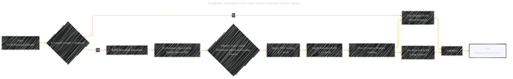

# LongRoPE2: Near-Lossless LLM Context Window Scaling
> **Disclaimer:**
>
> This document contains my personal notes on the topic,
> compiled from publicly available documentation and various cited sources.
> The materials are intended for educational purposes, personal study, and reference.
> The content is dual-licensed:
> 1. **MIT License:** Applies to all code implementations (Swift, Mermaid, and other programming languages).
> 2. **Creative Commons Attribution 4.0 International License (CC BY 4.0):** Applies to all non-code content, including text, explanations, diagrams, and illustrations.
---


## LongRoPE2 Paper Overview - A Diagrammatic Guide 


### Diagram 1: LongRoPE2 Overview - A Mind Map

```mermaid
---
title: "LongRoPE: Extending LLM Context Window Beyond 2 Million Tokens"
config:
  layout: elk
  look: handDrawn
  theme: dark
---
%%%%%%%% Mermaid version v11.4.1-b.14
%%%%%%%% Available curve styles include the following keywords:
%% basis, bumpX, bumpY, cardinal, catmullRom, linear, monotoneX, monotoneY, natural, step, stepAfter, stepBefore.
%%{
  init: {
    "graph": { "htmlLabels": false, 'curve': 'linear' },
    'fontFamily': 'Fantasy',
    'themeVariables': {
      'primaryColor': '#BB2528',
      'primaryTextColor': '#f529',
      'primaryBorderColor': '#7C0000',
      'lineColor': '#F8B229',
      'secondaryColor': '#006100',
      'tertiaryColor': '#fff'
    }
  }
}%%
mindmap
  root((LongRoPE2:<br>Context Window Scaling))
    ## B[RoPE and its Challenges]
      ### C[RoPE OOD Problem]
        #### D[Higher RoPE Dimensions Untrained]
          ##### E Implication: Limits effective context length & hurts performance
          ##### F Root Cause: Insufficient training causes OOD positional values
            ###### G Limited rotation periods
            ###### H Larger scaling factors needed

    ## B1[LongRoPE2 Solution Components]
      ### C1[RoPE Rescaling Algorithm]
        #### D1 Evolutionary Search Guided by Needle-Driven PPL
          ##### E1 Synthetic Needle Data
          ##### F1 ["Search for True Critical Dimension (drcd) & Scaling Factors"]
          ##### G1 NTK scaling for lower dimensions
      ### C2[Mixed Context Window Training]
        #### D2 Simultaneous Training with Original & Rescaled RoPE
          ##### E2 Short context window with original RoPE
          ##### F2 Long context window with rescaled RoPE
          ##### G2 Attention masks prevent cross-document attention

    ## B2[Benefits and Results]
      ### C3[Enhanced Long-Context Performance]
        #### D3 Outperforms baselines on RULER, Needle in a Haystack, LOFT, InfiniteBench, LongBench
      ### C4[Preserved Short-Context Performance]
        #### D4 Retains over 97% of original performance
      ### C5[Training Efficiency]
        #### D5 Achieves results with 10B tokens, 80x fewer than LLaMA3.1

    ## BB[Detailed RoPE]
        ### BB1 Encodes position information into word embeddings
        ### BB2 Uses per-dimensional rotation angles θi
        ### BB3 θi = θbase * i^(-2i/d)
        
    ## EE[Detailed Evaluation]
        ### EE1 RULER: Synthetic Long-Context Tasks
        ### EE2 Needle in a Haystack: Pressure Test for Retrieval
        ### EE3 LOFT, InfiniteBench, LongBench: Real-World Long-Context
        ### EE4 MMLU, HellaSwag, GSM8K: Standard Short Benchmarks
        
```

---


### Diagram 2: The LongRoPE2 Process - A Flowchart



---


### Diagram 3: RoPE Scaling Factors - A Bar Chart (Illustrative)

```mermaid
---
renderTo: '#diagram1'
---
barchart
    title RoPE Scaling Factors (Illustrative)
    xAxis Dimension Index
    yAxis Scaling Factor
    "NTK": 80,80,80,80,80,80,80,80,80,80,80,80,80,80,80,80,80,80,80,80,80,80,80,80,80,80,80,80,80,80,80,80
    "LongRoPE2": 1,1,1,1,1,1,1,1,1,1,1,1,1,1,1,1,1,1,1,1,1,1,1,1,1,64,65,66,67,68,69,70
    "YaRN": 1,1,1,1,1,1,1,1,1,1,1,1,1,1,1,1,1,1,1,1,1,1,1,1,1,64,64,64,64,64,64,64
```

---

### Diagram 4: Key Components Relationship - Component Diagram

```mermaid
componentDiagram
  component Pre-trained LLM
  component Rotary Positional Embedding (RoPE)
  component LongRoPE2 Rescaling Algorithm
  component Mixed Context Window Training
  component Long-Context Performance
  component Short-Context Performance
  
  Pre-trained LLM -- RoPE
  RoPE -- LongRoPE2 Rescaling Algorithm : Addresses OOD Issues
  LongRoPE2 Rescaling Algorithm -- Mixed Context Window Training : Uses rescaled Factors
  Mixed Context Window Training -- Long-Context Performance : Enhances
  Mixed Context Window Training -- Short-Context Performance : Preserves
  LongRoPE2 Rescaling Algorithm ..> Long-Context Performance : Significantly Improves
```

---

### Diagram 5: Ablation Study - a Table (using Markdown for simplicity)

Since Mermaid doesn't have great table support, here's a markdown table (can be displayed properly with Markdown extensions):

```md
| Method                       | MMLU  | GSM8K | RULER (128k) |
| ---------------------------- | ----- | ----- | ------------ |
| LongRoPE2 (Full)           | 70.07 | 73.62 | 58.81        |
| LongRoPE2 (No Mixed Train) | 66.56 | 64.67 | 56.22        |
```


---
**Licenses:**

- **MIT License:**  [](LICENSE) - Full text in [LICENSE](LICENSE) file.
- **Creative Commons Attribution 4.0 International:** [](LICENSE-CC-BY) - Legal details in [LICENSE-CC-BY](LICENSE-CC-BY) and at [Creative Commons official site](http://creativecommons.org/licenses/by/4.0/).

---