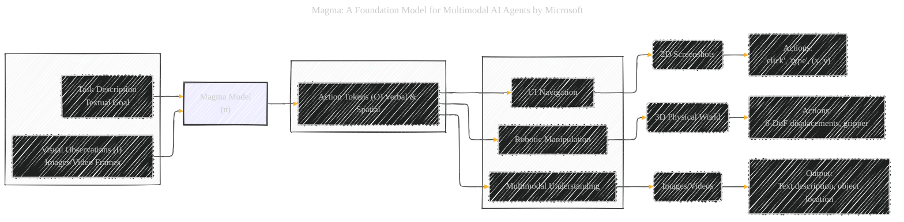
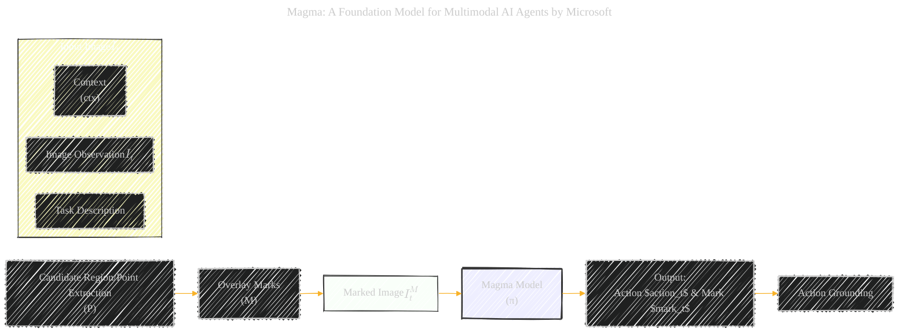
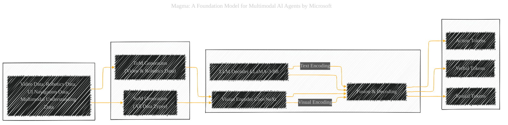
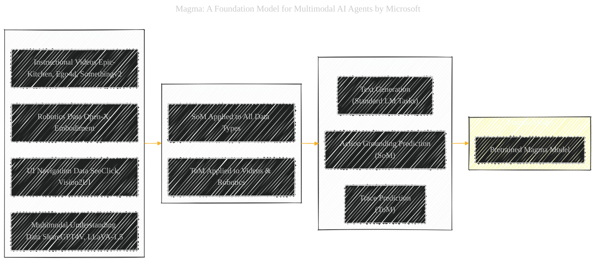
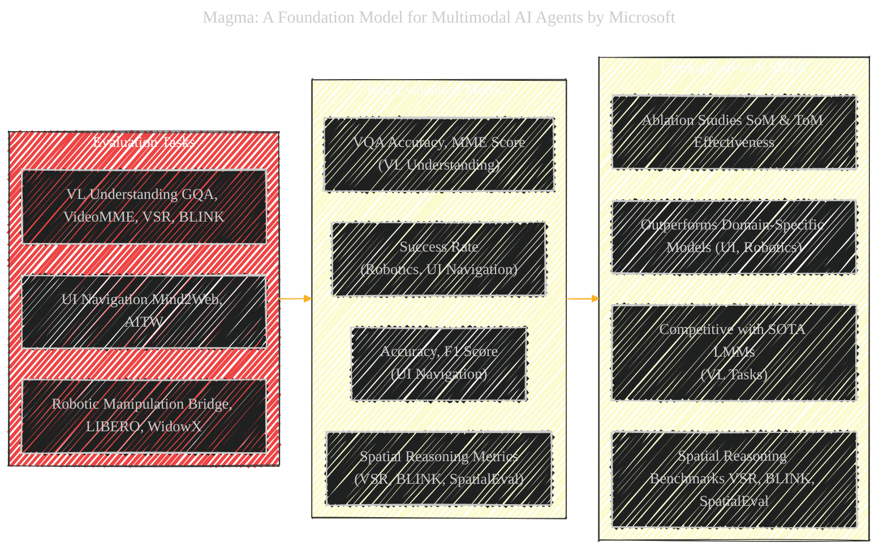

# Magma: A Foundation Model for Multimodal AI Agents
> **Disclaimer:**
>
> This document contains my personal notes on the topic,
> compiled from publicly available documentation and various cited sources.
> The materials are intended for educational purposes, personal study, and reference.
> The content is dual-licensed:
> 1. **MIT License:** Applies to all code implementations (Swift, Mermaid, and other programming languages).
> 2. **Creative Commons Attribution 4.0 International License (CC BY 4.0):** Applies to all non-code content, including text, explanations, diagrams, and illustrations.
---

## Magma - A Diagrammatic Guide 

Below are a collection of diagrams and illustrations using Mermaid syntax to visually represent the core concepts and complexities of the paper.

### Explanation of the Mindmap Diagram:

*   **Central Node:** `Magma: Multimodal AI Agent` serves as the root, representing the core topic.
*   **Branches:** Main branches extend from the root, covering key aspects like `Concept`, `Challenges & Solutions`, `Methodology`, `Architecture`, `Pretraining`, `Evaluation`, and `Contributions`.
*   **Sub-branches:** Each main branch further breaks down into more specific sub-topics, providing a hierarchical view of Magma's key features and details.
*   **Keywords and Phrases:** Nodes are labeled with concise keywords and phrases extracted directly from the paper, making it easy to grasp the essential information at a glance.
*   **Color Coding (Optional):** You can customize the mindmap with colors for different branches to further enhance visual organization if needed.

This mindmap is designed to provide a high-level overview of the Magma model and its key components, making it easy to understand the paper's structure and core message.

---

### Explanation of the System Diagram:

*   **Input Subgraph:**  Clearly defines the inputs to the Magma model: `Visual Observations` (Images/Video Frames) and `Task Description` (Textual Goal).
*   **Magma Model Node:** The central `Magma Model (π)` node, styled distinctively to emphasize its role as the core processing unit.
*   **Output Subgraph:**  Specifies the output as `Action Tokens (O)` which can be both `Verbal & Spatial`, highlighting Magma's multimodal action generation.
*   **Tasks Subgraph:** Lists the three main task categories Magma is designed for: `UI Navigation`, `Robotic Manipulation`, and `Multimodal Understanding`.
*   **Task-Specific Details:**  For each task, the diagram further specifies the environment (2D Screenshots, 3D Physical World, Images/Videos) and the nature of actions or outputs (e.g., "click, type, (x, y)" for UI Navigation, "Text description, object location" for Multimodal Understanding).
*   **Arrows:**  Arrows indicate the flow of information, from inputs to the Magma model, and then to outputs and specific tasks.
*   **Styling:** Subgraphs and the main model node are styled for visual grouping and emphasis.

This diagram provides a clear, system-level view of how Magma works, from input to output across different task domains.

---

### Explanation of the Challenges and Solutions Flowchart:

*   **Start Node:** Begins with "Start" to indicate the initiation of the thought process.
*   **Challenge Nodes (Blue):** Represent key challenges in developing a multimodal AI agent:
    *   `Unified Pretraining Interface?`: Questions the straightforward approach of predicting diverse outputs directly.
    *   `Predict 2D/3D Coordinates & Text?`:  Highlights the initial idea but identifies domain gaps as a problem.
    *   `Action Grounding (SoM)?` and `Action Planning (ToM)?`: Proposes surrogate tasks as solutions.
    *   `Data Scaling-up Challenge?` and `Limited VLA Data?`:  Points out the data scarcity issue for VLA models.
*   **Solution Nodes (Green):**  Showcase Magma's proposed solutions:
    *   `Set-of-Mark (SoM)` and `Trace-of-Mark (ToM)`:  Introduce the core techniques for action grounding and planning.
    *   `Directly Predict 2D/3D Coordinates & Text`: Represents the less effective, direct prediction approach.
    *   `Leverage Unlabeled Video Data`:  Suggests using video data to overcome data limitations.
    *   `Use Existing VLA Data`:  Indicates the use of available vision-language-action datasets.
    *   `Unified Pretraining Achieved`: Marks the successful outcome of applying SoM and ToM.
*   **Decision Nodes (Diamond):**  Represent decision points where the path diverges based on whether a challenge is addressed or a certain approach is taken.
*   **Arrows:**  Arrows guide the flow from challenges to solutions and decisions, illustrating the logical progression of problem-solving.
*   **End Node:** Concludes with "End" to signify the completion of the process.
*   **Styling:** Different node colors and border styles are used to visually distinguish between challenges and solutions.

This flowchart effectively illustrates the thought process behind Magma's design, highlighting the challenges faced and the innovative solutions (SoM and ToM) proposed to overcome them.

---

### Explanation of the Set-of-Mark (SoM) Diagram:

*   **Input Subgraph:**  Defines the inputs for SoM: `Input Image` ($I_t$), `Task Description`, and `Context (ctx)`.
*   **Process Flow:**
    *   `Candidate Region/Point Extraction (P)`: Indicates the first step of identifying potential actionable regions or points in the input image.
    *   `Overlay Marks (M)`: Shows the process of overlaying numerical marks onto the identified regions/points.
    *   `Marked Image` ($I^M_t$): Represents the resulting image with overlaid marks, which is fed into the Magma model.
*   **Magma Model Node:** The `Magma Model (π)` node receives the marked image, task description, and context.
*   **Output Node:**  `Output: Action` ($action_t$) `& Mark` ($mark_t$) represents the model's prediction—selecting a mark corresponding to an action and its location.
*   **Action Grounding Node:** `Action Grounding` indicates the purpose of SoM, which is to achieve precise grounding of actions to visual elements.
*   **Styling:** The `Marked Image` node is styled to highlight its modified state, and the `Magma Model` node is emphasized as the central component.

This diagram clearly visualizes the process of Set-of-Mark, from input image to action grounding, emphasizing how marks facilitate the model's ability to locate and interact with actionable elements in an image.

---

### Explanation of the Trace-of-Mark (ToM) Diagram:

*   **Input Subgraph:**  Defines the inputs for ToM: `Input Video Sequence` ($I = \{I_1, ..., I_t\}$), `Task Description`, and `Context (ctx)`.
*   **Process Flow:**
    *   `Point Tracking (CoTracker)`:  Indicates the use of a point tracking model (CoTracker) to track keypoints across video frames.
    *   `Marks at Frame` $I_t$ `(M)`: Represents the initial marks placed on the current frame $I_t$.
    *   `Extract Traces (T)`: Shows the extraction of future traces ($T = \{M_{t+1}, ..., M_{t+l}\}$) representing the movement of the marks over subsequent frames.
*   **Magma Model Node:** The `Magma Model (π)` receives the video frame sequence, task description, and context.
*   **Output Node:** `Output: Action` ($action_t$), `Mark` ($mark_t$), `Trace` ($trace_{t+1:t+l}$) represents the model's prediction—action, mark, and the predicted future trajectory of the mark.
*   **Action Planning Node:** `Action Planning` indicates the purpose of ToM, which is to enable the model to plan actions by predicting future movements and dynamics in the video.
*   **Styling:** The `Input Video Sequence` subgraph is styled to group video-related inputs, and the `Magma Model` is highlighted.

This diagram effectively visualizes the process of Trace-of-Mark, from input video sequence to action planning, emphasizing how predicting future traces allows the model to understand temporal dynamics and plan ahead.

---

### Explanation of the Magma Architecture Diagram:

*   **Inputs Subgraph:** Lists the diverse data sources used for pretraining: `Video Data`, `Robotics Data`, `UI Navigation Data`, and `Multimodal Understanding Data`.
*   **Processing_SoM_ToM Subgraph:** Highlights the key preprocessing steps:
    *   `SoM Generation (All Data Types)`:  Indicates that Set-of-Mark is applied across all data types for unified action grounding.
    *   `ToM Generation (Video & Robotics Data)`: Shows that Trace-of-Mark is used for video and robotics data to enable action planning.
*   **Model_Architecture Subgraph:**  Details the core components of the Magma model:
    *   `Vision Encoder (ConvNeXt)`: Specifies ConvNeXt as the vision backbone for encoding visual inputs.
    *   `LLM Decoder (LLaMA-3-8B)`: Indicates LLaMA-3-8B as the decoder-only Language Model for generating tokens.
    *   `Fusion & Decoding`: Represents the process where visual and textual encodings are fused and decoded to produce outputs.
*   **Outputs Subgraph:**  Lists the types of tokens generated by Magma: `Verbal Tokens`, `Spatial Tokens`, and `Action Tokens`, reflecting its multimodal output capabilities.
*   **Data and Process Flow:** Arrows show the flow of data from inputs through SoM/ToM processing, into the model architecture, and finally to the outputs.
*   **Encoding Paths:** Dashed arrows indicate the encoding paths—`Visual Encoding` from the Vision Encoder to Fusion & Decoding and `Text Encoding` from the LLM Decoder (acting as encoder in this context) to Fusion & Decoding.
*   **Styling:** Subgraphs are styled for visual grouping, and key components are clearly labeled.

This diagram offers a comprehensive view of Magma's architecture, from data ingestion and preprocessing to model components and output generation, emphasizing the role of SoM and ToM in bridging different data modalities.

---

### Explanation of the Pretraining Strategy Diagram:

*   **Data_Sources Subgraph:**  Details the specific datasets used for pretraining, categorized by domain:
    *   `Robotics Data (Open-X-Embodiment)`
    *   `UI Navigation Data (SeeClick, Vision2UI)`
    *   `Instructional Videos (Epic-Kitchen, Ego4d, Somethingv2)`
    *   `Multimodal Understanding Data (ShareGPT4V, LLaVA-1.5)`
*   **SoM_ToM_Application Subgraph:**  Clarifies how SoM and ToM are applied to these datasets:
    *   `SoM Applied to All Data Types`: Reinforces the broad application of SoM for unified grounding.
    *   `ToM Applied to Videos & Robotics`:  Specifies ToM's use for dynamic data to enable planning.
*   **Pretraining_Tasks Subgraph:**  Lists the primary pretraining tasks:
    *   `Action Grounding Prediction (SoM)`
    *   `Trace Prediction (ToM)`
    *   `Text Generation (Standard LM Tasks)`: Includes standard language modeling tasks for general language understanding.
*   **Magma_Model Subgraph:**  Represents the `Pretrained Magma Model` as the outcome of the pretraining process.
*   **Data Flow:** Arrows illustrate the sequential flow from data sources to SoM/ToM application, then to pretraining tasks, and finally resulting in the pretrained Magma model.
*   **Styling:** Subgraphs are styled for visual organization and clear labeling of each stage.

This diagram summarizes the pretraining strategy of Magma, from the diverse datasets used to the key pretraining tasks enabled by SoM and ToM, culminating in the pretrained model ready for downstream tasks.

---

### Explanation of the Evaluation Diagram:

*   **Evaluation_Tasks Subgraph:**  Lists the tasks used to evaluate Magma, categorized by domain:
    *   `UI Navigation (Mind2Web, AITW)`
    *   `Robotic Manipulation (Bridge, LIBERO, WidowX)`
    *   `VL Understanding (GQA, VideoMME, VSR, BLINK)`
*   **Key_Metrics Subgraph:**  Specifies the evaluation metrics used for each task domain:
    *   `Success Rate (Robotics, UI Navigation)`
    *   `Accuracy, F1 Score (UI Navigation)`
    *   `VQA Accuracy, MME Score (VL Understanding)`
    *   `Spatial Reasoning Metrics (VSR, BLINK, SpatialEval)`
*   **SOTA_Comparison Subgraph:**  Summarizes Magma's performance relative to state-of-the-art models:
    *   `Outperforms Domain-Specific Models (UI, Robotics)`:  Highlights Magma's superiority over specialized models.
    *   `Competitive with SOTA LMMs (VL Tasks)`:  Shows Magma's strong performance in VL tasks, comparable to top LMMs.
    *   `Ablation Studies (SoM & ToM Effectiveness)`:  Notes the use of ablation studies to validate the contribution of SoM and ToM.
    *   `Spatial Reasoning Benchmarks (VSR, BLINK, SpatialEval)`: Emphasizes evaluations on spatial reasoning tasks to confirm improved spatial intelligence.
*   **Evaluation Flow:** Arrows indicate that evaluation tasks are assessed using key metrics, and the results are then compared against the state-of-the-art.
*   **Styling:** Subgraphs are styled to group related information, making it easy to see the evaluation scope and outcomes.

This diagram offers a concise overview of Magma's evaluation, highlighting the tasks, metrics, and key findings regarding its performance compared to existing models.

---
**Licenses:**

- **MIT License:**   - Full text in [LICENSE](LICENSE) file.
- **Creative Commons Attribution 4.0 International:**  - Legal details in [LICENSE-CC-BY](LICENSE-CC-BY) and at [Creative Commons official site](http://creativecommons.org/licenses/by/4.0/).

---