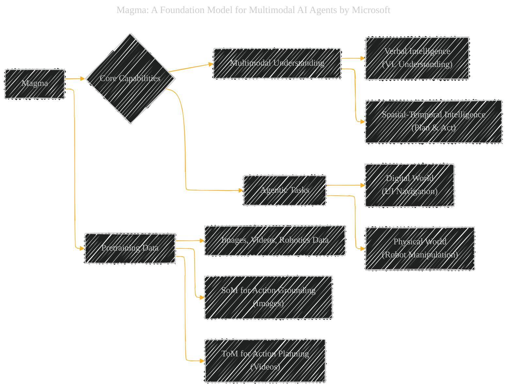
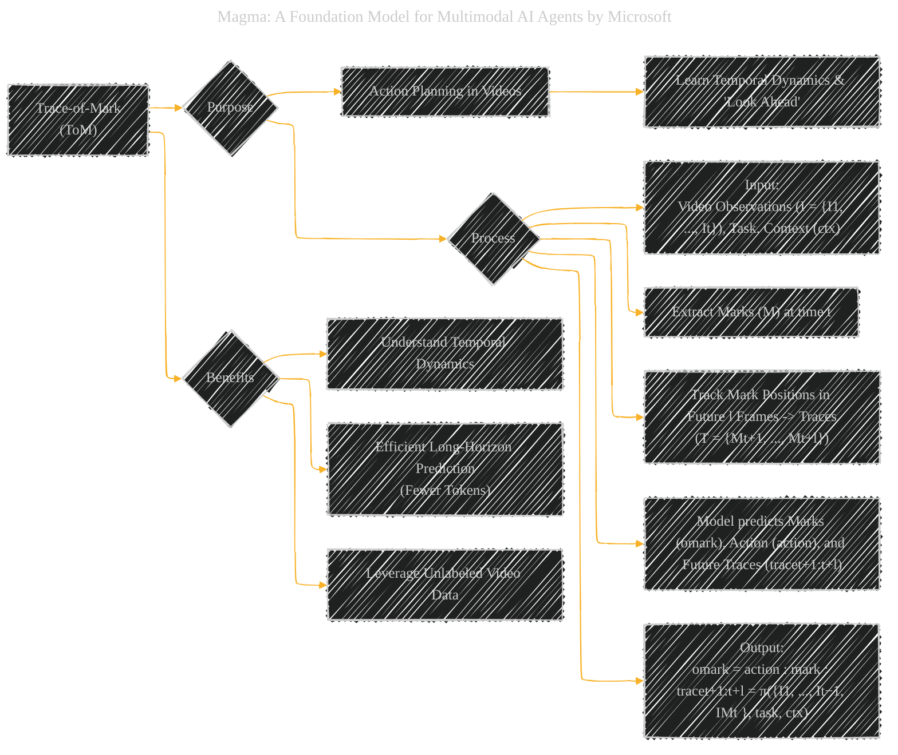
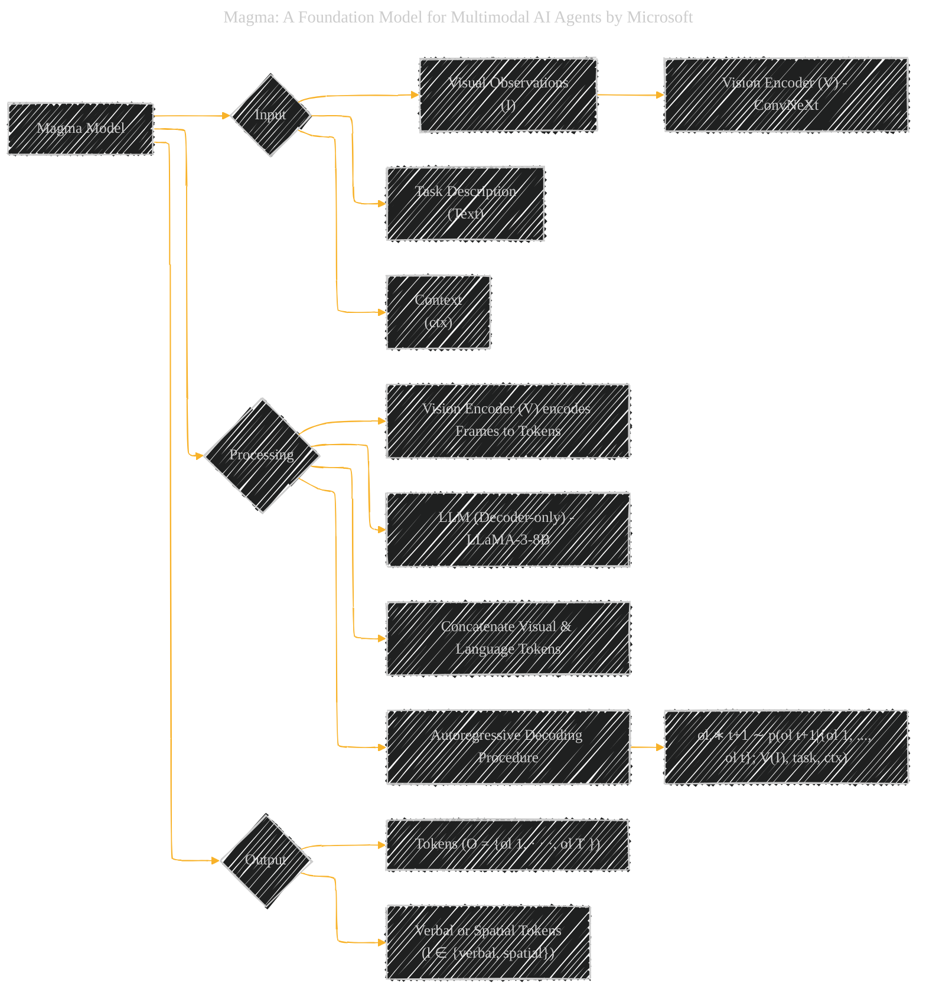
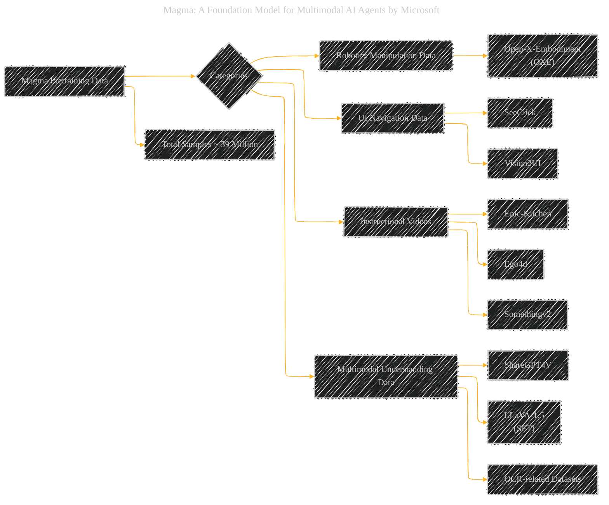
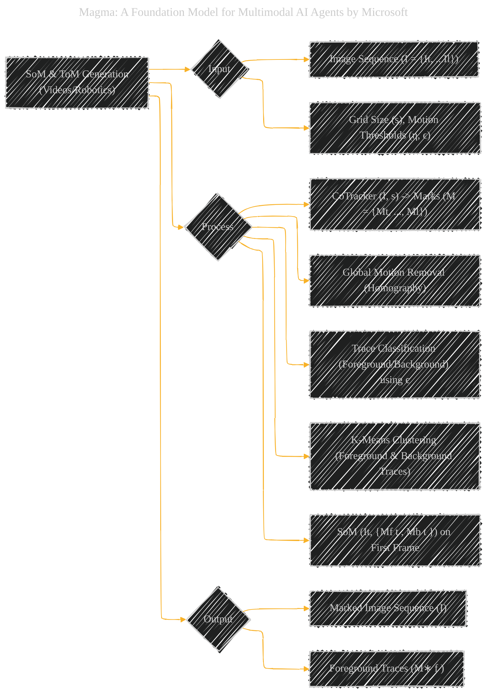
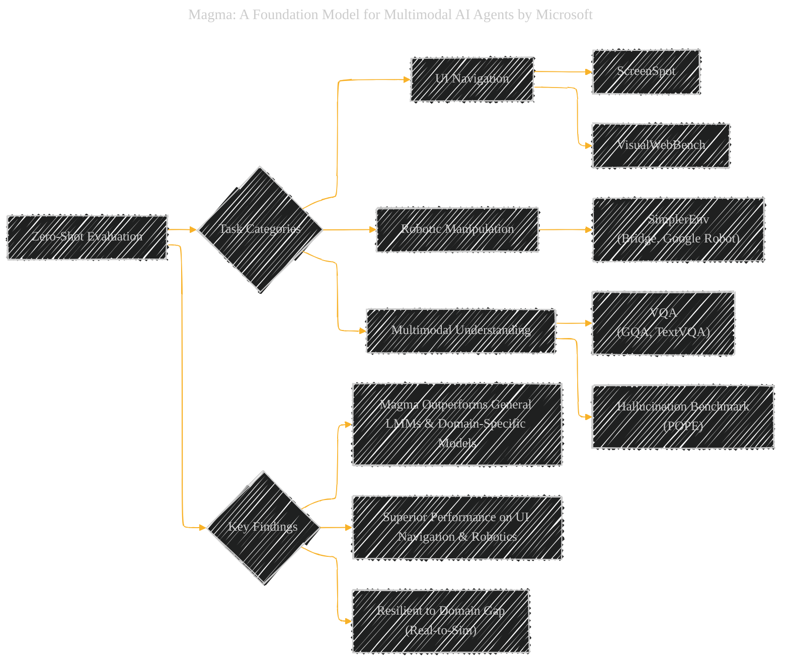
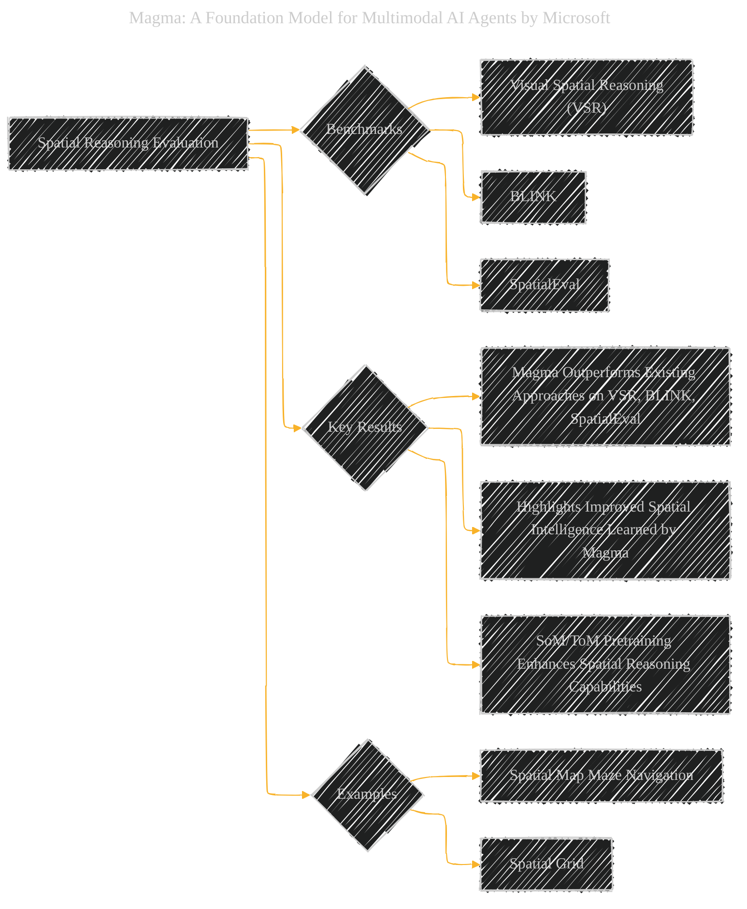
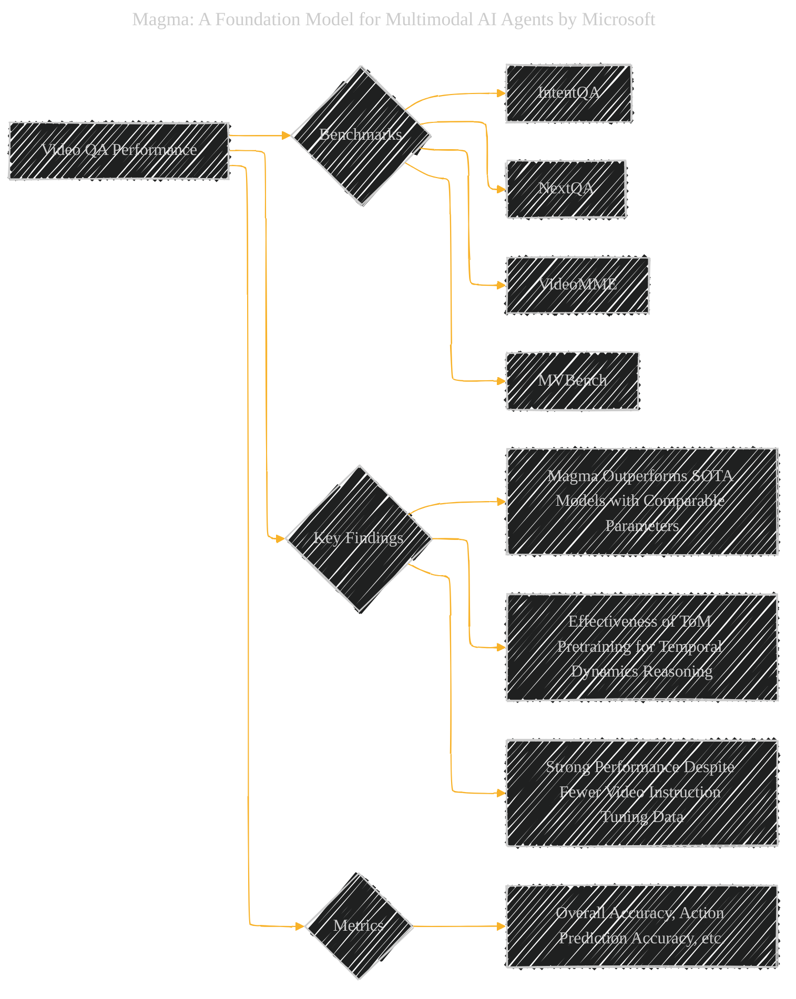
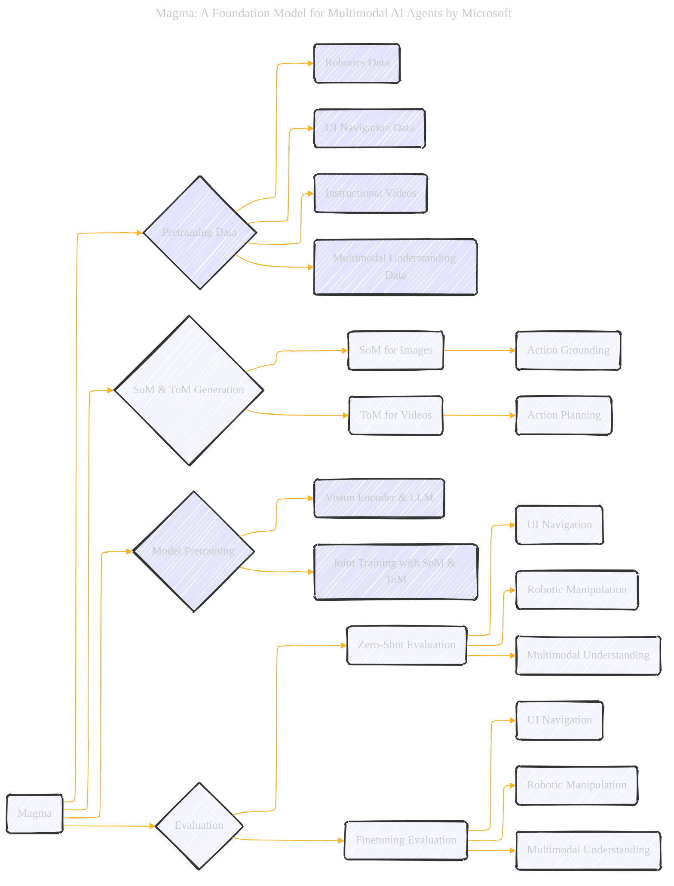

# Magma: A Foundation Model for Multimodal AI Agents
> **Disclaimer:**
>
> This document contains my personal notes on the topic,
> compiled from publicly available documentation and various cited sources.
> The materials are intended for educational purposes, personal study, and reference.
> The content is dual-licensed:
> 1. **MIT License:** Applies to all code implementations (Swift, Mermaid, and other programming languages).
> 2. **Creative Commons Attribution 4.0 International License (CC BY 4.0):** Applies to all non-code content, including text, explanations, diagrams, and illustrations.
---

## Magma - A Diagrammatic Guide 

### 1. Magma Overview: A Foundation Model for Multimodal AI Agents

#### Description
This diagram provides a high-level overview of Magma, highlighting its key capabilities in multimodal understanding and agentic tasks across digital and physical environments. It emphasizes the use of SoM and ToM during pretraining to achieve these capabilities.

----

### 2. Bridging the Gap: Set-of-Mark (SoM) for Action Grounding

#### Description
This diagram explains the Set-of-Mark (SoM) technique used in Magma for action grounding. It details the process from input to output, emphasizing its role in locating actionable elements in images across different domains.

---

### 3. Trace-of-Mark (ToM) for Action Planning

#### Description
This diagram illustrates the Trace-of-Mark (ToM) technique for action planning. It outlines the process of predicting future trajectories of marked objects in videos, highlighting the benefits for temporal understanding and efficient learning from video data.

----

### 4. Magma Model Architecture

#### Description
This diagram describes the architecture of the Magma model. It details the input modalities, the roles of the Vision Encoder and LLM, and the autoregressive decoding process to generate multimodal outputs.

-----

### 5. Pretraining Data Sources for Magma

#### Description
This diagram outlines the diverse pretraining datasets used for Magma. It categorizes them into robotics, UI navigation, instructional videos, and multimodal understanding, emphasizing the heterogeneity of the data.

----

### 6. SoM and ToM Generation Process for Videos and Robotics Data

#### Description
This diagram details the process of generating SoM and ToM annotations specifically for videos and robotics data. It includes steps for trace extraction using CoTracker, motion removal, trace classification, and clustering.

-----

### 7. Zero-Shot Evaluation Tasks

#### Description
This diagram summarizes the zero-shot evaluation tasks used to assess Magma's capabilities. It lists the benchmarks for UI navigation, robotic manipulation, and multimodal understanding, and highlights the key findings of Magma's superior performance.

----

### 8. Ablation Study: Impact of SoM and ToM

#### Description
This diagram explains the ablation study conducted to analyze the impact of SoM and ToM and different data combinations. It emphasizes that SoM and ToM are crucial for Magma to effectively learn from diverse datasets and bridge the gap between verbal and spatial intelligence.

----

### 9. Spatial Reasoning Evaluation

#### Description
This diagram focuses on the evaluation of Magma's spatial reasoning abilities. It lists the benchmarks used (VSR, BLINK, SpatialEval) and emphasizes the finding that Magma demonstrates improved spatial intelligence due to SoM and ToM pretraining.

-----

### 10. Video Question Answering (QA) Performance

#### Description
This diagram summarizes Magma's performance on video question answering benchmarks. It highlights Magma's competitive results, the impact of ToM on temporal reasoning, and its efficiency even with less video data.

---

### Method / Algorithm Analysis (Magma Pretraining)

#### Description
This diagram provides a flowchart-like summary of the Magma model's pretraining and evaluation methodology. It visually connects the key components: pretraining data, SoM/ToM generation, model pretraining, and different evaluation phases (zero-shot and finetuning) across various tasks. It acts as a consolidated overview of the entire process.

---
**Licenses:**

- **MIT License:**   - Full text in [LICENSE](LICENSE) file.
- **Creative Commons Attribution 4.0 International:**  - Legal details in [LICENSE-CC-BY](LICENSE-CC-BY) and at [Creative Commons official site](http://creativecommons.org/licenses/by/4.0/).

---