# Magma: A Foundation Model for Multimodal AI Agents
> **Disclaimer:**
>
> This document contains my personal notes on the topic,
> compiled from publicly available documentation and various cited sources.
> The materials are intended for educational purposes, personal study, and reference.
> The content is dual-licensed:
> 1. **MIT License:** Applies to all code implementations (Swift, Mermaid, and other programming languages).
> 2. **Creative Commons Attribution 4.0 International License (CC BY 4.0):** Applies to all non-code content, including text, explanations, diagrams, and illustrations.
---

## Magma - A Diagrammatic Guide 

```mermaid
---
title: "Magma: A Foundation Model for Multimodal AI Agents by Microsoft"
config:
  layout: elk
  look: handDrawn
  theme: dark
---
%%%%%%%% Mermaid version v11.4.1-b.14
%%%%%%%% Available curve styles include the following keywords:
%% basis, bumpX, bumpY, cardinal, catmullRom, linear, monotoneX, monotoneY, natural, step, stepAfter, stepBefore.
%%{
  init: {
    "graph": { "htmlLabels": false, 'curve': 'linear' },
    'fontFamily': 'Fantasy',
    'themeVariables': {
      'primaryColor': '#BB2528',
      'primaryTextColor': '#f529',
      'primaryBorderColor': '#7C0000',
      'lineColor': '#F8B229',
      'secondaryColor': '#006100',
      'tertiaryColor': '#fff'
    }
  }
}%%
graph LR
    A["Magma:<br>Multimodal AI Agent Foundation Model"] --> B{Key Capabilities}
    style A fill:#a3ae,stroke:#333,stroke-width:1px
    B --> C[Multimodal Understanding]:::detail
    C --> CA[Semantic, spatial, and temporal understanding across digital and physical domains.]
    C --> CB[Interpreting multimodal inputs: visual stimuli, language instructions, and environmental data.]
    style C fill:#c5cf,stroke:#333,stroke-width:1px
    B --> D[Multimodal Action Prediction]:::detail
    D --> DA[Breaking down long-horizon tasks into accurate action sequences.]
    D --> DB[Effective execution of action sequences by AI agent systems.]
    D --> DC[Driven by external goals specified by human commands.]
    style D fill:#c5cf,stroke:#333,stroke-width:1px

    A --> E{Key Components & Techniques}
    E --> F[Vision Encoder]:::detail
    F --> FA[ConvNeXt backbone for encoding images and videos.]
    F --> FB[Supports arbitrary image resolutions.]
    F --> FC[Global encoding captures context for high-resolution inputs.]
    style F fill:#c5cf,stroke:#333,stroke-width:1px
    E --> G["Set-of-Mark (SoM)"]:::detail
    G --> GA[Action grounding onto images for UI and robotic tasks.]
    G --> GB[Predicting actionable points/regions via numerical marks.]
    G --> GC[Eases action grounding for the agentic model.]
        style G fill:#c5cf,stroke:#333,stroke-width:1px
    E --> H["Trace-of-Mark<br>(ToM)"]:::detail
    H --> HA[Action planning by predicting future trajectories for valid marks.]
    H --> HB["Extends SoM to dynamic videos"]
    H --> HC["Forces model to understand temporal dynamics and 'look ahead'"]
    H --> HD[Captures long-horizon, action-related object dynamics using fewer tokens.]
        style H fill:#c5cf,stroke:#333,stroke-width:1px;
    A --> I{Pretraining}
    I --> J[Datasets]:::detail
    J --> JA["Open-X-Embodiment (OXE) for robotics manipulation"]
    J --> JB[SeeClick and Vision2UI for UI navigation.]
    J --> JC[Epic-Kitchen, Ego4D, Something-Something v2 for instructional videos.]
    J --> JD[ShareGPT4V and LLaVA-1.5 for multimodal understanding.]
    style J fill:#c5cf,stroke:#333,stroke-width:1px
    I --> K[Training Process]:::detail
    K --> KA[Joint training on heterogeneous datasets.]
    K --> KB[Constant learning rate.]
    K --> KC[SoM and ToM bridge verbal and action supervisions.]
    K --> KD[Significantly enhances spatial intelligence.]
        style K fill:#c5cf,stroke:#333,stroke-width:1px

    A --> L{Evaluation}
    L --> M[Tasks]:::detail
    M --> MA["UI Navigation<br>(Mind2Web, AITW)"]
    M --> MB["Vision-Language Understanding<br>(GQA, VideoMME)"]
    M --> MC["Robotic Manipulation<br>(Bridge, LIBERO)"]
        style M fill:#c5cf,stroke:#333,stroke-width:1px
    L --> N[Metrics]:::detail
    N --> NA["UI Navigation:<br>Element Selection Accuracy, Operation F1, Step Success Rate"]
    N --> NB[Robotic Manipulation: Success Rate.]
    N --> NC[Vision-Language Understanding: Performance on established benchmarks.]
        style N fill:#c5cf,stroke:#333,stroke-width:1px
    L --> O[Results]:::detail
    O --> OA[New SOTA on UI navigation and robotic manipulation.]
    O --> OB[Strong performance on VL tasks, comparable to SOTA LMMs.]
    O --> OC[Significantly improved spatial-temporal reasoning abilities.]
        style O fill:#c5cf,stroke:#333,stroke-width:1px

    A --> P{Key Findings}
    P --> Q[SoM & ToM]:::detail
    Q --> QA[Effectively enhance spatial-temporal intelligence.]
    Q --> QB[Enable pretraining on large amounts of heterogeneous data.]
        style Q fill:#c5cf,stroke:#333,stroke-width:1px
    P --> R[Generalization]:::detail
    R --> RA[Single suite of parameters achieves new SOTA on robotic manipulation and UI navigation.]
    R --> RB[Outperforms domain-specific models.]
        style R fill:#c5cf,stroke:#333,stroke-width:1px
    P --> S[Verbal & Spatial Intelligence]:::detail
    S --> SA[Proposed pretraining method significantly improves model's verbal and spatial-temporal intelligence abilities.]
        style S fill:#c5cf,stroke:#333,stroke-width:1px

    A --> T{Limitations & Considerations}
    T --> U[Data Bias]:::detail
    U --> UA[Distribution of identities and activities in instructional videos are not representative of the global human population.]
        style U fill:#c5cf,stroke:#333,stroke-width:1px
    T --> V[Responsible AI]:::detail
    V --> VA[Designed for UI navigation in controlled environments and robotic manipulation tasks.]
    V --> VB[Should not be broadly applied to other tasks.]
    V --> VC[Human-in-the-loop is recommended for UI navigation.]
        style V fill:#c5cf,stroke:#333,stroke-width:1px
        
```

----

### Explanation of the Diagram Structure and Mappings

*   **`Magma: Multimodal AI Agent Foundation Model` (A):** This is the central concept, representing the Magma model itself.
*   **`Key Capabilities` (B):** This node branches into the fundamental capabilities that Magma aims to achieve.
    *   **`Multimodal Understanding` (C):** This is a more detailed breakdown of the types of understanding Magma exhibits. The description focuses on how it can understand multimodal input.
    *   **`Multimodal Action Prediction` (D):** This branches into the elements needed for effective action prediction.
*   **`Key Components & Techniques` (E):** This section delves into the architecture and key innovations used in Magma.
    *   **`Vision Encoder` (F):**  Describes the visual processing element.
    *   **`Set-of-Mark (SoM)` (G):** Explains one of the core contributions.
    *   **`Trace-of-Mark (ToM)` (H):** Details the second core contribution.
*   **`Pretraining` (I):** Describes how Magma was trained.
    *   **`Datasets` (J):** Lists the various datasets used in pretraining.
    *   **`Training Process` (K):**  Details of the training process.
*   **`Evaluation` (L):** Outlines how Magma's performance was assessed.
    *   **`Tasks` (M):** Lists the types of tasks Magma was tested on.
    *   **`Metrics` (N):**  The quantitative measurements used for evaluation.
    *   **`Results` (O):** A summary of the evaluation findings.
*    **`Key Findings` (P):**  Key takeaways and insights from the experimental results
    *   **`SoM & ToM` (Q):** Summarizes the impact of the techniques.
    *   **`Generalization` (R):** How well the model adapts.
    *   **`Verbal & Spatial Intelligence` (S):** The influence of the approach on intelligence.
*   **`Limitations & Considerations` (T):**  Important limitations and ethical considerations.
    *   **`Data Bias` (U):** Discussion of potential biases in the training data.
    *   **`Responsible AI` (V):**  Highlights limitations in the application of the model.

This structure ensures that all main concepts and complexities are represented, creating a more clear representation.

---
**Licenses:**

- **MIT License:**   - Full text in [LICENSE](LICENSE) file.
- **Creative Commons Attribution 4.0 International:**  - Legal details in [LICENSE-CC-BY](LICENSE-CC-BY) and at [Creative Commons official site](http://creativecommons.org/licenses/by/4.0/).

---