# Assumptions and Limitations
> **Disclaimer:**
>
> This document contains my personal notes on the topic,
> compiled from publicly available documentation and various cited sources.
> The materials are intended for educational purposes, personal study, and reference.
> The content is dual-licensed:
> 1. **MIT License:** Applies to all code implementations (Swift, Mermaid, and other programming languages).
> 2. **Creative Commons Attribution 4.0 International License (CC BY 4.0):** Applies to all non-code content, including text, explanations, diagrams, and illustrations.
---

## Assumptions and Limitations in Machine Learning

```mermaid
---
title: Assumptions and Limitations in Machine Learning
config:
  layout: elk
  look: handDrawn
  theme: dark
---
%%{
  init: {
    'fontFamily': 'verdana',
    'themeVariables': {
      'primaryColor': '#BB2528',
      'primaryTextColor': '#f529',
      'primaryBorderColor': '#7C0000',
      'lineColor': '#F8B229',
      'secondaryColor': '#006100',
      'tertiaryColor': '#fff'
    }
  }
}%%
graph TD
    A["Assumptions & Limitations"] --> B("Models")

    subgraph Linear_Regression["Linear Regression"]
    style Linear_Regression fill:#425,stroke:#333,stroke-width:2px
        B -- Linear Regression --> C{"Linearity Assumption"}
        C --> CA["Data must exhibit a linear relationship between inputs and outputs"]
        C --> CB["Assumes constant variance in noise terms"]
        C --> CC["Implies that non-linear relationships can't be effectively modeled without feature engineering"]
        
        B -- Linear Regression --> D{"Noise Assumptions"}
        D --> DA["Assumes Gaussian noise, which may not always hold"]
        D --> DB["Independence of data points"]
        D --> DC["Assumes noise is uncorrelated"]
    end

    subgraph Probabilistic_Distributions["Probabilistic Distributions"]
    style Probabilistic_Distributions fill:#22f5,stroke:#333,stroke-width:2px
        B -- Probabilistic Distributions --> E{"Distributional Assumptions"}
        E --> EA["Many models assume specific distributions (e.g., Gaussian) for the data or parameters"]
        E --> EB["Incorrect distributional assumptions can lead to biased estimates and inaccurate predictions"]
        E --> EC["Distributional assumptions simplify calculations but may not always reflect real-world data"]
    end

    subgraph Parameter_Estimation["Parameter Estimation"]
    style Parameter_Estimation fill:#411f,stroke:#333,stroke-width:2px
        B -- Parameter Estimation --> F{"Estimation Limitations"}
        F --> FA["Local Optima:<br>Gradient-based methods may converge to local optima rather than the global minimum"]
        F --> FB["Computational Cost:<br>Finding optimal parameters can be computationally intensive, especially with large datasets"]
        F --> FC["Sensitivity to Initial Conditions:<br>Optimization algorithms may be sensitive to the initial parameter values, requiring careful initialization"]
    end

    subgraph Model_Selection["Model Selection"]
    style Model_Selection fill:#11f,stroke:#333,stroke-width:2px
        B -- Model Selection --> G{"Model Selection Limitations"}
        G --> GA["Overfitting:<br>Complex models can overfit the training data, leading to poor generalization to unseen data"]
        G --> GB["Bias-Variance Trade-off:<br>Selecting the best model involves balancing model complexity and the accuracy of the model"]
        G --> GC["Limited Data:<br>Model selection performance may be unreliable with small datasets"]
    end
    
    subgraph Bayesian_Methods["Bayesian Methods"]
    style Bayesian_Methods fill:#11f9,stroke:#333,stroke-width:2px
        B -- Bayesian Methods --> H{"Bayesian Limitations"}
        H --> HA["Computational Cost:<br>Integrating over parameters can be computationally expensive"]
        H --> HB["Computational Intractability:<br>Exact posterior computation is often intractable, requiring approximations"]
        H --> HC["Prior Choice:<br>The choice of prior distribution can significantly affect the results"]
    end

    subgraph Kernel_Methods["Kernel Methods"]
    style Kernel_Methods fill:#51f9,stroke:#333,stroke-width:2px
        B -- Kernel Methods --> I{"Kernel Limitations"}
        I --> IA["Computational Complexity:<br>Kernel computations can be computationally expensive with large datasets"]
        I --> IB["Kernel Choice:<br>The choice of kernel function can affect model performance"]
        I --> IC["Difficulty in Interpretation:<br>Non-linear mappings can make model interpretation challenging"]
    end

    subgraph General_Limitations["General Limitations"]
    style General_Limitations fill:#81f9,stroke:#333,stroke-width:2px
        B -- General Limitations --> J{"General Issues"}
        J --> JA["Data Quality:<br>Inaccurate or incomplete data can lead to poor model performance"]
        J --> JB["Feature Relevance:<br>Selecting the most relevant features is crucial, but it may not always be clear which features are most important"]
        J --> JC["Model Assumptions:<br>All models are wrong, but some are useful - acknowledging the inherent assumptions is important for effective use"]
    end
    
```

---

### Explaination

This diagram uses a hierarchical structure similar to the previous examples to depict assumptions and limitations associated with different models and methods.  Each subgraph represents a category of model or method, and the nodes within each subgraph list the specific assumptions or limitations related to that category.  This allows for a clear and organized presentation of the various considerations.  This approach can be further expanded by adding more specific limitations or assumptions as needed for a particular context. Remember to use specific examples from the original text to flesh out these nodes with appropriate details. For instance, under "Linear Regression," you might have nodes listing assumptions about linearity and noise.

---
**Licenses:**

- **MIT License:**   - Full text in [LICENSE](LICENSE) file.
- **Creative Commons Attribution 4.0 International:**  - Legal details in [LICENSE-CC-BY](LICENSE-CC-BY) and at [Creative Commons official site](http://creativecommons.org/licenses/by/4.0/).

---