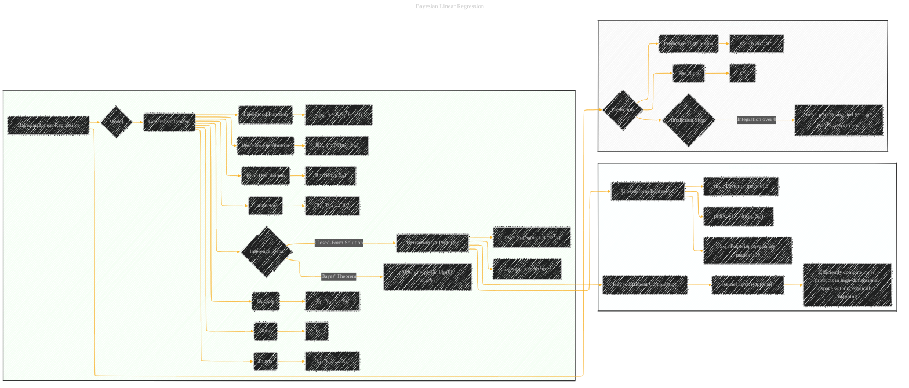

# Bayesian Linear Regression
> **Disclaimer:**
>
> This document contains my personal notes on the topic,
> compiled from publicly available documentation and various cited sources.
> The materials are intended for educational purposes, personal study, and reference.
> The content is dual-licensed:
> 1. **MIT License:** Applies to all code implementations (Swift, Mermaid, and other programming languages).
> 2. **Creative Commons Attribution 4.0 International License (CC BY 4.0):** Applies to all non-code content, including text, explanations, diagrams, and illustrations.
---

## A Diagram Structure

DOI: [10.13140/RG.2.2.24400.42244](http://dx.doi.org/10.13140/RG.2.2.24400.42244)

---

### Explanation

* **Generative Process (C):** Shows how data are generated.  The model assumes inputs (`xi`) and outputs (`yi`) are related through a linear transformation (`xiTθ`) plus Gaussian noise (`ϵ`).
* **Prior Distribution (CI):** Represents the initial belief about the parameters θ, modeled as a Gaussian distribution `N(m0, S0)`.
* **Likelihood Function (CK):**  Defines the probability of observing the outputs (`yi`) given the inputs (`xi`) and parameters (`θ`).  Modeled as a Gaussian distribution `N(xiTθ, σ2I)`.
* **Posterior Distribution (CM):** The updated belief about the parameters after observing the data.  Calculated using Bayes' theorem and shown as a Gaussian `N(mN, SN)`.  Crucially, the posterior mean (`mN`) and covariance (`SN`) are derived in closed form.
* **Inference Steps (CO):** Shows the key steps in obtaining the posterior:  applying Bayes' theorem and deriving the closed-form expression for the posterior parameters.
* **Closed-Form Expression (CT):** Explains the result of the inference process, that the posterior is a Gaussian distribution with specific mean and covariance.
* **Prediction Stage (D):** Shows how to predict the output for a new, unseen input (`x*`). The key step is integration over the posterior parameters, resulting in a predictive distribution.

**Important Considerations:**

* **Notation:** The diagram uses standard mathematical notation for probability distributions (e.g., `N(μ, Σ)` for a Gaussian distribution with mean μ and covariance Σ).  Using superscripts to indicate transpose is crucial for clarity, as is using * to denote variables in the prediction step.
* **Closed-form Solutions:** The diagram highlights that the posterior distribution has a closed-form expression, a critical aspect of Bayesian Linear Regression.
* **Kernels (Optional):** The diagram includes a possible path for the kernel trick if applicable.

---
**Licenses:**

- **MIT License:**   - Full text in [LICENSE](LICENSE) file.
- **Creative Commons Attribution 4.0 International:**  - Legal details in [LICENSE-CC-BY](LICENSE-CC-BY) and at [Creative Commons official site](http://creativecommons.org/licenses/by/4.0/).

---