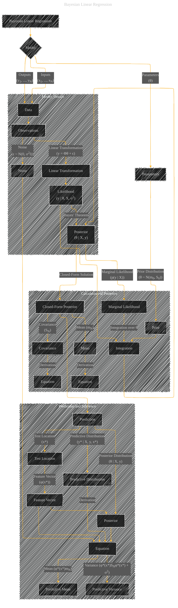

# Bayesian Linear Regression
> **Disclaimer:**
>
> This document contains my personal notes on the topic,
> compiled from publicly available documentation and various cited sources.
> The materials are intended for educational purposes, personal study, and reference.
> The content is dual-licensed:
> 1. **MIT License:** Applies to all code implementations (Swift, Mermaid, and other programming languages).
> 2. **Creative Commons Attribution 4.0 International License (CC BY 4.0):** Applies to all non-code content, including text, explanations, diagrams, and illustrations.
---

## Bayesian Linear Regression - A Diagram Structure

---

### Explanation of the Diagram

* **Nodes:** Represent key concepts and variables.  'Data', 'Parameters', 'Prior', 'Likelihood', 'Posterior', 'Marginal Likelihood', 'Predictive Distribution' are core nodes.  The diagram shows how these concepts relate.

* **Edges:** Indicate relationships and dependencies.  For example, an edge from 'Data' to 'Linear Transformation' shows the input to the model.  Edges to 'Likelihood' and 'Posterior' show how these relate to the data and prior.

* **Subgraphs:** Group related calculations or aspects of the model.  This improves readability by organizing the flow of information.

* **Equations:** While not fully written out, the diagram includes placeholders for equations (`N(m0, S0)`) to show the mathematical formulation.  This is crucial to convey the mathematical foundation.

* **Prediction and Inference:** The subgraph focuses on how the model makes predictions at a new data point (x*).  It highlights the predictive mean and variance, which are calculated using the posterior parameters and noise variance.

---

### Key Concepts Conveyed

* **Bayesian Approach:** The diagram explicitly shows the use of a prior distribution over parameters and how that influences the posterior and predictions.

* **Linear Model:** The model is explicitly a linear model using feature vectors Φ.

* **Gaussian Distributions:** The prior, likelihood, and posterior are all Gaussian distributions, making calculations tractable.

* **Conditional Dependence:** The diagram visualizes how observations depend on parameters and noise.

This diagram provides a more visual and comprehensive representation of Bayesian Linear Regression, clearly illustrating the relationships between concepts and the mathematical formulations involved.  It's designed to be more accessible to someone trying to understand the concept than a purely textual explanation.

---
**Licenses:**

- **MIT License:**   - Full text in [LICENSE](LICENSE) file.
- **Creative Commons Attribution 4.0 International:**  - Legal details in [LICENSE-CC-BY](LICENSE-CC-BY) and at [Creative Commons official site](http://creativecommons.org/licenses/by/4.0/).

---