# Bayesian Networks Diagrams - The Complex Version
> **Disclaimer:**
>
> This document contains my personal notes on the topic,
> compiled from publicly available documentation and various cited sources.
> The materials are intended for educational purposes, personal study, and reference.
> The content is dual-licensed:
> 1. **MIT License:** Applies to all code implementations (Swift, Mermaid, and other programming languages).
> 2. **Creative Commons Attribution 4.0 International License (CC BY 4.0):** Applies to all non-code content, including text, explanations, diagrams, and illustrations.
---

## Complex Bayesian Networks

```mermaid
---
title: Complex Bayesian Networks Diagram
config:
  layout: elk
  look: handDrawn
  theme: dark
---
%%{
  init: {
    'fontFamily': 'verdana',
    'themeVariables': {
      'primaryColor': '#BB2528',
      'primaryTextColor': '#f529',
      'primaryBorderColor': '#7C0000',
      'lineColor': '#F8B229',
      'secondaryColor': '#006100',
      'tertiaryColor': '#fff'
    }
  }
}%%
graph TD
    subgraph Complex_Bayesian_Networks["Complex Bayesian Networks"]
    style Complex_Bayesian_Networks fill:#cf211,stroke:#333,stroke-width:2px
        A[Complex Bayesian Network] --> B{Hierarchical Structure}
        B --> C(Latent Variables)
        C --> CA[Hidden/Unobserved Variables]
        C --> CB[Representing Underlying Processes]
        C --> CC[Often Model Uncertainty or Internal States]

        B --> D(Conditional Dependencies)
        D --> DA[Complex Interconnections]
        D --> DB[Multiple Levels of Influence]
        D --> DC[Non-linear Relationships]

        B --> E(Multiple Observed Variables)
        E --> EA[Representing Data]
        E --> EB[Observations from Different Sources]
        E --> EC[Correlated Measurements]

        B --> F(Multiple Parameter Sets)
        F --> FA[Model Parameters]
        F --> FB[Parameters at Different Levels]
        F --> FC["Hyperparameters<br>(Controlling Model Complexity)"]

        B --> G(Dynamic Relationships)
        G --> GA[Time-Dependent Variables]
        G --> GB[Sequential Dependencies]
        G --> GC[Models of Change Over Time]

        B --> H(Learning/Inference)
        H --> HA["Inference Procedures<br>(e.g., Variational Inference)"]
        H --> HB[Learning Parameters from Data]
        H --> HC[Updating Beliefs over Time]

        B --> I(Prior Distributions)
        I --> IA[Describing Initial Beliefs]
        I --> IB[Complex Prior Relationships]

        B --> J(Likelihood Functions)
        J --> JA[Representing Data Generation Processes]
        J --> JB[Complex Data Dependencies]

        subgraph Bayesian_Network_Example2["Bayesian Network Example 2"]
        style Bayesian_Network_Example2 fill:#d255,stroke:#333,stroke-width:2px
            D -- Example:<br>p(A, B, C, D, E) = p(A)p(B)p(C|A, B)p(D|C)p(E|D) --> K
            K -- A --> L[A]
            K -- B --> M[B]
            K -- C --> N[C]
            K -- D --> O[D]
            K -- E --> P[E]
            K -- A --> Q("p(A)")
            K -- B --> R("p(B)")
            K -- C --> S("p(C|A, B)")
            K -- D --> T("p(D|C)")
            K -- E --> U("p(E|D)")
        end
    end

classDef Style_for_Structure_1 fill:#d919,stroke:#333,stroke-width:2px
class C Style_for_Structure_1

classDef Style_for_Structure_2 fill:#ccf5,stroke:#333,stroke-width:2px
class D Style_for_Structure_2

classDef Style_for_Structure_3 fill:#c599,stroke:#333,stroke-width:2px
class E Style_for_Structure_3

classDef Style_for_Structure_4 fill:#5299,stroke:#333,stroke-width:2px
class F Style_for_Structure_4

classDef Style_for_Structure_5 fill:#1199,stroke:#333,stroke-width:2px
class G Style_for_Structure_5

classDef Style_for_Structure_6 fill:#8815,stroke:#333,stroke-width:2px
class H Style_for_Structure_6

classDef Style_for_Structure_7 fill:#675,stroke:#333,stroke-width:2px
class I Style_for_Structure_7

classDef Style_for_Structure_8 fill:#359,stroke:#333,stroke-width:2px
class J Style_for_Structure_8

```

---

### Explanation and Considerations for Complex Bayesian Networks

*   **Hierarchical Structure (B):** The diagram uses a hierarchical structure, making it suitable for models with multiple levels of variables, parameters, and dependencies. The `subgraph ComplexBayesianNetworks` houses all relevant components.
*   **Latent Variables (C):**  `Latent Variables` are crucial for complex models, and this diagram explicitly shows how they are incorporated.
*   **Conditional Dependencies (D):** The diagram highlights the complexities of interconnections between multiple variables, not just direct pairwise dependencies.  It indicates that influences can be multi-layered.
*   **Multiple Variables (E):** The diagram can handle multiple observed variables that might be correlated and come from different sources.
*   **Multiple Parameter Sets (F):** Bayesian models often have multiple parameter sets, which are explicitly included and shown to be potentially connected in complex ways.
*   **Dynamic Relationships (G):** The representation now explicitly supports models that deal with time-dependent variables and sequential dependencies.
*   **Learning and Inference (H):** Bayesian networks often incorporate learning procedures, and this aspect is included.
*   **Prior Distributions (I):** Prior distributions play a vital role in Bayesian models. The diagram emphasizes the complexity that can arise from representing initial beliefs, showing that these priors might have complex dependencies.
*   **Likelihood Functions (J):**  The diagram correctly shows that likelihood functions might incorporate more intricate data dependencies.

**Specific Improvements Over Simple Examples:**

* **Example Graph:**  `BayesianNetworkExample2` demonstrates a more complex factorization. This is a realistic example of a network with conditional probabilities and multiple layers of influence.

---

### How to Adapt to Specific Models

*   **Modify Node Names:** Change `A`, `B`, `C`, etc. to the specific variables or parameters in your target Bayesian network.
*   **Adjust Edge Labels:** Update edge labels to reflect the specific conditional probabilities or relationships for the model you want to visualize.
*   **Add Subgraphs:**  Add more subgraphs to handle complex dependencies, such as different phases or processes in a model.
*   **Annotate:**  Use annotations to explain complex dependencies, statistical relationships, or the overall function of the network.

Remember, the key is to match the Mermaid structure to the specific variables and relationships within your particular model.  The complexity of the visualization will depend on the complexity of the model.

---
**Licenses:**

- **MIT License:**   - Full text in [LICENSE](LICENSE) file.
- **Creative Commons Attribution 4.0 International:**  - Legal details in [LICENSE-CC-BY](LICENSE-CC-BY) and at [Creative Commons official site](http://creativecommons.org/licenses/by/4.0/).

---