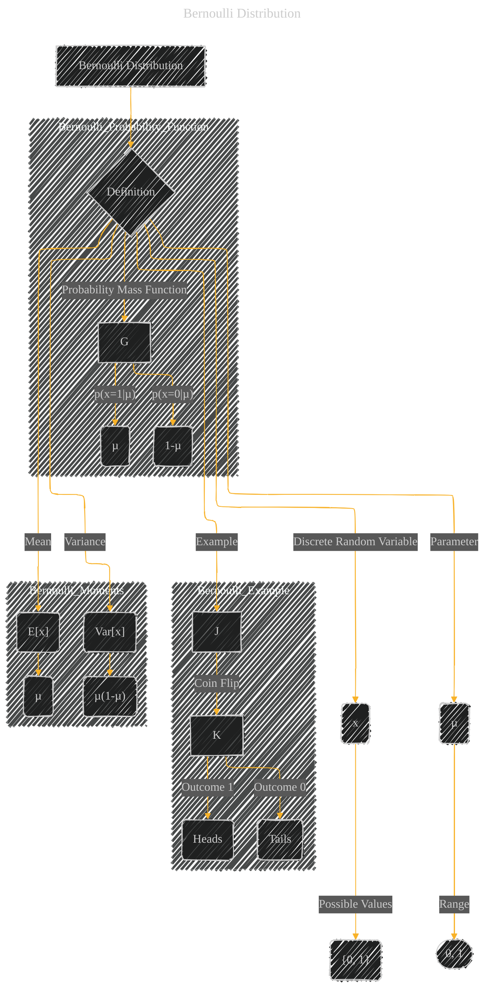

# Bernoulli Distribution
> **Disclaimer:**
>
> This document contains my personal notes on the topic,
> compiled from publicly available documentation and various cited sources.
> The materials are intended for educational purposes, personal study, and reference.
> The content is dual-licensed:
> 1. **MIT License:** Applies to all code implementations (Swift, Mermaid, and other programming languages).
> 2. **Creative Commons Attribution 4.0 International License (CC BY 4.0):** Applies to all non-code content, including text, explanations, diagrams, and illustrations.
---

## A Diagram Structure

**Explanation:**

This Mermaid diagram represents the Bernoulli distribution using a structure similar to the previous graphical models.

* **Node `A` (Bernoulli Distribution):**  The central concept.
* **Node `B` (Definition):**  Indicates the formal definition of the distribution.
* **Node `C` (x):** Represents the discrete random variable.
* **Node `D` ({0, 1})**:  The possible outcomes of the random variable (e.g., success/failure, heads/tails).
* **Node `E` (µ):** The parameter of the distribution, representing the probability of success (x=1).
* **Node `F` ([0, 1]):** The range of possible values for the parameter µ (probability must be between 0 and 1).
* **Subgraph `Bernoulli_Probability_Function`:** Shows the probability mass function. Nodes `H` and `I` represent the probabilities of the respective outcomes.
* **Subgraph `Bernoulli_Example`:** Illustrates a common application of the Bernoulli distribution (a coin flip). Nodes `L` and `M` represent the outcomes.
* **Subgraph `Bernoulli_Moments`:** Represents the mean and variance of the distribution.  Nodes `O` and `Q` provide the formulas for these moments, explicitly showing the dependence on the parameter µ.

This structured diagram, with explicit nodes and clear relationships, effectively communicates the key aspects of the Bernoulli distribution in a visual format.

---
**Licenses:**

- **MIT License:**   - Full text in [LICENSE](LICENSE) file.
- **Creative Commons Attribution 4.0 International:**  - Legal details in [LICENSE-CC-BY](LICENSE-CC-BY) and at [Creative Commons official site](http://creativecommons.org/licenses/by/4.0/).

---