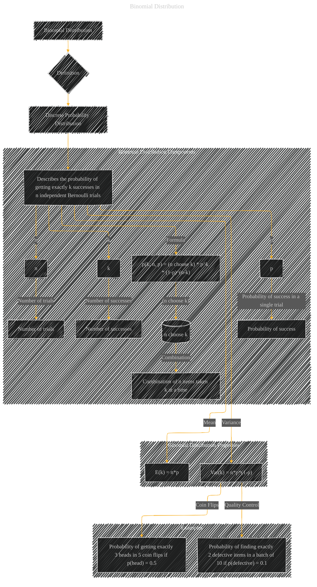

# Binomial Distribution
> **Disclaimer:**
>
> This document contains my personal notes on the topic,
> compiled from publicly available documentation and various cited sources.
> The materials are intended for educational purposes, personal study, and reference.
> The content is dual-licensed:
> 1. **MIT License:** Applies to all code implementations (Swift, Mermaid, and other programming languages).
> 2. **Creative Commons Attribution 4.0 International License (CC BY 4.0):** Applies to all non-code content, including text, explanations, diagrams, and illustrations.
---

## A Diagram Structure

---

### Explanation

The diagram depicts the Binomial Distribution, highlighting its key components and properties.

* **Definition:** The Binomial Distribution is a discrete probability distribution.
* **Components:**  It's defined by:
    * `n`: The number of independent Bernoulli trials.
    * `k`: The number of successes observed in those `n` trials.
    * `p`: The probability of success in a single trial.
* **Formula:** The probability mass function (PMF) is shown, emphasizing the combination (n choose k) and the powers of `p` and `(1-p)`.
* **Properties:** The diagram also shows the mean (expected value) and variance of the distribution.
* **Examples:** Practical examples demonstrate how the binomial distribution can model real-world scenarios involving repeated Bernoulli trials.

This diagram effectively visualizes the key elements of the Binomial Distribution, facilitating understanding of its use in probability calculations.  Note that this diagram is highly adaptable for adding more details like specific examples, or calculations depending on the context.

---
**Licenses:**

- **MIT License:**   - Full text in [LICENSE](LICENSE) file.
- **Creative Commons Attribution 4.0 International:**  - Legal details in [LICENSE-CC-BY](LICENSE-CC-BY) and at [Creative Commons official site](http://creativecommons.org/licenses/by/4.0/).

---