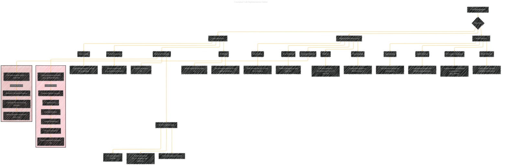

# Conceptual Code Implementation Outline
> **Disclaimer:**
>
> This document contains my personal notes on the topic,
> compiled from publicly available documentation and various cited sources.
> The materials are intended for educational purposes, personal study, and reference.
> The content is dual-licensed:
> 1. **MIT License:** Applies to all code implementations (Swift, Mermaid, and other programming languages).
> 2. **Creative Commons Attribution 4.0 International License (CC BY 4.0):** Applies to all non-code content, including text, explanations, diagrams, and illustrations.
---

## Conceptual Code Implementations Diagram

---

### Explanation

This Mermaid graph provides a conceptual outline of how code implementations for various algorithms could be structured. It's important to note that this is a high-level overview. Actual code would involve much more detail.

* **Nodes:** Each node represents a specific step or component in the code.  Nodes like `Load training data`, `Initialize parameters`, `Calculate gradient`, represent functions or procedures within the code.
* **Edges:** Directed edges illustrate the flow of execution, showing the sequence in which these steps are performed.  For example, `Data Loading` -> `Feature Extraction` means the data loading step must be done before feature extraction.
* **Subgraphs:**  Subgraphs (`Linear_Regression_Code_Example`, `Bayesian_Linear_Regression_Code_Example`) group related code elements, promoting a more organized view.
* **Algorithm-Specific Steps:** The graph includes key steps of each algorithm (e.g., loading data, calculating gradients, updating parameters, predicting outputs) as outlined in the earlier lecture notes.

----

### Crucial Considerations for Actual Implementation

* **Data Structures:**  How data is stored (e.g., NumPy arrays, pandas DataFrames) and the choice of data structures influence the efficiency of operations.
* **Libraries:** The use of libraries like NumPy, Scikit-learn (Python), or equivalent libraries in other languages.
* **Error Handling:** Implementing error handling and input validation.
* **Iteration Control:** The details of convergence checks, loop structures, and handling of hyperparameters in iterative algorithms.
* **Optimization Techniques:**  The exact numerical optimization methods used within gradient descent.
* **Performance Considerations:**  How to vectorize operations for speed, and memory management techniques.

This diagram serves as a guide, illustrating the general architecture of a conceptual code implementation.  To turn this into an actual implementation, the precise details of the algorithms, data structures, and libraries used would need to be added.

---
**Licenses:**

- **MIT License:**   - Full text in [LICENSE](LICENSE) file.
- **Creative Commons Attribution 4.0 International:**  - Legal details in [LICENSE-CC-BY](LICENSE-CC-BY) and at [Creative Commons official site](http://creativecommons.org/licenses/by/4.0/).

---