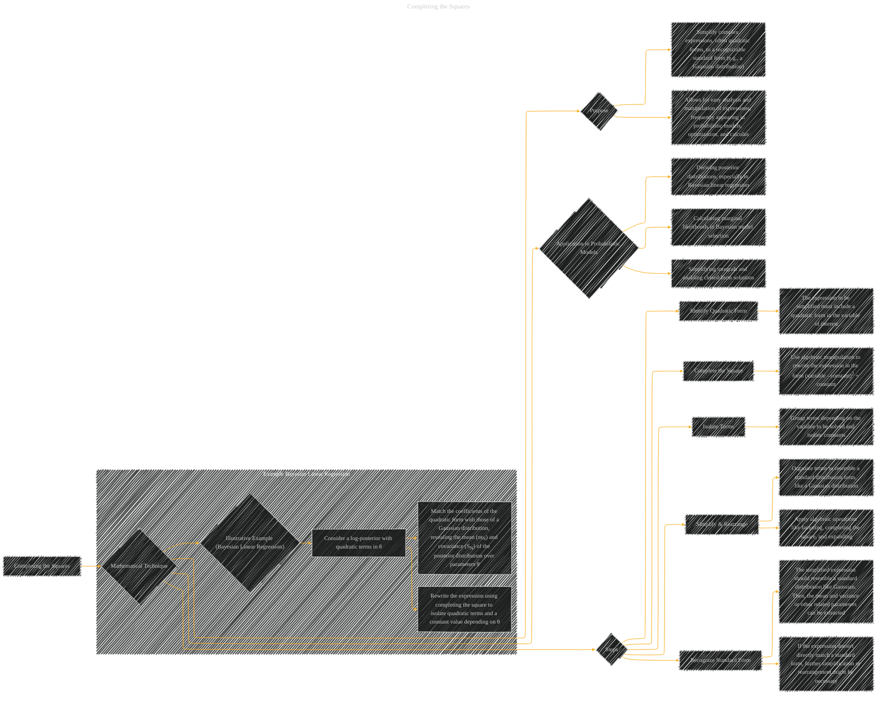

# Completing the Squares
> **Disclaimer:**
>
> This document contains my personal notes on the topic,
> compiled from publicly available documentation and various cited sources.
> The materials are intended for educational purposes, personal study, and reference.
> The content is dual-licensed:
> 1. **MIT License:** Applies to all code implementations (Swift, Mermaid, and other programming languages).
> 2. **Creative Commons Attribution 4.0 International License (CC BY 4.0):** Applies to all non-code content, including text, explanations, diagrams, and illustrations.
---

## Completing the Squares - A Diagram Structure

---

### Explanation of the Diagram

The diagram illustrates the technique of completing the squares, focusing on its mathematical foundation, application in probabilistic models, and the step-by-step procedure involved. The example subgraph highlights the direct application in the context of Bayesian Linear Regression.

* **Nodes:**  Represent key concepts and steps in the process.
* **Subgraphs:**  Provide focused examples within a broader context (e.g., Bayesian Linear Regression).
* **Arrows:** Indicate the relationships and flow of information between concepts.

This detailed diagram helps clarify the purpose, application, and procedure of completing the squares, particularly its role in deriving posterior distributions in Bayesian Linear Regression.  This structure can be adapted to other contexts by changing the illustrative example and adjusting the specific nodes and arrows. Remember to add annotations, equations, and formulas to make the diagram more descriptive and insightful.

---
**Licenses:**

- **MIT License:**   - Full text in [LICENSE](LICENSE) file.
- **Creative Commons Attribution 4.0 International:**  - Legal details in [LICENSE-CC-BY](LICENSE-CC-BY) and at [Creative Commons official site](http://creativecommons.org/licenses/by/4.0/).

---