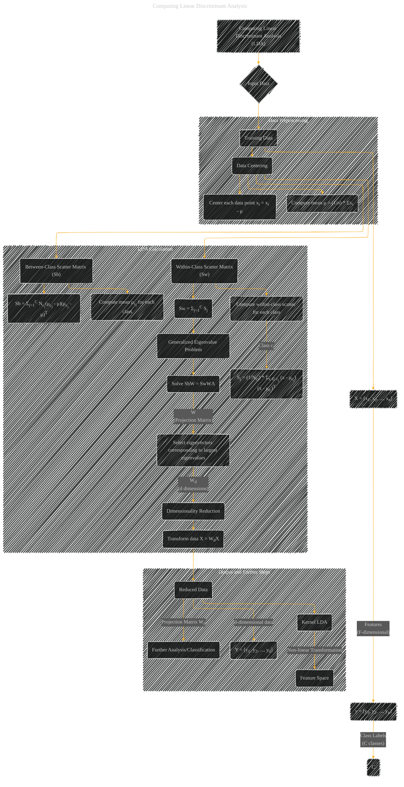

# Computing Linear Discriminant Analysis
> **Disclaimer:**
>
> This document contains my personal notes on the topic,
> compiled from publicly available documentation and various cited sources.
> The materials are intended for educational purposes, personal study, and reference.
> The content is dual-licensed:
> 1. **MIT License:** Applies to all code implementations (Swift, Mermaid, and other programming languages).
> 2. **Creative Commons Attribution 4.0 International License (CC BY 4.0):** Applies to all non-code content, including text, explanations, diagrams, and illustrations.
---

## Computing Linear Discriminant Analysis - A Diagram Structure

----

### Explanation

This Mermaid diagram visualizes the steps involved in computing Linear Discriminant Analysis (LDA).  It's structured to mirror the key components and calculations in a way that's easy to follow.

*   **Input Data (X, y, C):**  The input data `X` is a matrix of features, `y` is a vector of class labels, and `C` is the number of classes.
*   **Data Preprocessing:** The data is centered to remove the effect of the mean.
*   **Scatter Matrices (Sw, Sb):** The within-class scatter matrix (`Sw`) and between-class scatter matrix (`Sb`) are calculated.  These matrices capture the variance within and between the classes.
*   **Generalized Eigenvalue Problem:**  The core of LDA is solving the generalized eigenvalue problem `SbW = SwWΛ`.  This equation finds the projection matrix `W` that maximizes the separation between classes while minimizing the variance within each class.
*   **Eigenvector Selection:** The eigenvectors corresponding to the largest eigenvalues of `Sw-1Sb` are selected to form the projection matrix `Wd`, reducing the dimensionality to `d`.
*   **Dimensionality Reduction:** The input data `X` is projected onto the lower-dimensional space using `Wd`. This results in a new data set `Y` in `d` dimensions.
*   **Output and Further Steps:** The diagram includes `Kernel LDA` as an extension, indicating the applicability of non-linear transformations.

-----

### Key Improvements

*   **Clearer Structure:**  The diagram is more organized with distinct subgraphs for preprocessing and LDA calculation.
*   **Mathematical Representation:**  Uses mathematical notation (`xi`, `μ`, `Sj`, `Wd`) to clearly convey the computations.
*   **Focus on Key Concepts:** Highlights the core steps (data centering, scatter matrices, eigenvalue problem) crucial to understanding LDA.
*   **Connections:** Shows clear connections between input data, preprocessing, calculations, and the resulting reduced data.

This diagram is a more robust visual representation of the LDA process compared to a simple flowchart, offering a better understanding of the mathematical steps involved.  It's ready to be adapted further to incorporate more detailed mathematical formulas if needed. Remember to replace the example variables with the actual ones from your original text if you are aiming to use it as a visual representation of a specific problem.

---
**Licenses:**

- **MIT License:**   - Full text in [LICENSE](LICENSE) file.
- **Creative Commons Attribution 4.0 International:**  - Legal details in [LICENSE-CC-BY](LICENSE-CC-BY) and at [Creative Commons official site](http://creativecommons.org/licenses/by/4.0/).

---