# Computing PCA
> **Disclaimer:**
>
> This document contains my personal notes on the topic,
> compiled from publicly available documentation and various cited sources.
> The materials are intended for educational purposes, personal study, and reference.
> The content is dual-licensed:
> 1. **MIT License:** Applies to all code implementations (Swift, Mermaid, and other programming languages).
> 2. **Creative Commons Attribution 4.0 International License (CC BY 4.0):** Applies to all non-code content, including text, explanations, diagrams, and illustrations.
---

## Computing PCA - A Diagram Structure

```mermaid
---
title: Computing PCA
config:
  look: handDrawn
  theme: dark
---
%%{
  init: {
    'fontFamily': 'verdana',
    'themeVariables': {
      'primaryColor': '#BB2528',
      'primaryTextColor': '#f529',
      'primaryBorderColor': '#7C0000',
      'lineColor': '#F8B229',
      'secondaryColor': '#006100',
      'tertiaryColor': '#fff'
    }
  }
}%%
graph LR
    A["Computing PCA"] --> B{Methods}
    B --> C(Eigenvalue Decomposition)
    C --> D{Data Matrix}
    D -- X = [x<sub>1</sub>, x<sub>2</sub>, ..., x<sub>n</sub>] --> E[Centering Data]
    E --> F(Compute Mean)
    F -- m = (1/n) * Σx<sub>i</sub> --> G[Subtract Mean]
    G -- "X' = X - m" --> H[Compute Covariance Matrix]
    H --> I(XX<sup>T</sup>)
    I --> J{Eigen Decomposition}
    J --> K(Eigenvectors)
    K -- U = [u<sub>1</sub>, u<sub>2</sub>, ..., u<sub>d</sub>] --> L[Select Principal Components]
    L --> M(Largest Eigenvalues)
    M -- λ<sub>1</sub> ≥ λ<sub>2</sub> ≥ ... ≥ λ<sub>d</sub> --> N[Projection Matrix]
    N --> O(W = U<sub>d</sub>)
    O --> P{Project Data}
    P --> Q(Y = W<sup>T</sup>X)
    Q --> R(Reduced Dimensional Data)
    R -- Y = [y<sub>1</sub>, y<sub>2</sub>, ..., y<sub>d</sub>] --> S[Result]

    subgraph Data_Centering_Details["Data Centering Details"]
        F -- Computation --> FF(Efficient Matrix Operations)
        %% FF -- "(1/n) * Σx<sub>i</sub>"
    end

    subgraph Eigenvalue_Decomposition_Details["Eigenvalue Decomposition Details"]
        J --> JJ[Compute Eigenvalues and Eigenvectors]
        JJ --> KK[XX<sup>T</sup> = UΛU<sup>T</sup>]
    end
    
    subgraph Projection_Matrix_Details["Projectio Matrix Details"]
        O --> OO(Dimensionality Reduction)
        %% OO --> W = U<sub>d</sub>
    end

```

---

### Explanation

This Mermaid diagram outlines the process of computing Principal Component Analysis (PCA) using eigenvalue decomposition.

* **Data Matrix (X):**  The input data is represented as a matrix where each column represents a data point and each row represents a feature.

* **Centering Data:** PCA requires centered data to avoid bias towards dimensions with larger magnitudes. This involves computing the mean of the data and subtracting it from each data point.

* **Covariance Matrix (XXT):** The covariance matrix is computed, capturing the relationships between features in the data.  This matrix is symmetric.

* **Eigenvalue Decomposition:** The eigenvalue decomposition (EVD) of the covariance matrix is performed to find the principal components.  The largest eigenvalues correspond to the principal components that explain the most variance in the data.

* **Principal Components (Eigenvectors):** The eigenvectors corresponding to the largest eigenvalues are extracted and form the projection matrix W.  In this case, `Ud` denotes the matrix containing the top *d* principal components.

* **Projection Matrix (W):**  The projection matrix W is formed by selecting the eigenvectors (columns of Ud) corresponding to the *d* largest eigenvalues.

* **Projecting Data (Y):**  The data points are projected onto the new subspace defined by W.

* **Reduced Dimensional Data (Y):** The output Y represents the data in the reduced dimensional space.

* **Result:** The final reduced dimensional data (Y) is the outcome of PCA.

---

### Key improvements over previous versions

* **Explicit Steps:** The diagram now clearly shows the individual steps involved in computing PCA.
* **Data Centering Detail:**  Added a subgraph to show how data centering is done efficiently using matrix operations.
* **Eigenvalue Decomposition Detail:**  A subgraph is added to show the core steps involved in calculating the eigenvalues and eigenvectors from the covariance matrix.
* **Projection Matrix Detail:**  The diagram now explicitly shows how the projection matrix W is formed.
* **Clearer Variable Names:**  More descriptive variable names (e.g., X' for centered data, W for projection matrix) are used.

This diagram provides a comprehensive and clear visual representation of the PCA computation process. Remember that *d* represents the desired dimensionality of the reduced data set.

---
**Licenses:**

- **MIT License:**   - Full text in [LICENSE](LICENSE) file.
- **Creative Commons Attribution 4.0 International:**  - Legal details in [LICENSE-CC-BY](LICENSE-CC-BY) and at [Creative Commons official site](http://creativecommons.org/licenses/by/4.0/).

---