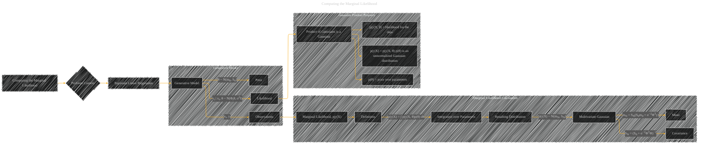

# Computing the Marginal Likelihood
> **Disclaimer:**
>
> This document contains my personal notes on the topic,
> compiled from publicly available documentation and various cited sources.
> The materials are intended for educational purposes, personal study, and reference.
> The content is dual-licensed:
> 1. **MIT License:** Applies to all code implementations (Swift, Mermaid, and other programming languages).
> 2. **Creative Commons Attribution 4.0 International License (CC BY 4.0):** Applies to all non-code content, including text, explanations, diagrams, and illustrations.
---

## Computing the Marginal Likelihood - A Diagram Structure

---

### Explanation

This diagram visualizes the process of computing the marginal likelihood in the context of Bayesian linear regression.  It clearly outlines the generative model and the steps involved in the calculation.

*   **Problem Context:** The diagram starts by highlighting that we're dealing with Bayesian linear regression.
*   **Generative Model:**  This section emphasizes the key components of the generative model. The prior on the parameters (θ), the likelihood of the data given the parameters, and the observed data (xi, yi) are crucial elements.
*   **Marginal Likelihood Calculation:** The section explicitly shows the mathematical definition of the marginal likelihood (p(y|X)), highlighting the integration over all possible parameter values (θ).
*   **Resulting Distribution:**  The key takeaway is that the marginal likelihood itself follows a multivariate Gaussian distribution (N(mN, SN)).
*   **Mean and Covariance:**  The diagram explicitly shows how the mean (mN) and covariance (SN) of the resulting Gaussian are calculated.
*   **Gaussian Product Property:** This subgraph highlights the crucial property that a product of two Gaussian distributions results in another Gaussian distribution. This property is essential for the closed-form solution.

---

### Important Considerations

*   **Notations:** The diagram uses variables like θ, m0, S0, Φ, σ2, xi, yi to reflect the notations from the original text. These are important for understanding the specific mathematical details.
*   **Relationships:** The diagram shows how the various components (prior, likelihood, observations) relate to the final calculation of the marginal likelihood.
*   **Mathematical Formulation:** The diagram connects the mathematical definition of the marginal likelihood (integration) to the resulting Gaussian distribution. This clarifies the connection between the probabilistic model and the computational step.

This revised diagram provides a more structured and visual representation of computing the marginal likelihood in Bayesian linear regression, making the process easier to understand. Remember that the specific mathematical expressions and their derivation are critical components that are implied but not explicitly shown in the diagram for clarity.

---
**Licenses:**

- **MIT License:**   - Full text in [LICENSE](LICENSE) file.
- **Creative Commons Attribution 4.0 International:**  - Legal details in [LICENSE-CC-BY](LICENSE-CC-BY) and at [Creative Commons official site](http://creativecommons.org/licenses/by/4.0/).

---