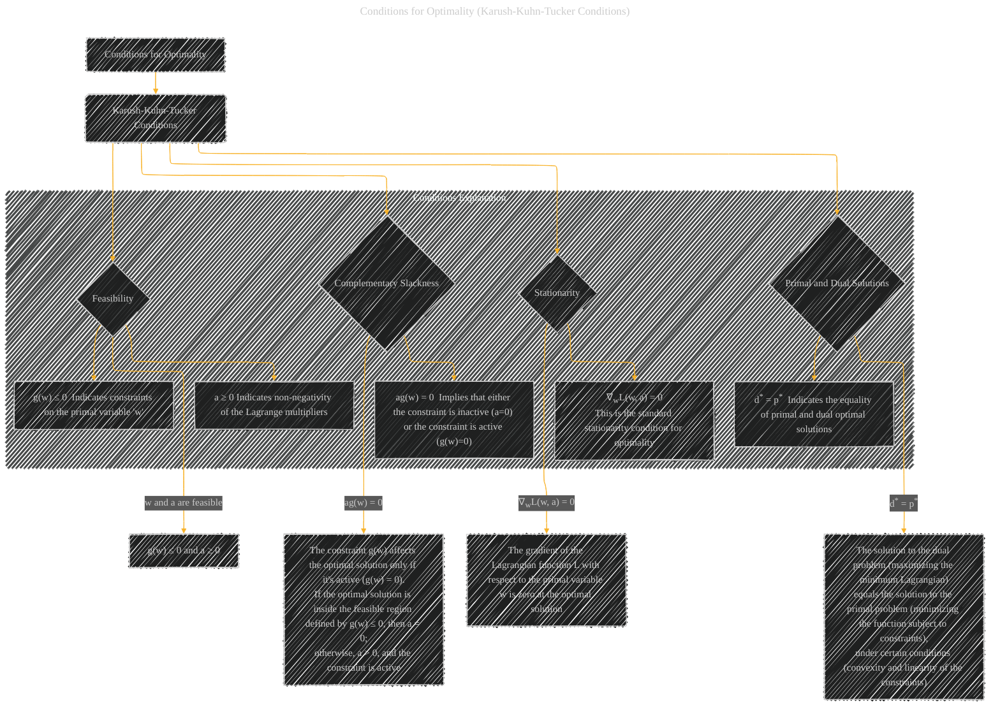

# Conditions for Optimality (Karush-Kuhn-Tucker Conditions)
> **Disclaimer:**
>
> This document contains my personal notes on the topic,
> compiled from publicly available documentation and various cited sources.
> The materials are intended for educational purposes, personal study, and reference.
> The content is dual-licensed:
> 1. **MIT License:** Applies to all code implementations (Swift, Mermaid, and other programming languages).
> 2. **Creative Commons Attribution 4.0 International License (CC BY 4.0):** Applies to all non-code content, including text, explanations, diagrams, and illustrations.
---

## Conditions for Optimality - A Diagram Structure

---

### Explanation

The Karush-Kuhn-Tucker (KKT) conditions provide necessary and sufficient conditions for optimality in constrained optimization problems.  The diagram illustrates these conditions in a structured way, showing the relationships between feasibility, complementary slackness, and stationarity conditions, and how they relate to the primal and dual solutions.

* **Feasibility (C):**  This condition ensures that the chosen values for the primal variables (`w`) and Lagrange multipliers (`a`) are valid within the constraints defined by the problem.  This is critical, as solutions outside these constraints are not valid.

* **Complementary Slackness (D):** This condition is key for understanding when a constraint actively influences the solution. If the multiplier `a` is zero, the constraint is not binding (inactive) at the optimal solution.  If `a` is positive, the constraint is active (binding), and thus must be satisfied with equality.

* **Stationarity (E):** This standard condition ensures that the gradient of the Lagrangian (`∇wL(w, a)`) is zero at the optimal point.  This means the function is not changing in the direction of the primal variables at the optimal point, satisfying the necessary condition for a minimum or maximum.

* **Primal and Dual Solutions (F):** This condition states that under specific convexity conditions and linear constraints, the solutions to the primal and dual problems are equal.  This is a crucial result in optimization, as the dual problem is sometimes easier to solve than the primal, allowing the use of efficient algorithms for its solution.

This diagram provides a concise and visual representation of the KKT conditions, highlighting their importance for finding optimal solutions in constrained optimization problems.  It is suitable for both theoretical understanding and practical application, especially when applying KKT conditions in situations involving Support Vector Machines (SVMs).

---
**Licenses:**

- **MIT License:**   - Full text in [LICENSE](LICENSE) file.
- **Creative Commons Attribution 4.0 International:**  - Legal details in [LICENSE-CC-BY](LICENSE-CC-BY) and at [Creative Commons official site](http://creativecommons.org/licenses/by/4.0/).

---