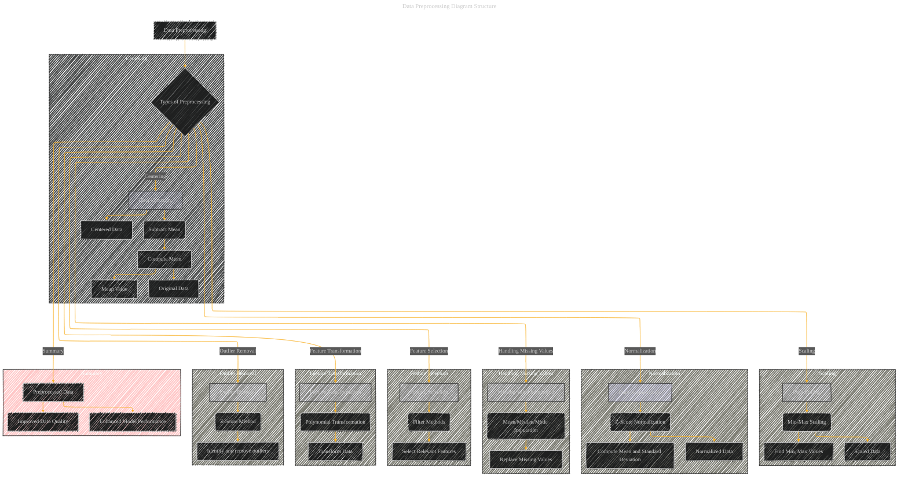

# Data Preprocessing Techniques
> **Disclaimer:**
>
> This document contains my personal notes on the topic,
> compiled from publicly available documentation and various cited sources.
> The materials are intended for educational purposes, personal study, and reference.
> The content is dual-licensed:
> 1. **MIT License:** Applies to all code implementations (Swift, Mermaid, and other programming languages).
> 2. **Creative Commons Attribution 4.0 International License (CC BY 4.0):** Applies to all non-code content, including text, explanations, diagrams, and illustrations.
---

## A Diagram Structure

----

### Explanation of Diagram

*   **Nodes:** The diagram uses nodes to represent different types of preprocessing steps (centering, scaling, normalization, missing value imputation, feature selection, feature transformation, and outlier removal).
*   **Subgraphs:** Each preprocessing type is enclosed in a subgraph for better organization.
*   **Edges:** Directed edges connect the steps of preprocessing, showing the flow from raw data to preprocessed data.  For example, 'Data Centering' connects to 'Compute Mean' and then to 'Centered Data'.
*   **Detailing:** The subgraph detail shows more about the steps involved in each technique. For example, 'Data Centering' details steps like computing the mean and subtracting it from each data point.

---
**Licenses:**

- **MIT License:**   - Full text in [LICENSE](LICENSE) file.
- **Creative Commons Attribution 4.0 International:**  - Legal details in [LICENSE-CC-BY](LICENSE-CC-BY) and at [Creative Commons official site](http://creativecommons.org/licenses/by/4.0/).

---