# Data Representation
> **Disclaimer:**
>
> This document contains my personal notes on the topic,
> compiled from publicly available documentation and various cited sources.
> The materials are intended for educational purposes, personal study, and reference.
> The content is dual-licensed:
> 1. **MIT License:** Applies to all code implementations (Swift, Mermaid, and other programming languages).
> 2. **Creative Commons Attribution 4.0 International License (CC BY 4.0):** Applies to all non-code content, including text, explanations, diagrams, and illustrations.
---

## Data Representation Diagram Structure

```mermaid
---
title: Data Representation
config:
  layout: elk
  look: handDrawn
  theme: dark
---
%%{
  init: {
    'fontFamily': 'verdana',
    'themeVariables': {
      'primaryColor': '#BB2528',
      'primaryTextColor': '#f529',
      'primaryBorderColor': '#7C0000',
      'lineColor': '#F8B229',
      'secondaryColor': '#006100',
      'tertiaryColor': '#fff'
    }
  }
}%%
graph TD
    A[Data Representation] --> B(Tables)
    B --> BA[Rows and Columns]
    B --> BB[Data Values]
    B --> BC["Relational Database Model<br>(ERD)"]
    
    A --> C(Matrices)
    C --> CA["Rows and Columns<br>(like Tables)"]
    C --> CB["Matrix Operations<br>(e.g., multiplication, transpose)"]
    C --> CC["Dimensionality<br>(m x n)"]
    
    A --> D(Graphs)
    D --> DA[Nodes and Edges]
    D --> DB[Representing Relationships]
    D --> DC["Graph Types<br>(directed, undirected, weighted)"]
    
    A --> E(Input Vectors)
    E --> EA[Ordered Collection of Data Values]
    E --> EB["Dimensionality<br>(d-dimensional)"]
    E --> EC[Feature Vectors in ML]
    
    A --> F(Data Frames)
    F --> FA["Rows and Columns<br>(like Tables)"]
    F --> FB["Mixed Data Types<br>(numeric, categorical)"]
    F --> FC[Flexibility in Data Handling]

    A --> G(Images)
    G --> GA[Pixels, Color Channels]
    G --> GB["Matrix Representation<br>(e.g., grayscale, RGB)"]
    G --> GC["Spatial Relationships<br>(adjacency, neighborhood)"]

    A --> H(Time Series)
    H --> HA[Data Points over Time]
    H --> HB["Temporal Relationships<br>(precedence, trends)"]
    H --> HC[Univariate or Multivariate]
    
    A --> I(Text Data)
    I --> IA[Words, Sentences, Documents]
    I --> IB["Feature Extraction<br>(Bag-of-Words, TF-IDF)"]
    I --> IC["Structure<br>(e.g., paragraphs, sections)"]

    subgraph Summary["Summary"]
    style Summary fill:#cff3,stroke:#333,stroke-width:2px
        B --> BB1[Common for structured data]
        C --> CC1[Essential for matrix operations, algorithms]
        D --> DC1[Crucial for understanding relationships between data]
        E --> EC1[Basic unit for input to machine learning algorithms]
        F --> FC1[Common in statistical computing environments]
        G --> GC1[Essential in computer vision, image processing]
        H --> HC1[Essential in time series analysis]
        I --> IC1["Essential in Natural Language Processing<br>(NLP)"]
    end
    
```

----

### Explanation

This Mermaid diagram visually represents different ways data can be structured.  It uses nodes for the various data representation types (Tables, Matrices, Graphs, Input Vectors, Data Frames, Images, Time Series, Text Data) and links to illustrate the key characteristics of each.

* **Tables:** Shows tabular data with rows, columns, and data values.  Highlights relational database concepts using ERDs.
* **Matrices:**  Emphasizes the role of matrices in data representation for machine learning.  Highlights matrix operations like multiplication and transposition, essential for algorithms.  Indicates the dimensionality (m x n) of the matrix as a critical aspect.
* **Graphs:** Shows data as nodes connected by edges, highlighting the representation of relationships.  Indicates the types of graphs (directed, undirected, weighted) that are important.
* **Input Vectors:** Focuses on the basic vector representation of data, important for algorithms in machine learning. Shows dimensionality (d-dimensional) as a key factor.  Connects to feature vectors in machine learning.
* **Data Frames:**  Emphasizes the flexibility in data handling that data frames provide.  Illustrates the ability to hold mixed data types.
* **Images:** Shows how images are represented as pixel collections and highlights the use of matrix representation, essential for computer vision tasks.  Points out spatial relationships between pixels.
* **Time Series:** Highlights time-dependent data and the representation of temporal relationships.  Specifies that data can be univariate or multivariate.
* **Text Data:** Shows how text data is represented, including words, sentences, and documents.  Links to feature extraction methods like Bag-of-Words and TF-IDF, important in NLP.

---
**Licenses:**

- **MIT License:**   - Full text in [LICENSE](LICENSE) file.
- **Creative Commons Attribution 4.0 International:**  - Legal details in [LICENSE-CC-BY](LICENSE-CC-BY) and at [Creative Commons official site](http://creativecommons.org/licenses/by/4.0/).

---