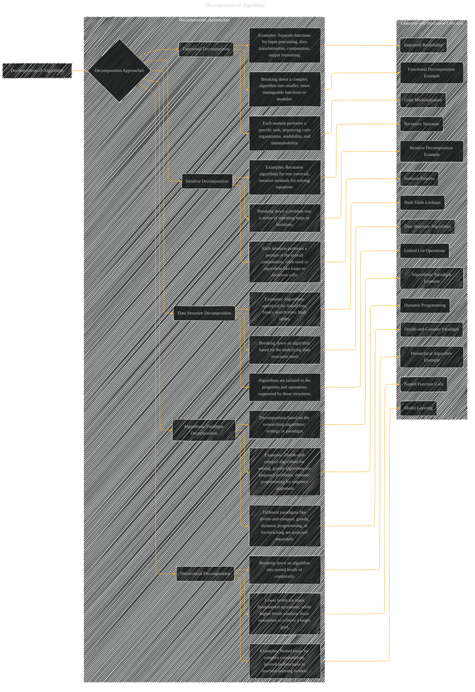

# Decomposition of Algorithms
> **Disclaimer:**
>
> This document contains my personal notes on the topic,
> compiled from publicly available documentation and various cited sources.
> The materials are intended for educational purposes, personal study, and reference.
> The content is dual-licensed:
> 1. **MIT License:** Applies to all code implementations (Swift, Mermaid, and other programming languages).
> 2. **Creative Commons Attribution 4.0 International License (CC BY 4.0):** Applies to all non-code content, including text, explanations, diagrams, and illustrations.
---

## Decomposition of Algorithms - A Diagram Structure

----

### Explanation

This Mermaid diagram visualizes the different ways algorithms can be broken down for analysis, design, and implementation.

* **Functional Decomposition:**  Focuses on separating the algorithm into self-contained functions or modules.  Each module handles a specific sub-task.
* **Iterative Decomposition:** Breaks the algorithm down into repetitive steps, iterations, or recursive calls.  Key aspects of iterations, recursive patterns, and loops are emphasized.
* **Hierarchical Decomposition:**  Describes algorithms with nested levels of operations.  Lower levels are fundamental, building blocks, while higher levels utilize and combine them for larger objectives.
* **Data Structure Decomposition:** Emphasizes how the choice of data structure influences the algorithm's design and implementation.  Specific algorithms and data structures (linked lists, trees, hash tables) are explicitly mentioned as examples.
* **Algorithmic Paradigm Decomposition:**  Focuses on the general approach or strategy behind the algorithm (divide-and-conquer, greedy, dynamic programming, backtracking).

The diagram uses subgraphs for organization and connects concepts with concrete examples, improving understanding of the decomposition process.  It's a useful framework for further analysis of specific algorithms, highlighting how their components work together.  You can adapt this to any algorithm or concept by adding specific examples, illustrations, or equations.

---
**Licenses:**

- **MIT License:**   - Full text in [LICENSE](LICENSE) file.
- **Creative Commons Attribution 4.0 International:**  - Legal details in [LICENSE-CC-BY](LICENSE-CC-BY) and at [Creative Commons official site](http://creativecommons.org/licenses/by/4.0/).

---