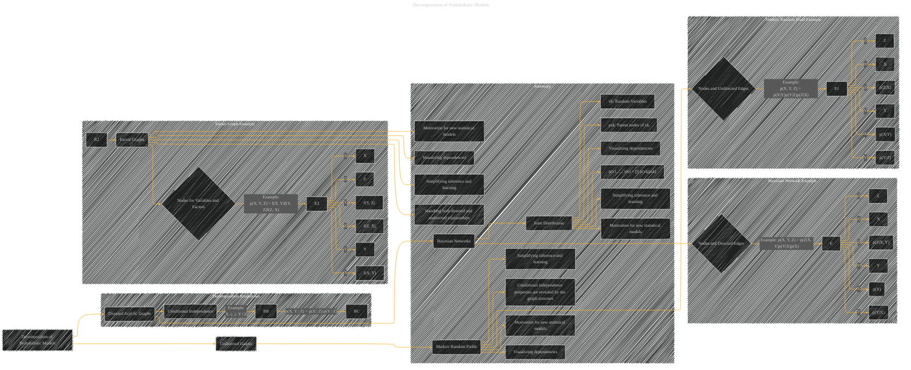

# Decomposition of Probabilistic Models
> **Disclaimer:**
>
> This document contains my personal notes on the topic,
> compiled from publicly available documentation and various cited sources.
> The materials are intended for educational purposes, personal study, and reference.
> The content is dual-licensed:
> 1. **MIT License:** Applies to all code implementations (Swift, Mermaid, and other programming languages).
> 2. **Creative Commons Attribution 4.0 International License (CC BY 4.0):** Applies to all non-code content, including text, explanations, diagrams, and illustrations.
---

## Decomposition of Probabilistic Models - A Diagram Structure

----

### Explanation

This Mermaid diagram visually decomposes probabilistic models into three primary types (Bayesian Networks, Markov Random Fields, and Factor Graphs).  Each subgraph focuses on a different aspect of model decomposition, making the diagram a more focused and structured representation of the topic.

*   **Subgraphs:** The diagram uses subgraphs to organize related concepts (e.g., Bayesian Networks, Markov Random Fields, Factor Graphs), making the overall structure more digestible.

*   **Clear Examples:** Each subgraph provides concrete examples of how joint probability distributions (`p(X, Y, Z)`) are factorized, demonstrating how variables depend on each other (in the case of Directed Acyclic Graphs) or mutually (in the case of Markov Random Fields).

*   **Conditional Independence:** The diagram highlights the importance of conditional independence as a critical concept in these models. The decomposition into factors based on conditional independence simplifies the complexity of the models and facilitates inference and computation.

*   **Summary subgraph:** This provides a concise summary of how the decomposition impacts inference, model learning, and visualization. This shows how the graph structure provides a direct representation of the model's dependencies.

----

### Key improvements over the previous diagram

*   **Focus:**  This diagram focuses more specifically on the decomposition aspect.
*   **Clarity:** The use of subgraphs improves clarity by grouping similar model types.
*   **Conciseness:** It avoids redundant information.
*   **Context:** The addition of implications and examples provides more context.

This updated diagram offers a more comprehensive and focused view of the decomposition of probabilistic models, suitable for understanding their structure and application in various contexts. Remember to adapt these nodes and edges according to the specific elements of the probabilistic models you wish to represent. Remember to include relevant equations and annotations to enhance clarity and context.

---
**Licenses:**

- **MIT License:**   - Full text in [LICENSE](LICENSE) file.
- **Creative Commons Attribution 4.0 International:**  - Legal details in [LICENSE-CC-BY](LICENSE-CC-BY) and at [Creative Commons official site](http://creativecommons.org/licenses/by/4.0/).

---