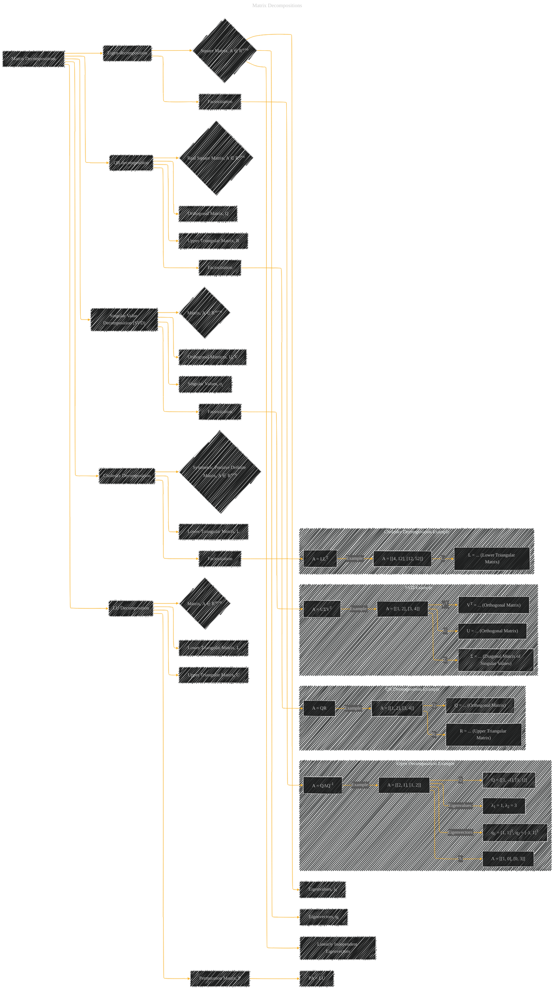

# Matrix Decompositions
> **Disclaimer:**
>
> This document contains my personal notes on the topic,
> compiled from publicly available documentation and various cited sources.
> The materials are intended for educational purposes, personal study, and reference.
> The content is dual-licensed:
> 1. **MIT License:** Applies to all code implementations (Swift, Mermaid, and other programming languages).
> 2. **Creative Commons Attribution 4.0 International License (CC BY 4.0):** Applies to all non-code content, including text, explanations, diagrams, and illustrations.
---

## Matrix Decompositions - A Diagram Structure

---

### Explanation and Considerations

* **Eigen-decomposition:** Decomposes a square matrix into eigenvectors and eigenvalues.  Crucial for understanding the fundamental properties of a matrix, such as its rank and linear transformations.
* **QR decomposition:** Decomposes a matrix into an orthogonal matrix (Q) and an upper triangular matrix (R).  Used for solving linear systems, generating orthogonal bases, and eigenvalue computations.
* **Singular Value Decomposition (SVD):** Decomposes any matrix into three matrices (U, Σ, VT).  Fundamental for dimensionality reduction, finding low-rank approximations, and understanding a matrix's rank, null space, and range.
* **Cholesky Decomposition:** Decomposes a symmetric positive-definite matrix into a lower triangular matrix (L) and its transpose (LT).  Important for solving systems of linear equations and various computations in statistics and machine learning.
* **LU Decomposition:** Decomposes a matrix into a lower triangular matrix (L), an upper triangular matrix (U), and a permutation matrix (P).  Used for solving systems of linear equations, calculating determinants, and more.

### Illustrative Examples

The subgraphs provide example matrices and their decomposed parts to make the concepts concrete.  Each subgraph is designed to show a typical decomposition example.

**Diagram Organization:**

The diagram uses subgraphs for illustrative examples to break down each type of decomposition. This helps in presenting the concept in a structured and clear manner.

**How to Use for Further Analysis:**

This diagram can be expanded to include specific algorithms (e.g., Gram-Schmidt process for QR), properties (e.g., symmetry, positive definiteness), and applications (e.g., dimensionality reduction with SVD, solving linear systems with LU).  You can tailor the specific examples to match your needs.

---
**Licenses:**

- **MIT License:**   - Full text in [LICENSE](LICENSE) file.
- **Creative Commons Attribution 4.0 International:**  - Legal details in [LICENSE-CC-BY](LICENSE-CC-BY) and at [Creative Commons official site](http://creativecommons.org/licenses/by/4.0/).

---