# Dimensionality Reduction and SVD
> **Disclaimer:**
>
> This document contains my personal notes on the topic,
> compiled from publicly available documentation and various cited sources.
> The materials are intended for educational purposes, personal study, and reference.
> The content is dual-licensed:
> 1. **MIT License:** Applies to all code implementations (Swift, Mermaid, and other programming languages).
> 2. **Creative Commons Attribution 4.0 International License (CC BY 4.0):** Applies to all non-code content, including text, explanations, diagrams, and illustrations.
---

## Dimensionality Reduction and SVD - A Diagram Structure

```mermaid
---
title: Dimensionality Reduction and SVD
config:
  layout: elk
  look: handDrawn
  theme: dark
---
%%{
  init: {
    'fontFamily': 'verdana',
    'themeVariables': {
      'primaryColor': '#BB2528',
      'primaryTextColor': '#f529',
      'primaryBorderColor': '#7C0000',
      'lineColor': '#F8B229',
      'secondaryColor': '#006100',
      'tertiaryColor': '#fff'
    }
  }
}%%
graph LR
    A[Dimensionality Reduction] --> B(SVD)
    B --> C{Singular Value Decomposition}
    
    subgraph SVD_Decomposition["SVD Decomposition"]
        C --  A ∈ R<sup>m×n</sup> --> D[U ∈ R<sup>m×m</sup>]
        C --  A ∈ R<sup>m×n</sup> --> E[Σ ∈ R<sup>m×n</sup>]
        C --  A ∈ R<sup>m×n</sup> --> F[V<sup>T</sup> ∈ R<sup>n×n</sup>]
        
        D -- Orthogonal --> G[U<sup>T</sup>U = I<sub>m</sub>]
        E -- Diagonal --> H["Σ = diag(σ<sub>1</sub>, σ<sub>2</sub>, ..., σ<sub>p</sub>)"]
        F -- Orthogonal --> I[V<sup>T</sup>V = I<sub>n</sub>]
        
        C -- Rank Reduction --> J(k < r) 
        J -- Approximation --> K[A<sub>k</sub> = ∑<sub>i=1</sub><sup>k</sup> σ<sub>i</sub>u<sub>i</sub>v<sub>i</sub><sup>T</sup>]
        K -- Minimizing Error --> L["min<sub>rank(B)=k</sub> ||A − B||<sub>2</sub> = ||A − A<sub>k</sub>||<sub>2</sub> = σ<sub>k+1</sub>"]
    end
    
    subgraph Visualization["Visualization"]
        J -- Data in Matrix Form --> M["X = [x<sub>1</sub>, x<sub>2</sub>, ..., x<sub>n</sub>]"]
        
        M --  Dimensionality Reduced --> N[X<sub>k</sub> = U<sub>k</sub>Σ<sub>k</sub>V<sub>k</sub><sup>T</sup>]
    
        N -- Keeping k Singular Values --> O[Low-Rank Representation]
    end
    
```

---

### Explanation

This diagram visually represents the process of dimensionality reduction using Singular Value Decomposition (SVD).

* **SVD Decomposition:** The core of the diagram is the SVD decomposition of a matrix A. This decomposition expresses the matrix as a product of three matrices: U, Σ, and VT, where U and V are orthogonal matrices, and Σ is a diagonal matrix containing the singular values.

* **Orthogonality:**  Crucially, the diagram highlights that U and VT are orthogonal matrices. This property is essential for preserving the data's intrinsic structure during the projection.

* **Rank Reduction (k < r):**  The diagram shows that dimensionality reduction is achieved by choosing a lower rank approximation (k) of the original matrix A. This is represented by the formula Ak.

* **Minimizing Error:**  A key concept is the minimization of the error introduced by the rank reduction.  The formula `minrank(B)=k ||A − B||2 = ||A − Ak||2 = σk+1` shows that choosing the first k singular values minimizes the reconstruction error.

* **Data in Matrix Form:** The diagram shows that the original data is represented as columns in the matrix X.  This is a crucial step for understanding how SVD is applied to data sets.

* **Low-Rank Representation:** The result of the dimensionality reduction is a low-rank representation Xk, which preserves the most significant information in the original data while reducing the number of dimensions.

* **Keeping k Singular Values:** The process involves selecting the first k singular values and the corresponding left and right singular vectors, which define the new lower-dimensional representation.

This diagram provides a clear visual overview of the dimensionality reduction process using SVD, highlighting the key mathematical concepts and how they relate to the data.

---
**Licenses:**

- **MIT License:**   - Full text in [LICENSE](LICENSE) file.
- **Creative Commons Attribution 4.0 International:**  - Legal details in [LICENSE-CC-BY](LICENSE-CC-BY) and at [Creative Commons official site](http://creativecommons.org/licenses/by/4.0/).

---