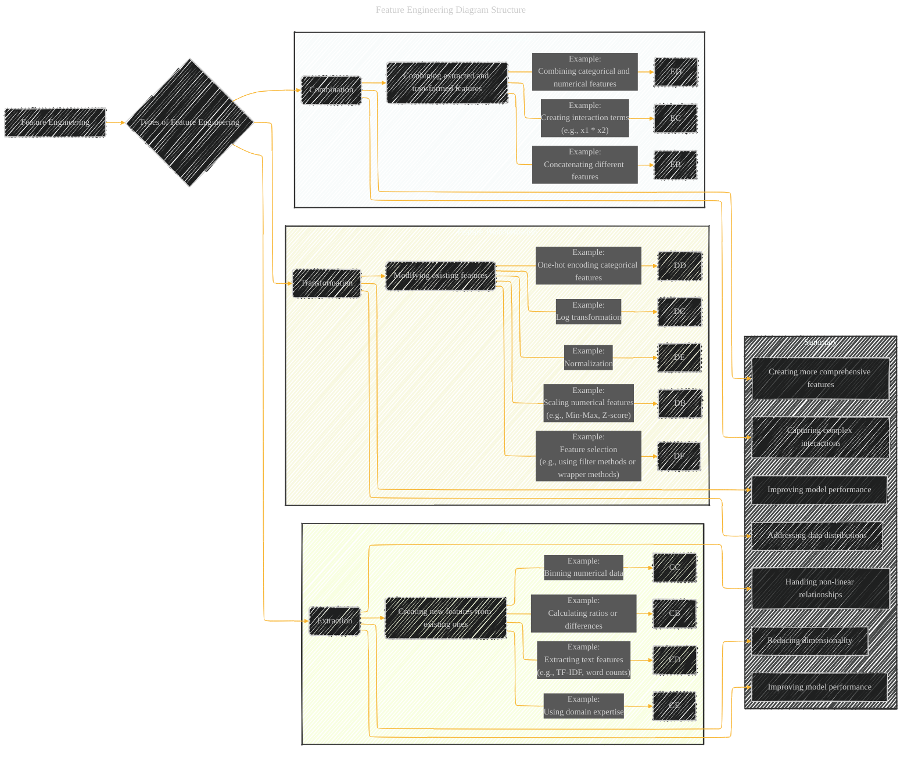

# Feature Engineering
> **Disclaimer:**
>
> This document contains my personal notes on the topic,
> compiled from publicly available documentation and various cited sources.
> The materials are intended for educational purposes, personal study, and reference.
> The content is dual-licensed:
> 1. **MIT License:** Applies to all code implementations (Swift, Mermaid, and other programming languages).
> 2. **Creative Commons Attribution 4.0 International License (CC BY 4.0):** Applies to all non-code content, including text, explanations, diagrams, and illustrations.
---

## Feature Engineering Diagram Structure

---

### Explanation

* **Feature Engineering:** This is the overarching concept.
* **Types of Feature Engineering:** The core strategies are broken down into three main categories: Extraction, Transformation, and Combination.
* **Feature Extraction:** This focuses on creating new features from existing ones.  Examples include calculating ratios, differences, binning numerical data, or extracting text features like TF-IDF.  The examples are meant to be illustrative, and you can add more as needed, relevant to the specific context of your application.
* **Feature Transformation:** This involves modifying existing features.  Examples include scaling (Min-Max, Z-score), log transformations, one-hot encoding, normalization, and feature selection.  Feature selection is important to reduce irrelevant or redundant features, improving model performance.
* **Feature Combination:** This focuses on combining extracted and transformed features to create more comprehensive and expressive features. Examples include concatenating features, creating interaction terms, and combining categorical and numerical features.  This is vital for capturing complex relationships between variables that might be missed using only individual features.
* **Summary:** The bottom subgraph highlights the overarching benefits of feature engineering in machine learning tasks. It emphasizes that feature engineering can reduce dimensionality, enhance model performance, and effectively handle complex relationships in data.

### How to use this diagram in different contexts

* **Specific Data:**  For a specific dataset, you can add more detailed examples within each category that are relevant to the data's characteristics (e.g., if you are dealing with images, feature engineering might involve creating edge or corner detectors).
* **Algorithms:** Include specific algorithms that benefit from specific feature engineering techniques. For example, you could note that one-hot encoding is frequently used with decision trees.
* **Applications:** Connect the diagram to specific applications (e.g., image recognition, natural language processing, etc.) to illustrate how feature engineering is used in different domains.

---
**Licenses:**

- **MIT License:**   - Full text in [LICENSE](LICENSE) file.
- **Creative Commons Attribution 4.0 International:**  - Legal details in [LICENSE-CC-BY](LICENSE-CC-BY) and at [Creative Commons official site](http://creativecommons.org/licenses/by/4.0/).

---