# Feature Extraction
> **Disclaimer:**
>
> This document contains my personal notes on the topic,
> compiled from publicly available documentation and various cited sources.
> The materials are intended for educational purposes, personal study, and reference.
> The content is dual-licensed:
> 1. **MIT License:** Applies to all code implementations (Swift, Mermaid, and other programming languages).
> 2. **Creative Commons Attribution 4.0 International License (CC BY 4.0):** Applies to all non-code content, including text, explanations, diagrams, and illustrations.
---

## Feature Extraction - A Diagram Structure

```mermaid
---
title: Feature Extraction
config:
  layout: elk
  look: handDrawn
  theme: dark
---
%%{
  init: {
    'fontFamily': 'verdana',
    'themeVariables': {
      'primaryColor': '#BB2528',
      'primaryTextColor': '#f529',
      'primaryBorderColor': '#7C0000',
      'lineColor': '#F8B229',
      'secondaryColor': '#006100',
      'tertiaryColor': '#fff'
    }
  }
}%%
graph LR
    A[Feature Extraction] --> B(Linear Methods)
    B --> C(PCA)
    C --> D{"Data<br>(X)"}
    D -- Centering --> E("Covariance Matrix (XX<sup>T</sup>)")
    E -- Eigenvalue Decomposition --> F("Principal Components<br>(W)")
    F -- Projection --> G("Reduced-Dimensional Data<br>(Y)")
    
    B --> D1(LDA)
    D1 -- "Within-Class Scatter<br>(Sw)" --> E1(Sw)
    D1 -- "Between-Class Scatter<br>(Sb)" --> E2(Sb)
    E1 -- Eigenvalue Decomposition --> F1("Discriminant Components<br>(W)")
    F1 -- Projection --> G1("Reduced-Dimensional Data<br>(Y)")

    B --> D2(SVD)
    D2 -- "Data<br>(X)" --> E3("Singular Value Decomposition<br>(SVD)")
    E3 -- Singular Values and Vectors --> F2("Reduced-Dimensional Representation<br>(Xk)")

    subgraph Non_Linear_Methods["Non-Linear Methods"]
        A --> B1(Kernel Methods)
        B1 --> C1("Kernel PCA<br>(KPCA)")
        C1 --> D3("Kernel Matrix<br>(K)")
        D3 -- "Feature Mapping<br>(φ)" --> F3("Reduced-Dimensional Data in Feature Space")
    
        B1 --> C2(Kernel LDA)
        C2 --> D4("Kernel Matrix<br>(K)")
        D4 -- "Feature Mapping<br>(φ)" --> F4("Reduced-Dimensional Data in Feature Space")
    end

    subgraph Summary["Summary"]
        C --> CC[Statistical perspective]
        C --> CC1[Maximize variance of projected data]
        C1 --> CC2[Principal components as directions of maximum variance]

        D1 --> CC3[Maximize between-class separation, minimize within-class scatter]
        CC3 --> CC4[Discriminant components focus on class separability]

        D2 --> CC5[Decompose data into orthogonal components]
        CC5 --> CC6[Useful for dimensionality reduction and noise removal]

        D3 --> CC7[Kernel trick for nonlinear feature extraction]
        CC7 --> CC8[Mapping to high-dimensional feature spaces implicitly]
    end
    
```

----

### Explanation

*   **Feature Extraction:** The top-level node represents the overall process.
*   **Linear Methods:** This subgraph groups methods that operate directly on the original data space.
*   **PCA (Principal Component Analysis):** Starts with the data, calculates the covariance matrix, performs eigenvalue decomposition, and projects data onto principal components (eigenvectors) to obtain reduced-dimensional data (Y).
*   **LDA (Linear Discriminant Analysis):** Uses both within-class scatter (Sw) and between-class scatter (Sb) matrices.  Eigenvalue decomposition of the matrix (Sw-1Sb) provides discriminant components (directions that maximize class separation) for dimensionality reduction.
*   **SVD (Singular Value Decomposition):** Decomposes the data matrix into orthogonal matrices and a diagonal matrix of singular values.  This allows for dimensionality reduction by selecting the top k singular vectors and values.
*   **Non-Linear Methods (Kernel Methods):** This subgraph shows the kernel methods, which are extensions of linear methods for nonlinear data.
*   **Kernel PCA (KPCA):**  Uses a kernel function to implicitly map data to a higher-dimensional space, performs PCA in this space, and returns reduced-dimensional data.
*   **Kernel LDA:** Similarly, applies LDA in the higher-dimensional space defined by the kernel function.
*   **Summary:** This subgraph highlights the key statistical motivations behind each method.

---

### Key improvements

*   **Clearer Structure:** The diagram is more structured, grouping related concepts (linear vs. kernel methods) for better understanding.
*   **Explicit Variables:** Identifies specific matrices and vectors involved (covariance matrix, principal components, etc.).
*   **Relationships:** Shows how each method is connected to the data and the resulting reduced-dimensional data.
*   **Non-linear Extension:**  Explicitly shows the kernel methods as an extension of linear methods.

This revised diagram provides a more comprehensive and semantically accurate representation of feature extraction techniques, particularly highlighting the extension of linear methods using kernel methods for non-linear data. Remember that specific details and nuances of each algorithm might require further annotation and elaboration, depending on the context of your discussion.

---
**Licenses:**

- **MIT License:**   - Full text in [LICENSE](LICENSE) file.
- **Creative Commons Attribution 4.0 International:**  - Legal details in [LICENSE-CC-BY](LICENSE-CC-BY) and at [Creative Commons official site](http://creativecommons.org/licenses/by/4.0/).

---