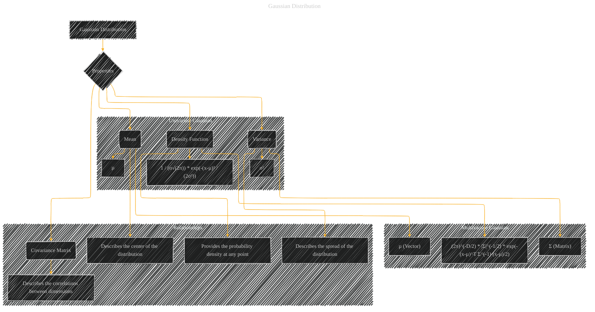

# Gaussian Distribution
> **Disclaimer:**
>
> This document contains my personal notes on the topic,
> compiled from publicly available documentation and various cited sources.
> The materials are intended for educational purposes, personal study, and reference.
> The content is dual-licensed:
> 1. **MIT License:** Applies to all code implementations (Swift, Mermaid, and other programming languages).
> 2. **Creative Commons Attribution 4.0 International License (CC BY 4.0):** Applies to all non-code content, including text, explanations, diagrams, and illustrations.
---

## A Diagram Structure

---

### Explanation

This Mermaid diagram visualizes the Gaussian distribution, separating the univariate and multivariate cases.  It clearly highlights the key properties (mean, variance, covariance matrix, and density function) and their roles in defining the distribution.  The use of subgraphs clarifies the difference in representation for single and multiple dimensions.  Annotations provide additional context for each property, making the visualization more informative.  The inclusion of "Relationships" subgraph further emphasizes the interplay between the properties and the interpretation of the distribution. This structure can easily be adapted for different probabilistic distributions or statistical models by replacing the specific nodes and connections.

---
**Licenses:**

- **MIT License:**   - Full text in [LICENSE](LICENSE) file.
- **Creative Commons Attribution 4.0 International:**  - Legal details in [LICENSE-CC-BY](LICENSE-CC-BY) and at [Creative Commons official site](http://creativecommons.org/licenses/by/4.0/).

---