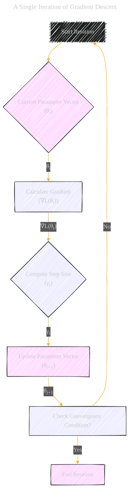
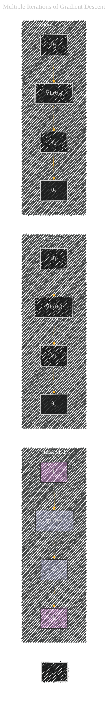

# Gradient Descent Iteration Breakdown
> **Disclaimer:**
>
> This document contains my personal notes on the topic,
> compiled from publicly available documentation and various cited sources.
> The materials are intended for educational purposes, personal study, and reference.
> The content is dual-licensed:
> 1. **MIT License:** Applies to all code implementations (Swift, Mermaid, and other programming languages).
> 2. **Creative Commons Attribution 4.0 International License (CC BY 4.0):** Applies to all non-code content, including text, explanations, diagrams, and illustrations.
---

Applying the "Decomposition of Complex Concepts" strategy to Gradient Descent.

## A Single Iteration of Gradient Descent

A flowchart detailing the steps in a single iteration of gradient descent, emphasizing the inputs and outputs at each step:

DOI: [10.13140/RG.2.2.26078.14404](http://dx.doi.org/10.13140/RG.2.2.26078.14404)

### Explanation of Nodes and Connections

* **Start Iteration (A):** The beginning of an iteration cycle.
* **Current Parameter Vector (θi) (B):** The current estimate of the parameters at the start of the iteration.
* **Calculate Gradient (∇L(θi)) (C):** Computes the gradient of the loss function (L) with respect to the parameters at the current point.  This step requires calculating partial derivatives. Annotate this node with the formula for the gradient: ∇L(θi) = ... (where ... represents the actual calculation).
* **Compute Step Size (γi) (D):** Determines the magnitude of the update step. The formula used for calculating the step size should be shown here (e.g., a fixed learning rate or a dynamically adjusted one).  Annotate with the formula: γi = ...
* **Update Parameter Vector (θi+1) (E):** Updates the parameter vector based on the calculated gradient and step size.  Show the formula: θi+1 = θi - γi∇L(θi).
* **Check Convergence Condition? (F):** Checks if the algorithm has converged to a solution (e.g., if the change in the parameter vector is below a certain threshold or if the loss function value stops decreasing significantly).
* **End Iteration (G):** The end of the iteration if the convergence condition is met.

---

## Multiple Iterations of Gradient Descent

An alternative diagram (for visualizing multiple iterations).

This second diagram shows multiple iterations and how the parameter vector updates through the steps.  The subgraphs help visualize each iteration distinctly.  Further iterations can be added as necessary.

---
**Licenses:**

- **MIT License:**   - Full text in [LICENSE](LICENSE) file.
- **Creative Commons Attribution 4.0 International:**  - Legal details in [LICENSE-CC-BY](LICENSE-CC-BY) and at [Creative Commons official site](http://creativecommons.org/licenses/by/4.0/).

---