```mermaid
---
title: Graphical Models and Their Equations
config:
  layout: elk
  look: handDrawn
  theme: dark
---
%%{
  init: {
    'fontFamily': 'verdana',
    'themeVariables': {
      'primaryColor': '#BB2528',
      'primaryTextColor': '#f529',
      'primaryBorderColor': '#7C0000',
      'lineColor': '#F8B229',
      'secondaryColor': '#006100',
      'tertiaryColor': '#fff'
    }
  }
}%%
graph LR
    A[Graphical Models] --> B(Directed Acyclic Graphs)
    B --> C(Bayesian Networks)
    C --> D{Nodes and Directed Edges}
    
    subgraph Bayesian_Network_Example["Bayesian Network Example"]
        D -- Example: p(a,b,c) = p(c|a,b)p(b|a)p(a) --> E
        E -- a --> F[a]
        E -- b --> G[b]
        E -- c --> H[c]
        E -- a --> I("p(a)")
        E -- b --> J("p(b|a)")
        E -- c --> K("p(c|a,b)")
    end

    A --> B1(Undirected Graphs)
    B1 --> C1(Markov Random Fields)
    C1 --> D1{Nodes and Undirected Edges}
    
    subgraph Markov_Random_Field_Example["Markov Random Field Example"]
        D1 -- Example: p(a,b,c) = p(a|b)p(b|c)p(c|a) --> E1
        E1 -- a --> F1[a]
        E1 -- b --> G1[b]
        E1 -- c --> H1[c]
        E1 -- a --> I1("p(a|b)")
        E1 -- b --> J1("p(b|c)")
        E1 -- c --> K1("p(c|a)")
    end
    
    A --> B2(Factor Graphs)
    B2 --> C2(Factor Graphs)
    C2 --> D2{Nodes for Variables and Factors}

    subgraph Factor_Graph_Example["Factor Graph Example"]
        D2 -- Example: p(a,b,c) = f(a,b)f(b,c)f(c,a) --> E2
        E2 -- a --> F2[a]
        E2 -- b --> G2[b]
        E2 -- c --> H2[c]
        E2 -- a --> I2["f(a,b)"]
        E2 -- b --> J2["f(b,c)"]
        E2 -- c --> K2["f(c,a)"]
    end

    
    subgraph Summary["Summary"]
        C --> CC[Joint Distribution]
        CC --> CC1["p(x1, ..., xK) =  ∏ p(xk|pak)"]
        C1 --> CC2[pak: Parent nodes of xk]
        C1 --> CC3[xk: Random Variables]

        C1 --> CC4[Mathematical foundation for inference]
        C1 --> CC5[Visualization of dependencies]
        C1 --> CC6[Motivation for new statistical models]
    
        C2 --> CC7[Mathematical foundation for inference]
        C2 --> CC8[Visualization of dependencies]
        C2 --> CC9[Motivation for new statistical models]

        C2 --> CC10[Important for understanding conditional independence]
    end
  

```

# Graphical Models and Their Equations
> **Disclaimer:**
>
> This document contains my personal notes on the topic,
> compiled from publicly available documentation and various cited sources.
> The materials are intended for educational purposes, personal study, and reference.
> The content is dual-licensed:
> 1. **MIT License:** Applies to all code implementations (Swift, Mermaid, and other programming languages).
> 2. **Creative Commons Attribution 4.0 International License (CC BY 4.0):** Applies to all non-code content, including text, explanations, diagrams, and illustrations.
---

---

### Explanation and Considerations

* **Directed Acyclic Graphs (DAGs) / Bayesian Networks:** These models represent probabilistic relationships between variables as directed edges.  The direction indicates a causal relationship or dependence.  For example, in the Bayesian network `p(a,b,c) = p(c|a,b)p(b|a)p(a)`, `c` depends on both `a` and `b`, and `b` depends on `a`, but not vice-versa.  This factorization is crucial for efficient inference and computation.

* **Undirected Graphs / Markov Random Fields (MRFs):**  Unlike DAGs, MRFs don't assume a directional dependence.  Instead, they represent pairwise relationships using undirected edges.  In the example `p(a,b,c) = p(a|b)p(b|c)p(c|a)`, there's a mutual dependency between the variables. This structure can be used for models like image segmentation, where pixels influence each other.

* **Factor Graphs:** These are a more general representation that can handle both directed and undirected relationships. They represent a joint distribution as a product of factors, each of which depends on a subset of variables.  A factor graph is often used in algorithms like belief propagation. In the example `p(a,b,c) = f(a,b)f(b,c)f(c,a)`, the factors `f(a,b)`, `f(b,c)`, and `f(c,a)` encapsulate the relationships between pairs of variables.

**Important Notes:**

* **Nodes:** Nodes represent random variables or deterministic parameters.  Shading or other visual cues (like filled circles) can indicate whether a variable is observed or unobserved.
* **Edges:** Directed edges represent dependencies between variables.  Undirected edges indicate pairwise relationships.  The example factorizations and corresponding graphical models provided are for illustration and can be extended based on the topic of the document you are trying to visualize.
* **Equations:**  The mathematical equations should be integrated into the diagrams. This is crucial for making the diagram meaningful and providing context.  Use labels or annotations to point to relevant equations.

---
**Licenses:**

- **MIT License:**   - Full text in [LICENSE](LICENSE) file.
- **Creative Commons Attribution 4.0 International:**  - Legal details in [LICENSE-CC-BY](LICENSE-CC-BY) and at [Creative Commons official site](http://creativecommons.org/licenses/by/4.0/).

---