# Inverse of a Sum
> **Disclaimer:**
>
> This document contains my personal notes on the topic,
> compiled from publicly available documentation and various cited sources.
> The materials are intended for educational purposes, personal study, and reference.
> The content is dual-licensed:
> 1. **MIT License:** Applies to all code implementations (Swift, Mermaid, and other programming languages).
> 2. **Creative Commons Attribution 4.0 International License (CC BY 4.0):** Applies to all non-code content, including text, explanations, diagrams, and illustrations.
---

## A Diagram Structure

```mermaid
---
title: Inverse of a Sum - Useful Matrix Identities
config:
  layout: elk
  look: handDrawn
  theme: dark
---
%%{
  init: {
    'fontFamily': 'verdana',
    'themeVariables': {
      'primaryColor': '#BB2528',
      'primaryTextColor': '#f529',
      'primaryBorderColor': '#7C0000',
      'lineColor': '#F8B229',
      'secondaryColor': '#006100',
      'tertiaryColor': '#fff'
    }
  }
}%%
graph LR
    A[Inverse of a Sum] --> B{Conditions}
    B --> C[Matrices A and B]
    C --> CA(Invertible)
    CA --> CB("The inverse of a sum of two matrices, A + B, can be calculated in closed form only under special conditions. A simple inverse operation (A + B)<sup>-1</sup>  does not directly exist in the general case")
    
    subgraph Special_Conditions
        CB --> CC(Matrix Inversion Lemma/Woodbury Matrix Identity)
        CC --> CD("Applies when the inverse of A exists and the matrix (A + B) is invertible")
        CD --> CE("Provides a formula to compute the inverse of (A + UCV) in terms of A, U, C, and V")
    end

    subgraph Example_Formula
        CE --> CF("Example Formula, (A + UCV)<sup>-1</sup> = A<sup>-1</sup> - A<sup>-1</sup> U C (V<sup>-1</sup> + A<sup>-1</sup> U C)<sup>-1</sup> VA<sup>-1</sup>")
        style CF fill:#f2af,stroke:#333,stroke-width:1px
    end

    
    subgraph Summary
        B --> D(In general, the inverse of a sum of matrices is not a direct calculation, but relies on specific identities.);
        D --> DA[Consider special conditions such as the Woodbury matrix identity when working with the inverse of a sum of matrices, and it is important to check for the invertibility of the sum.]
    end


```

----

### Explanation

This Mermaid diagram illustrates the key concepts related to the inverse of a sum of matrices.  It's structured to show the conditions under which a closed-form solution exists and how to calculate it using the Woodbury matrix identity.

* **Special Conditions (Invertibility):**  The diagram highlights that, in general, (A + B)-1 is not directly calculated. It emphasizes that the inverse of a sum exists only if the inverse of A exists *and* the sum (A + B) is invertible. This is crucial for avoiding errors.

* **Woodbury Matrix Identity:** The diagram explicitly connects the inverse of a sum to the Woodbury matrix identity, showcasing its importance. It highlights that this identity provides a formula to compute the inverse of a sum involving matrices that meet specific criteria.

* **Formula:** The diagram gives an example of the formula that arises from the Woodbury identity, making it explicit how the inverse of the sum can be expressed in terms of the individual inverses and matrix multiplications.

* **Summary:** The diagram's summary section emphasizes that, generally, the inverse of a sum of matrices requires special conditions and often relies on specific matrix identities like the Woodbury identity. It stresses the importance of checking for the invertibility of the sum.

---

### Important Considerations for Implementation

* **Numerical Stability:** When dealing with matrices, numerical stability is crucial.  If a matrix is ill-conditioned, its inverse may be unreliable or very sensitive to small changes in the values of the matrix.  In numerical computations, you should always check for the invertibility of the sum or employ techniques to improve numerical stability.

* **Specific Cases:** The formula provided is only one form of the Woodbury identity.  You might encounter different variations depending on the exact matrix structure or the context of your application.

This diagram provides a structured way to understand the conditions for calculating the inverse of a sum of matrices and the formula to use when these conditions are met. It focuses on clarity, directness, and emphasizing the practical aspects of numerical computation.

---
**Licenses:**

- **MIT License:**   - Full text in [LICENSE](LICENSE) file.
- **Creative Commons Attribution 4.0 International:**  - Legal details in [LICENSE-CC-BY](LICENSE-CC-BY) and at [Creative Commons official site](http://creativecommons.org/licenses/by/4.0/).

---